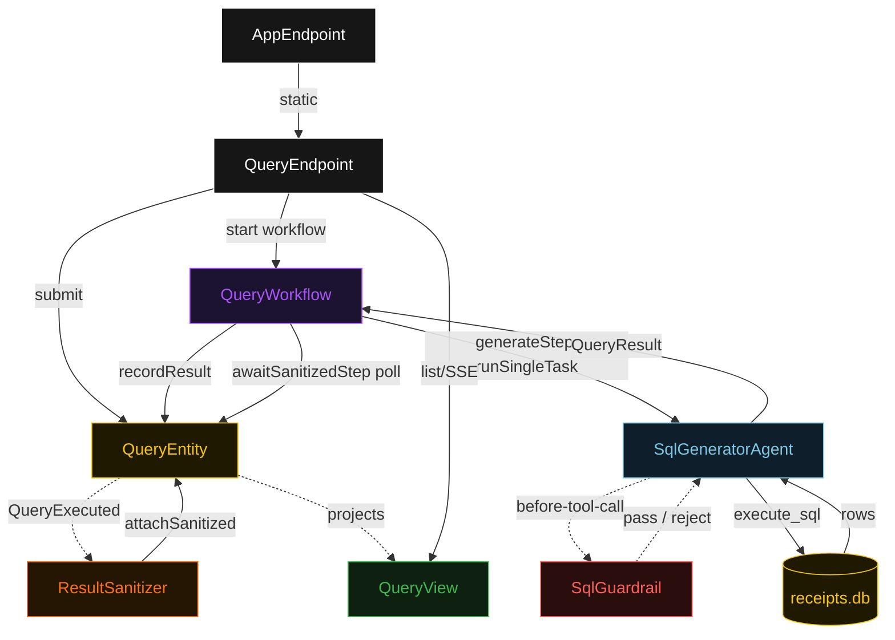
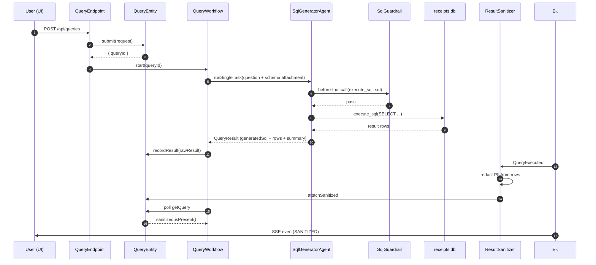
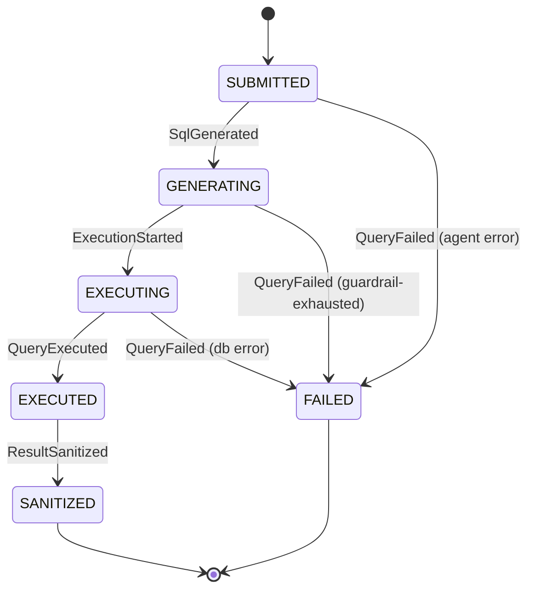
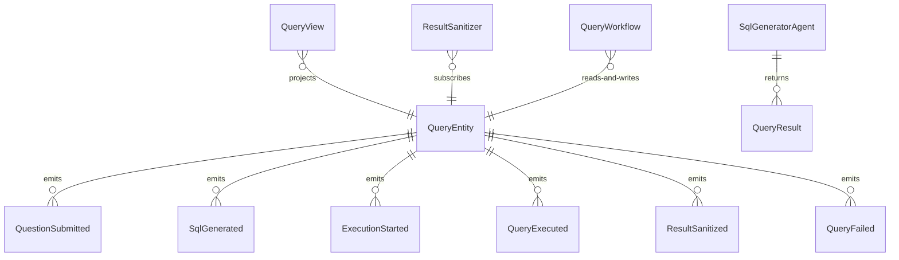

# PLAN — text-to-sql-agent

Architectural sketch consumed by `/akka:plan` and rendered on the generated system's Architecture tab. The four mermaid diagrams below carry the theme variables and CSS overrides from Lesson 24; without them, state names render black-on-black and edge labels clip.

---

## Component graph

## Interaction sequence — J1 (happy path)

## State machine — `QueryEntity`

## Entity model

## Component table — Java file targets

| Component | Path (generated) |
|---|---|
| `QueryEndpoint` | `api/QueryEndpoint.java` |
| `AppEndpoint` | `api/AppEndpoint.java` |
| `QueryEntity` | `application/QueryEntity.java` (state in `domain/QueryResult.java`, events in `domain/QueryEvent.java`) |
| `ResultSanitizer` | `application/ResultSanitizer.java` |
| `QueryWorkflow` | `application/QueryWorkflow.java` |
| `SqlGeneratorAgent` | `application/SqlGeneratorAgent.java` (tasks in `application/QueryTasks.java`) |
| `SqlGuardrail` | `application/SqlGuardrail.java` |
| `QueryView` | `application/QueryView.java` |
| `MockModelProvider` (option-a only) | `application/MockModelProvider.java` |
| Bootstrap | `Bootstrap.java` |

## Concurrency notes

- **Per-step timeout**: `generateStep` 90 s, `awaitSanitizedStep` 15 s, `error` 5 s. Default step recovery `maxRetries(2).failoverTo(QueryWorkflow::error)`. The 90 s on `generateStep` accommodates LLM latency plus tool-call round-trips (Lesson 4).
- **Idempotency**: every workflow uses `"query-" + queryId` as the workflow id; the `ResultSanitizer` Consumer is allowed to redeliver `QueryExecuted` events because `QueryEntity.attachSanitized` is event-version-guarded — a second sanitize attempt against an already-sanitized query is a no-op.
- **One agent per query**: the AutonomousAgent instance id is `"sql-" + queryId`, which gives each task its own conversation context. The agent's `capability(...).maxIterationsPerTask(4)` caps guardrail-triggered retries at 4 — one extra over the legal-compliance blueprint because a SQL guardrail rejection is highly likely to require two internal tries before the agent produces a purely safe SELECT.
- **Guardrail-driven retry**: when `SqlGuardrail` rejects a tool call, the rejection is returned as a structured error to the agent loop. The loop counts toward `maxIterationsPerTask`; if all 4 iterations are rejected, the workflow's `generateStep` fails over to `error` and the entity transitions to `FAILED`.
- **Sanitizer is asynchronous**: `ResultSanitizer` runs as a separate Consumer after `QueryExecuted`. `awaitSanitizedStep` polls `QueryEntity` every 1 s up to 15 s, advancing when `query.sanitized().isPresent()` returns true. This keeps the agent loop's wall-clock bounded and makes the sanitizer independently replaceable.
- **SQLite is embedded**: `receipts.db` is opened with `DriverManager.getConnection("jdbc:sqlite::resource:receipts.db")` using the sqlite-jdbc driver on the classpath. No separate process, no network call.
- **No saga / no compensation**: query execution is read-only; there is nothing to roll back.
