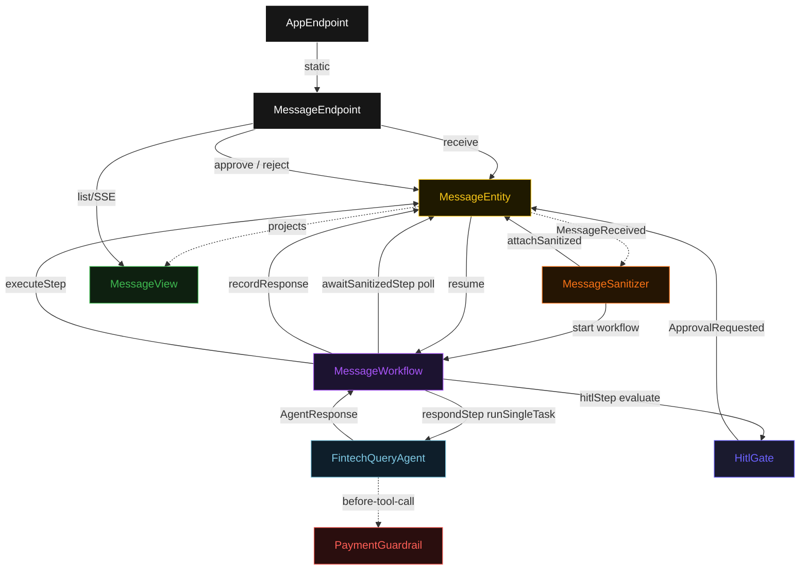
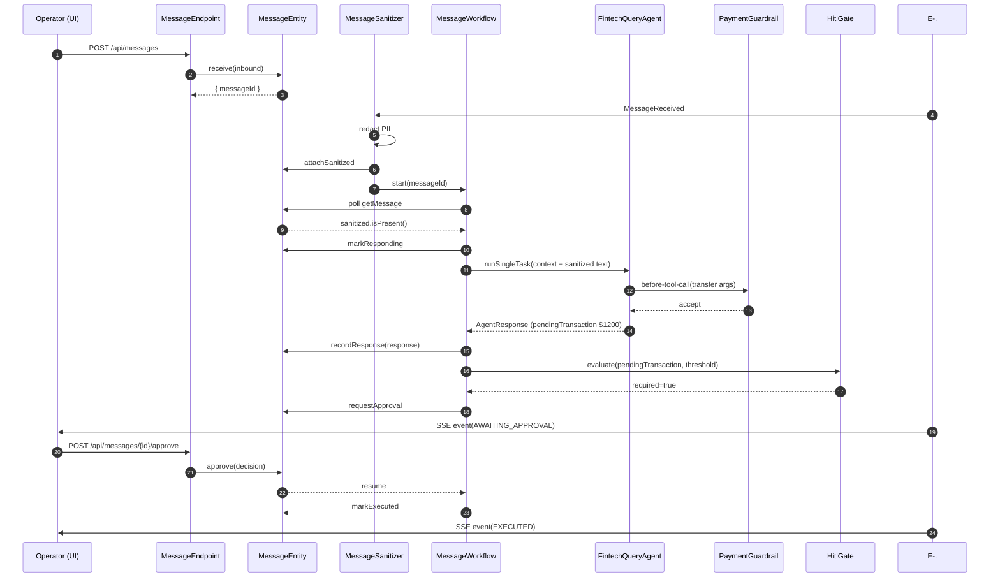
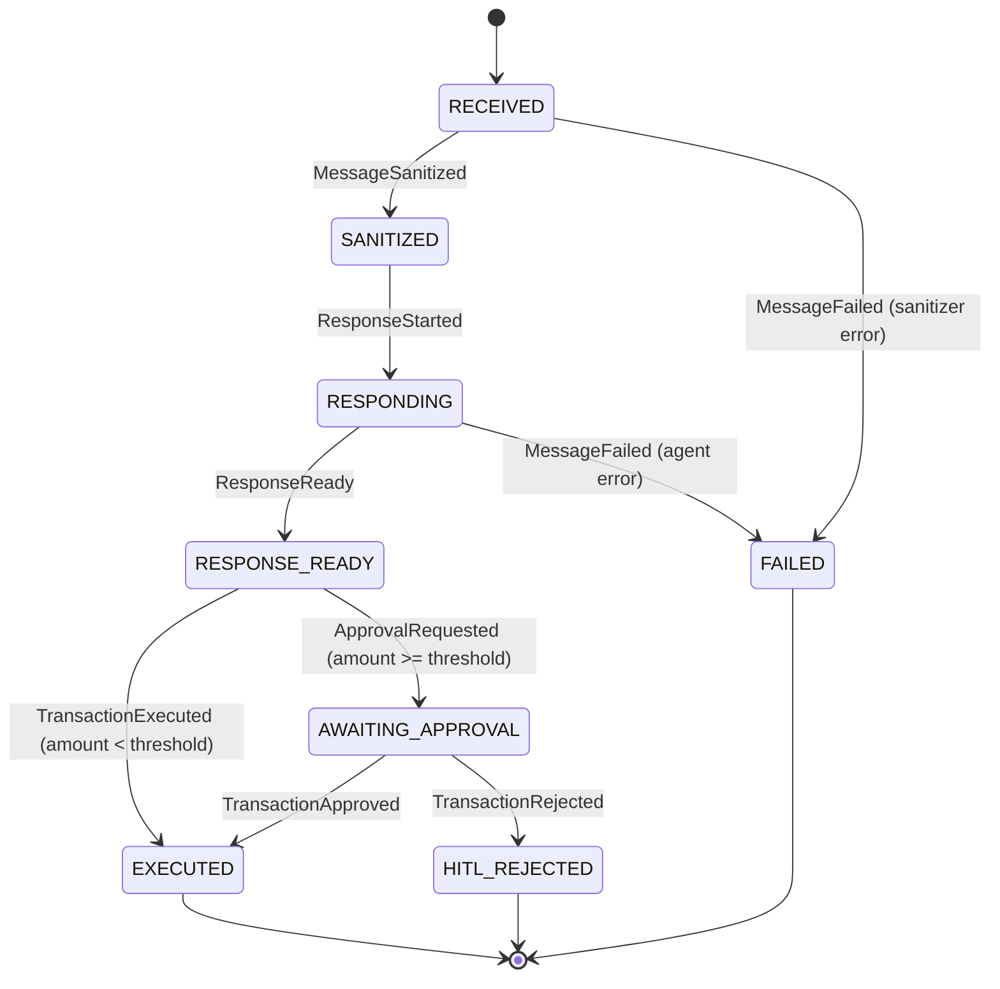
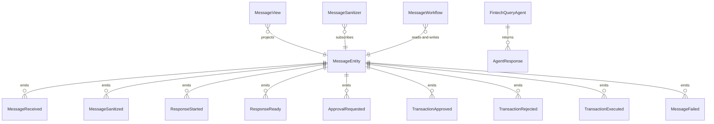

# PLAN — whatsapp-fintech-agent

Architectural sketch consumed by `/akka:plan` and rendered on the generated system's Architecture tab. The four mermaid diagrams below carry the theme variables and CSS overrides from Lesson 24; without them, state names render black-on-black and edge labels clip.

---

## Component graph

## Interaction sequence — J3 (large transfer, HITL approve)

## State machine — `MessageEntity`

## Entity model

## Component table — Java file targets

| Component | Path (generated) |
|---|---|
| `MessageEndpoint` | `api/MessageEndpoint.java` |
| `AppEndpoint` | `api/AppEndpoint.java` |
| `MessageEntity` | `application/MessageEntity.java` (state in `domain/Message.java`, events in `domain/MessageEvent.java`) |
| `MessageSanitizer` | `application/MessageSanitizer.java` |
| `MessageWorkflow` | `application/MessageWorkflow.java` |
| `FintechQueryAgent` | `application/FintechQueryAgent.java` (tasks in `application/MessageTasks.java`) |
| `PaymentGuardrail` | `application/PaymentGuardrail.java` |
| `HitlGate` | `application/HitlGate.java` |
| `MessageView` | `application/MessageView.java` |
| `MockModelProvider` (option-a only) | `application/MockModelProvider.java` |
| Bootstrap | `Bootstrap.java` |

## Concurrency notes

- **Per-step timeout**: `awaitSanitizedStep` 15 s, `respondStep` 60 s, `hitlStep` unbounded (workflow suspends pending operator input), `executeStep` 10 s, `error` 5 s. Default step recovery `maxRetries(2).failoverTo(MessageWorkflow::error)`. The 60 s on `respondStep` accommodates LLM latency (Lesson 4).
- **Idempotency**: every workflow uses `"msg-" + messageId` as the workflow id; `MessageSanitizer` redelivery is safe because `MessageEntity.attachSanitized` is event-version-guarded — a second sanitize attempt against an already-sanitized message is a no-op.
- **One agent per message**: the AutonomousAgent instance id is `"agent-" + messageId`. Each message gets its own conversation context. `maxIterationsPerTask(3)` caps guardrail-triggered retries at 3.
- **Guardrail-driven retry**: when `PaymentGuardrail` rejects a tool call, the rejection flows back into the agent loop as a structured error. The loop retries within `maxIterationsPerTask`; if all 3 iterations fail, the workflow fails over to `error` and the entity transitions to `FAILED`.
- **HITL is synchronous from the workflow's perspective**: `hitlStep` emits `ApprovalRequested` and the workflow suspends. The resume is triggered by an external command (`approve` / `reject`) arriving on the entity, which signals the workflow to continue via a callback. There is no polling loop in `hitlStep`.
- **No saga / no compensation**: payments in this blueprint are simulated. A real deployer would wrap `executeStep` in an idempotent external payment API call and handle compensation there.
