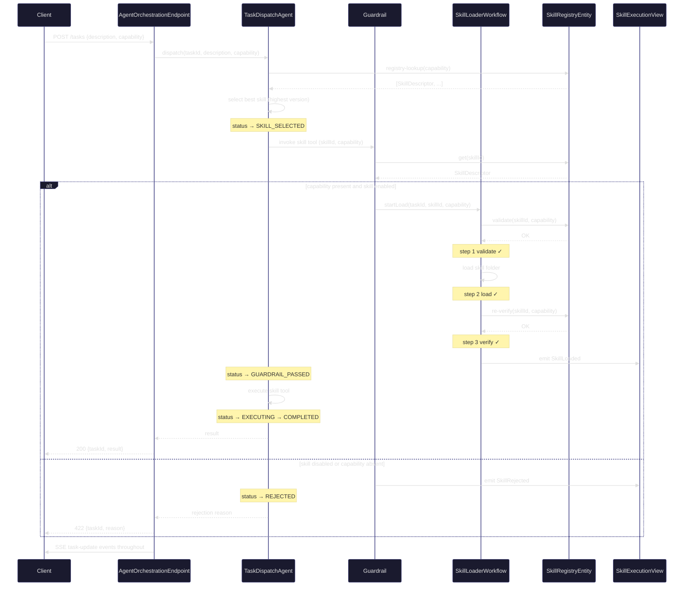
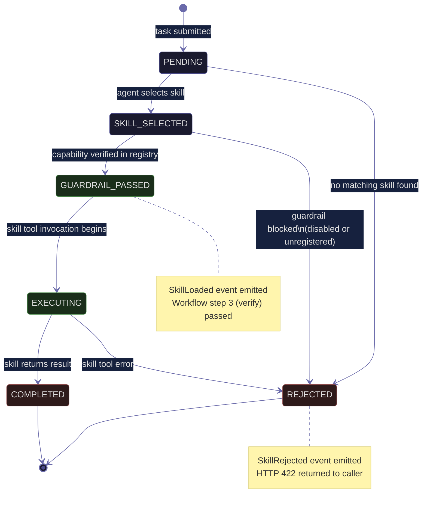
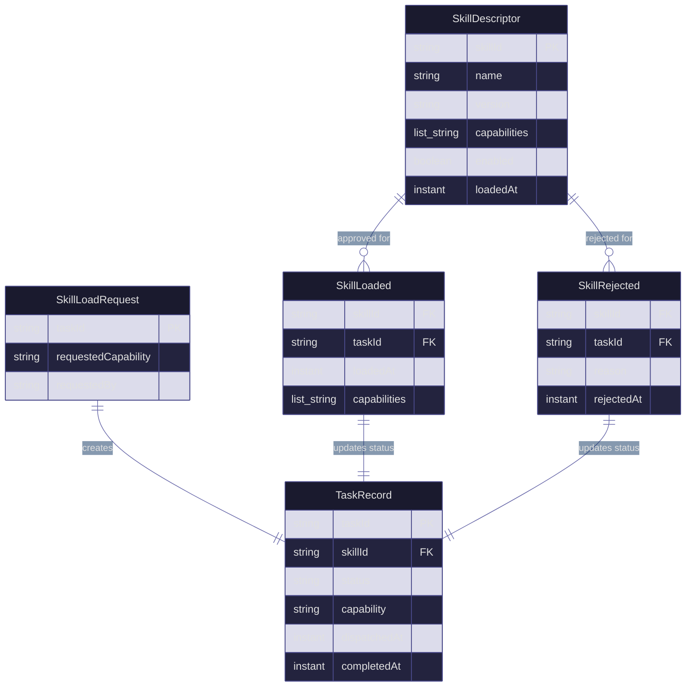

# Architecture Plan: Modular Agent Skills Loader

## Diagram 1: Component Graph

```mermaid
%%{init: {'theme':'base','themeVariables':{'primaryColor':'#1a1a2e','primaryTextColor':'#e0e0e0','primaryBorderColor':'#4a4a8a','lineColor':'#6a6aaa','secondaryColor':'#16213e','tertiaryColor':'#0f3460'}}}%%
graph TD
    Client([HTTP Client]):::external

    subgraph Endpoint Layer
        AOE[AgentOrchestrationEndpoint<br/>HTTP Endpoint]:::endpoint
    end

    subgraph Agent Layer
        TDA[TaskDispatchAgent<br/>Agent]:::agent
        GL{Guardrail<br/>before-tool-invocation}:::guardrail
    end

    subgraph Workflow Layer
        SLW[SkillLoaderWorkflow<br/>Workflow]:::workflow
    end

    subgraph Entity Layer
        SRE[SkillRegistryEntity<br/>Key-Value Entity]:::entity
    end

    subgraph View Layer
        SEV[SkillExecutionView<br/>View]:::view
    end

    Client -->|POST /tasks<br/>POST /skills<br/>PUT /skills/{id}/enable|disable| AOE
    Client -->|GET /tasks SSE| AOE
    AOE -->|dispatch task| TDA
    AOE -->|register/toggle skill| SRE
    AOE -->|query tasks| SEV
    TDA -->|registry-lookup tool| SRE
    TDA -->|invoke skill tool| GL
    GL -->|approved| SLW
    GL -->|rejected| TDA
    SLW -->|validate capability| SRE
    SLW -->|emit SkillLoaded / SkillRejected| SEV
    SRE -->|events| SEV

    classDef external fill:#0f3460,stroke:#4a4a8a,color:#e0e0e0
    classDef endpoint fill:#16213e,stroke:#4a4a8a,color:#e0e0e0
    classDef agent fill:#1a1a2e,stroke:#6a6aaa,color:#e0e0e0
    classDef guardrail fill:#2a1a3e,stroke:#9a4a9a,color:#e0e0e0
    classDef workflow fill:#1a2e1a,stroke:#4a8a4a,color:#e0e0e0
    classDef entity fill:#2e1a1a,stroke:#8a4a4a,color:#e0e0e0
    classDef view fill:#1a2e2e,stroke:#4a8a8a,color:#e0e0e0
```

---

## Diagram 2: Request Sequence



---

## Diagram 3: Task State Machine



---

## Diagram 4: Entity-Relationship


