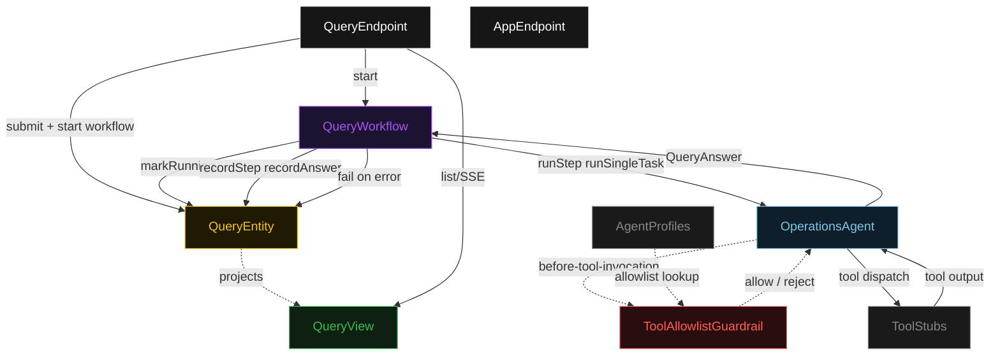
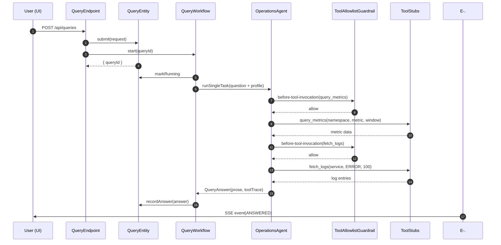
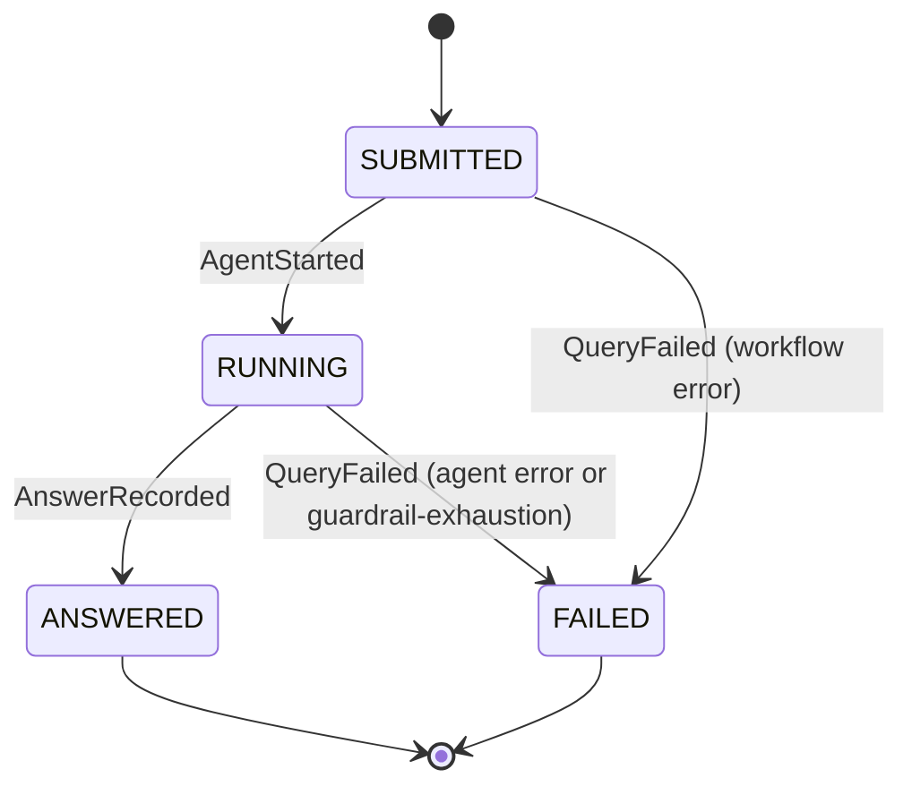
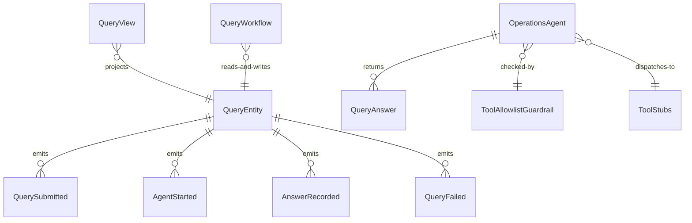

# PLAN — managed-harness-tool-use-agent

Architectural sketch consumed by `/akka:plan` and rendered on the generated system's Architecture tab. The four mermaid diagrams below carry the theme variables and CSS overrides from Lesson 24; without them, state names render black-on-black and edge labels clip.

---

## Component graph

## Interaction sequence — J1 (happy path)

## State machine — `QueryEntity`

## Entity model

## Component table — Java file targets

| Component | Path (generated) |
|---|---|
| `QueryEndpoint` | `api/QueryEndpoint.java` |
| `AppEndpoint` | `api/AppEndpoint.java` |
| `QueryEntity` | `application/QueryEntity.java` (state in `domain/Query.java`, events in `domain/QueryEvent.java`) |
| `QueryWorkflow` | `application/QueryWorkflow.java` |
| `OperationsAgent` | `application/OperationsAgent.java` (tasks in `application/QueryTasks.java`) |
| `ToolAllowlistGuardrail` | `application/ToolAllowlistGuardrail.java` |
| `AgentProfiles` | `application/AgentProfiles.java` |
| `ToolStubs` | `application/ToolStubs.java` |
| `QueryView` | `application/QueryView.java` |
| `MockModelProvider` (option-a only) | `application/MockModelProvider.java` |
| Bootstrap | `Bootstrap.java` |

## Concurrency notes

- **Per-step timeout**: `runStep` 90 s, `recordStep` 10 s, `error` 5 s. Default step recovery `maxRetries(2).failoverTo(QueryWorkflow::error)`. The 90 s on `runStep` accommodates multi-turn tool-calling latency (Lesson 4).
- **Idempotency**: every workflow uses `"query-" + queryId` as the workflow id; duplicate `POST /api/queries` calls with the same `queryId` resolve to no-ops at the entity level because `QuerySubmitted` is version-guarded.
- **One agent per query**: the AutonomousAgent instance id is `"ops-" + queryId`, giving each task its own tool-calling conversation context. `maxIterationsPerTask(8)` caps the tool-calling loop at eight turns.
- **Guardrail-driven recovery**: when `ToolAllowlistGuardrail` rejects a tool call, the rejection is returned as a structured error to the agent loop. The loop counts toward `maxIterationsPerTask`; the agent can attempt a different, allowed tool. If all 8 iterations are exhausted without a final answer, the workflow's `runStep` fails over to `error` and the entity transitions to `FAILED`.
- **Tool stubs are synchronous and deterministic**: `ToolStubs` methods are pure functions. No external service, no I/O. The same arguments always produce the same output. This keeps local-dev latency predictable and the single-agent invariant honest.
- **No saga / no compensation**: every step is either an append-only entity write or a single-task agent call. There is nothing external to roll back.
