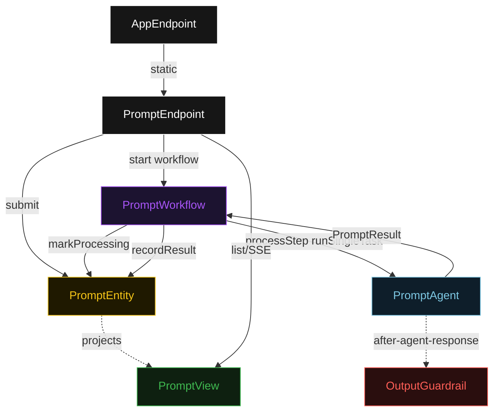
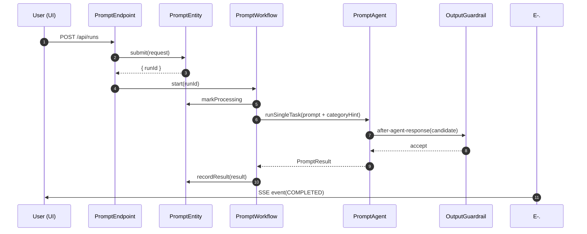
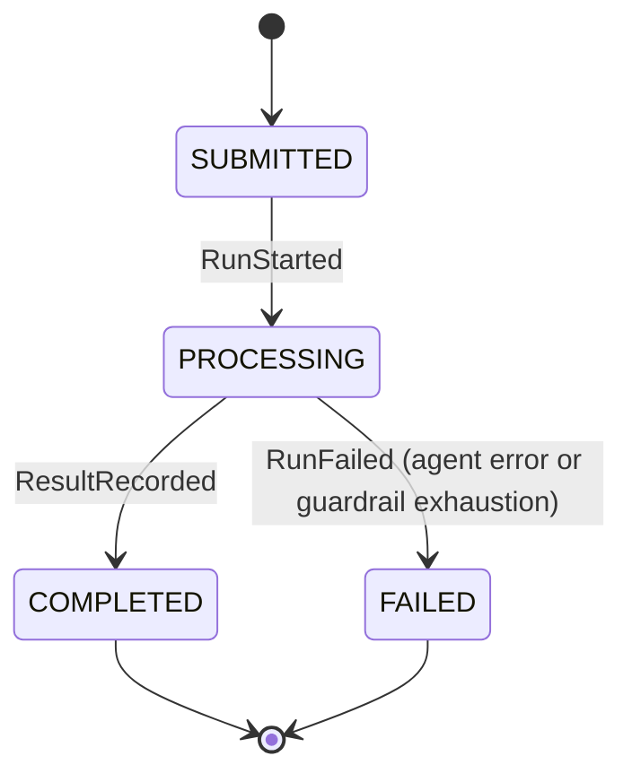
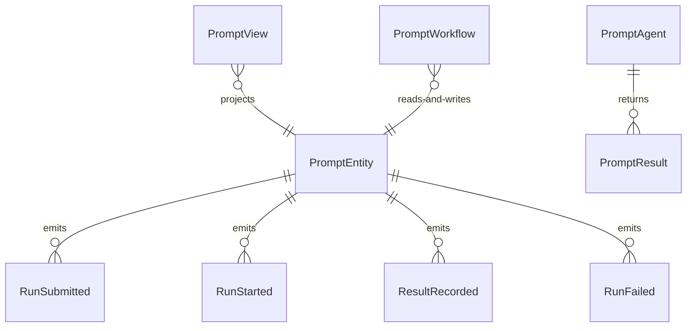

# PLAN — akka-basic

Architectural sketch consumed by `/akka:plan` and rendered on the generated system's Architecture tab. The four mermaid diagrams below carry the theme variables and CSS overrides from Lesson 24; without them, state names render black-on-black and edge labels clip.

---

## Component graph

## Interaction sequence — J1 (happy path)

## State machine — `PromptEntity`

## Entity model

## Component table — Java file targets

| Component | Path (generated) |
|---|---|
| `PromptEndpoint` | `api/PromptEndpoint.java` |
| `AppEndpoint` | `api/AppEndpoint.java` |
| `PromptEntity` | `application/PromptEntity.java` (state in `domain/Run.java`, events in `domain/RunEvent.java`) |
| `PromptWorkflow` | `application/PromptWorkflow.java` |
| `PromptAgent` | `application/PromptAgent.java` (tasks in `application/PromptTasks.java`) |
| `OutputGuardrail` | `application/OutputGuardrail.java` |
| `PromptView` | `application/PromptView.java` |
| `MockModelProvider` (option-a only) | `application/MockModelProvider.java` |
| Bootstrap | `Bootstrap.java` |

## Concurrency notes

- **Per-step timeout**: `processStep` 60 s, `error` 5 s. Default step recovery `maxRetries(2).failoverTo(PromptWorkflow::error)`. The 60 s on `processStep` accommodates LLM latency (Lesson 4).
- **Idempotency**: every workflow uses `"prompt-" + runId` as the workflow id; the endpoint is the sole entry point so double-submission is caught by entity command validation before the workflow starts.
- **One agent per run**: the AutonomousAgent instance id is `"agent-" + runId`, giving each task its own conversation context. The agent's `capability(...).maxIterationsPerTask(3)` caps guardrail-triggered retries at 3.
- **Guardrail-driven retry**: when `OutputGuardrail` rejects a candidate response the rejection is returned as a structured error to the agent loop. The loop counts toward `maxIterationsPerTask`; if all 3 iterations fail validation, `processStep` fails over to `error` and the entity transitions to `FAILED`.
- **No saga / no compensation**: `processStep` is a single task call. There is nothing external to roll back.
