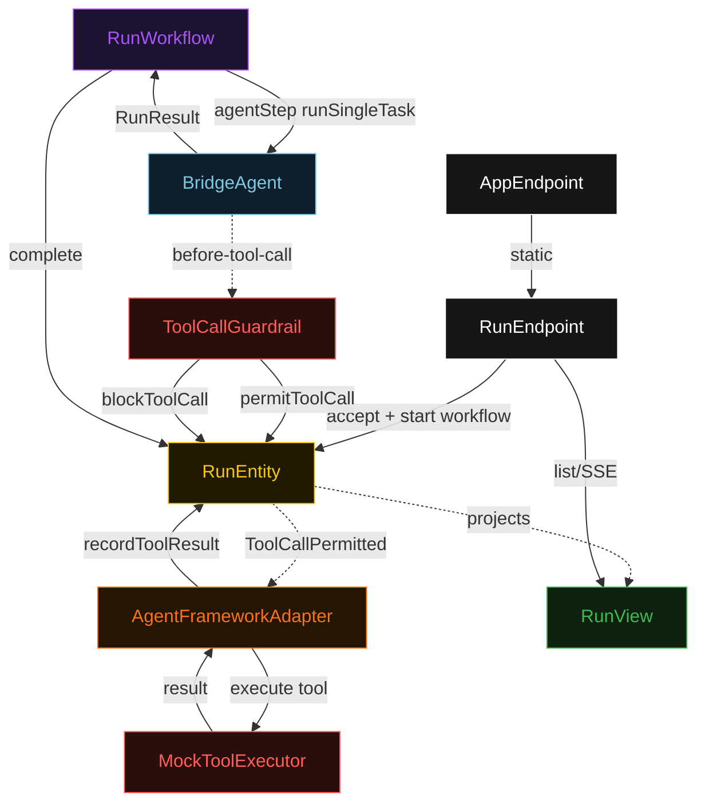
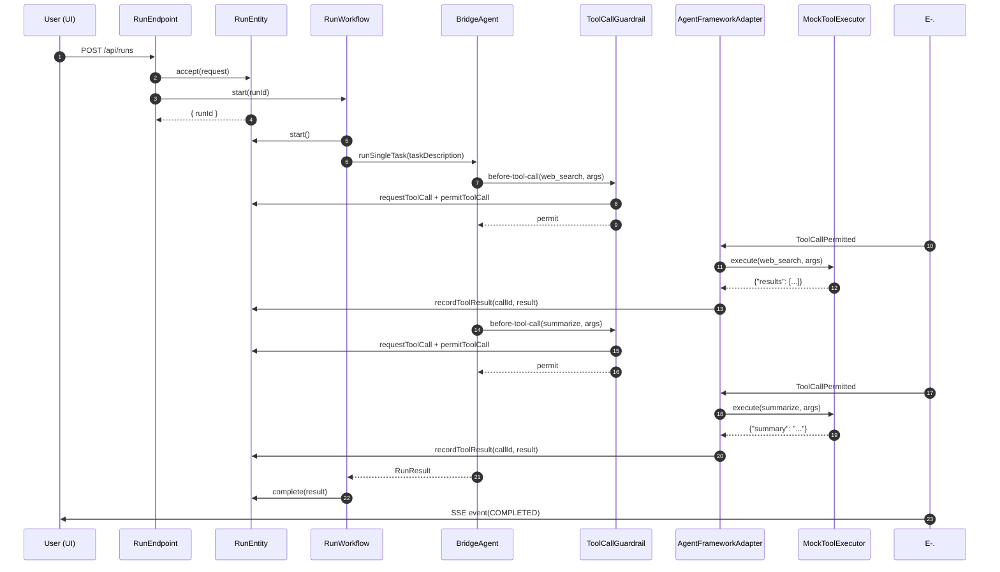
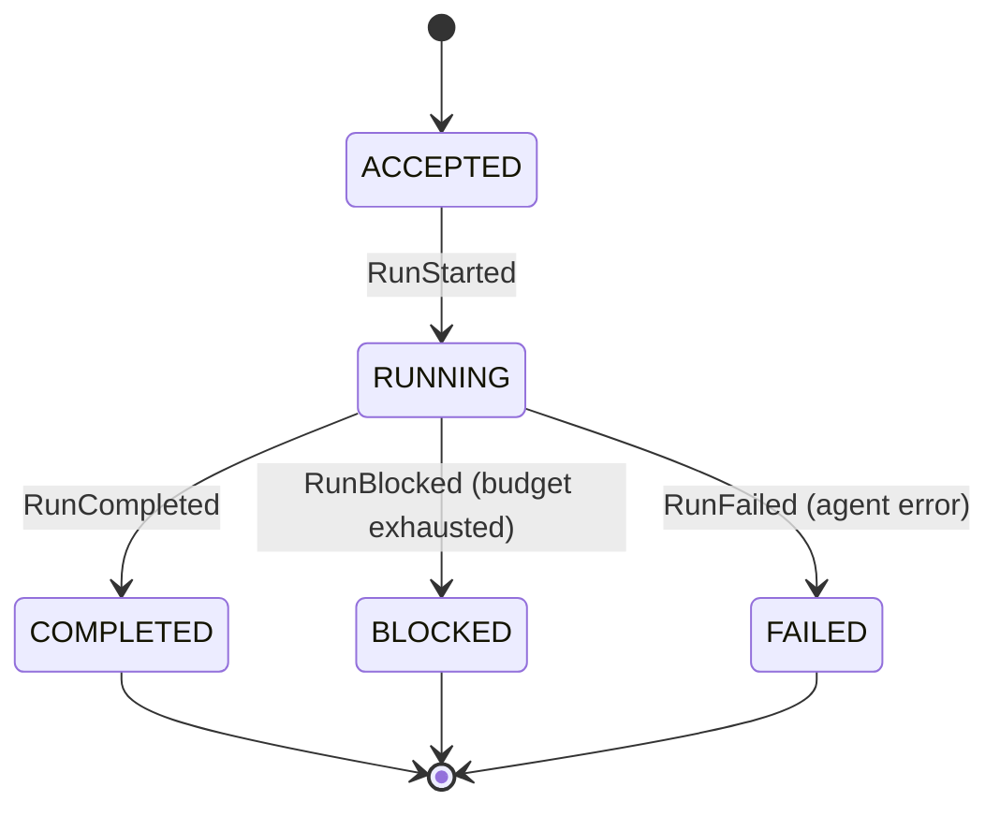
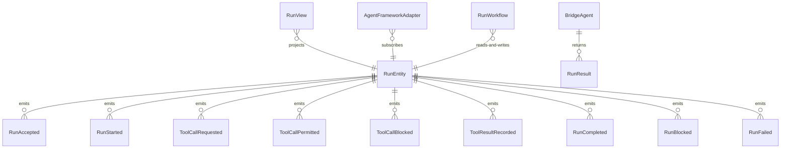

# PLAN — akka-bridge

Architectural sketch consumed by `/akka:plan` and rendered on the generated system's Architecture tab. The four mermaid diagrams below carry the theme variables and CSS overrides from Lesson 24; without them, state names render black-on-black and edge labels clip.

---

## Component graph

## Interaction sequence — J1 (happy path)

## State machine — `RunEntity`

## Entity model

## Component table — Java file targets

| Component | Path (generated) |
|---|---|
| `RunEndpoint` | `api/RunEndpoint.java` |
| `AppEndpoint` | `api/AppEndpoint.java` |
| `RunEntity` | `application/RunEntity.java` (state in `domain/Run.java`, events in `domain/RunEvent.java`) |
| `AgentFrameworkAdapter` | `application/AgentFrameworkAdapter.java` |
| `RunWorkflow` | `application/RunWorkflow.java` |
| `BridgeAgent` | `application/BridgeAgent.java` (tasks in `application/RunTasks.java`) |
| `ToolCallGuardrail` | `application/ToolCallGuardrail.java` |
| `MockToolExecutor` | `application/MockToolExecutor.java` |
| `RunView` | `application/RunView.java` |
| `MockModelProvider` (option-a only) | `application/MockModelProvider.java` |
| Bootstrap | `Bootstrap.java` |

## Concurrency notes

- **Per-step timeout**: `agentStep` 120 s, `completionStep` 10 s, `error` 10 s. Default step recovery `maxRetries(1).failoverTo(RunWorkflow::error)`. The 120 s on `agentStep` accommodates multi-turn agent execution with several tool calls (Lesson 4).
- **Idempotency**: every workflow uses `"run-" + runId` as the workflow id; `RunEndpoint` starts the workflow after the `accept` command succeeds. Re-submitting the same runId returns the existing run.
- **One agent per run**: the AutonomousAgent instance id is `"bridge-" + runId`, giving each task its own conversation context. The agent's `capability(...).maxIterationsPerTask(5)` caps iterations.
- **Guardrail-driven blocking**: when `ToolCallGuardrail` rejects a call for budget exhaustion, it emits `RunBlocked` before returning the rejection. The agent receives a tool error and the run is halted. Other rejection reasons (tool not permitted, schema mismatch) feed back as tool errors that allow the agent to adapt within its remaining iterations.
- **Adapter is event-driven**: `AgentFrameworkAdapter` subscribes to `ToolCallPermitted` events. This decouples the guardrail decision (synchronous, in-agent-loop) from the actual tool execution (async Consumer). The agent loop does not block on the Consumer — it receives the tool result via the task's tool-result callback.
- **No saga / no compensation**: tool calls are append-only records. There is nothing to roll back; a blocked or failed run retains its partial tool-call log for audit.
