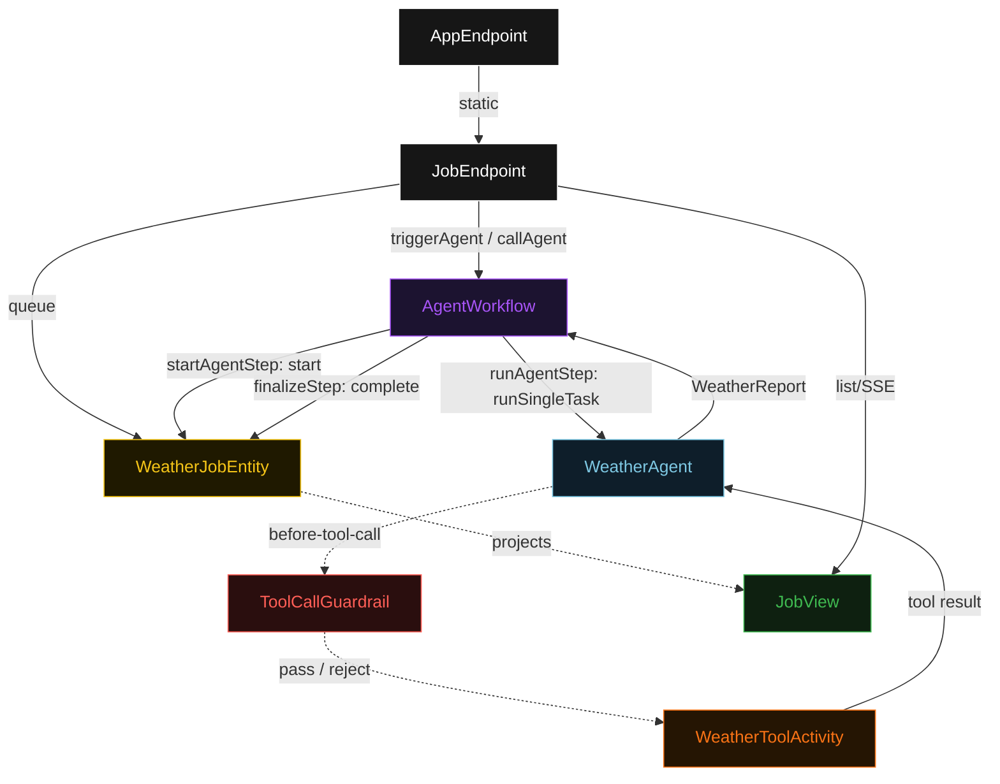
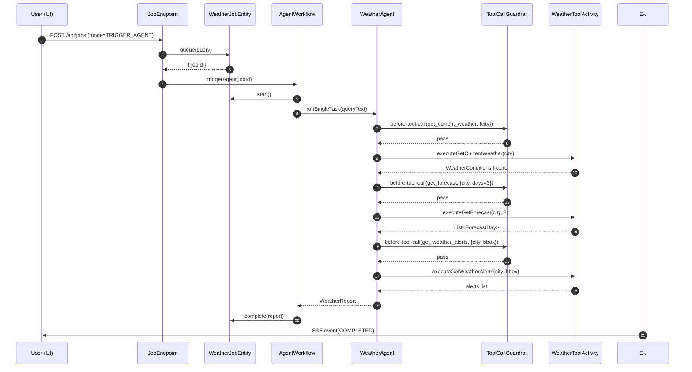
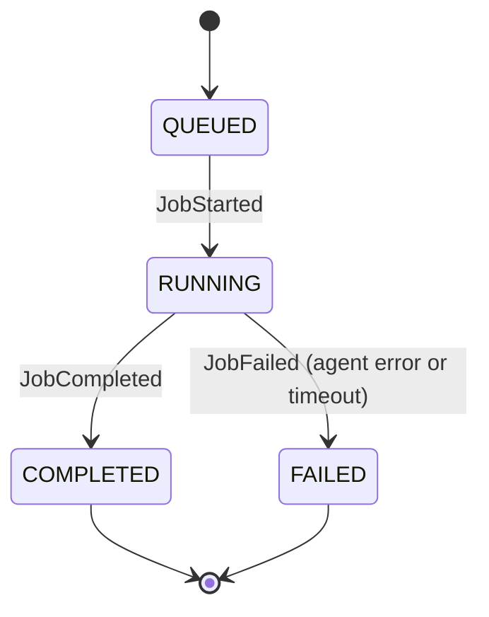
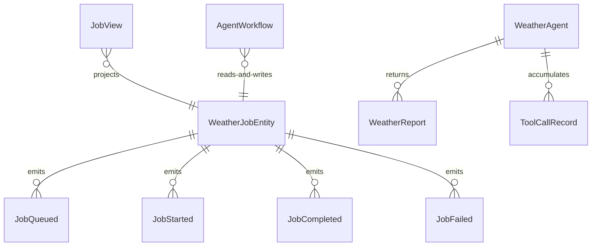

# PLAN — durable-weather-agent

Architectural sketch consumed by `/akka:plan` and rendered on the generated system's Architecture tab. The four mermaid diagrams below carry the theme variables and CSS overrides from Lesson 24; without them, state names render black-on-black and edge labels clip.

---

## Component graph

## Interaction sequence — J1 (trigger_agent happy path)

## State machine — `WeatherJobEntity`

## Entity model

## Component table — Java file targets

| Component | Path (generated) |
|---|---|
| `JobEndpoint` | `api/JobEndpoint.java` |
| `AppEndpoint` | `api/AppEndpoint.java` |
| `WeatherJobEntity` | `application/WeatherJobEntity.java` (state in `domain/WeatherJob.java`, events in `domain/WeatherJobEvent.java`) |
| `AgentWorkflow` | `application/AgentWorkflow.java` (inner `WeatherToolActivity`) |
| `WeatherAgent` | `application/WeatherAgent.java` (tasks in `application/WeatherTasks.java`) |
| `ToolCallGuardrail` | `application/ToolCallGuardrail.java` |
| `JobView` | `application/JobView.java` |
| `MockModelProvider` (option-a only) | `application/MockModelProvider.java` |
| Bootstrap | `Bootstrap.java` |

## Concurrency notes

- **Per-step timeout**: `startAgentStep` 10 s, `runAgentStep` 120 s, `finalizeStep` 10 s, `error` 5 s. Default step recovery `maxRetries(2).failoverTo(AgentWorkflow::error)`. The 120 s on `runAgentStep` accommodates multiple sequential tool calls plus LLM latency (Lesson 4).
- **Idempotency**: every workflow uses `"agent-" + jobId` as the workflow id; `WeatherJobEntity.start` is guarded — a second `JobStarted` event on an already-running job is a no-op.
- **One agent per job**: the AutonomousAgent instance id is `"weather-" + jobId`, giving each task its own conversation context. `capability(...).maxIterationsPerTask(4)` accommodates guardrail-blocked tool calls that consume an iteration.
- **Guardrail-driven retry**: when `ToolCallGuardrail` rejects a tool call, the rejection is returned as `{ tool, argument, reason }` to the agent loop. The loop counts toward `maxIterationsPerTask`; if all 4 iterations exhaust the budget, the workflow's `runAgentStep` fails over to `error` and the entity transitions to `FAILED`.
- **call_agent composition**: a parent workflow step calls `asyncCall(AgentWorkflow::callAgent, childJobId)`. The parent step suspends until the child workflow's `done` transition fires. Both the parent and child job IDs are tracked independently in `WeatherJobEntity`; the UI shows them as separate cards.
- **Activity durability**: each `WeatherToolActivity` method is an Akka workflow activity, so if the process crashes after the HTTP call but before the agent receives the response, the activity replays without re-issuing the HTTP call (the result is stored in the workflow journal).
- **No saga / no compensation**: tool calls are idempotent fixtures in dev mode. In production, a deployer would replace the fixture calls with real HTTP and decide whether the tool is idempotent; if not, a deduplication key should be passed to the activity.
