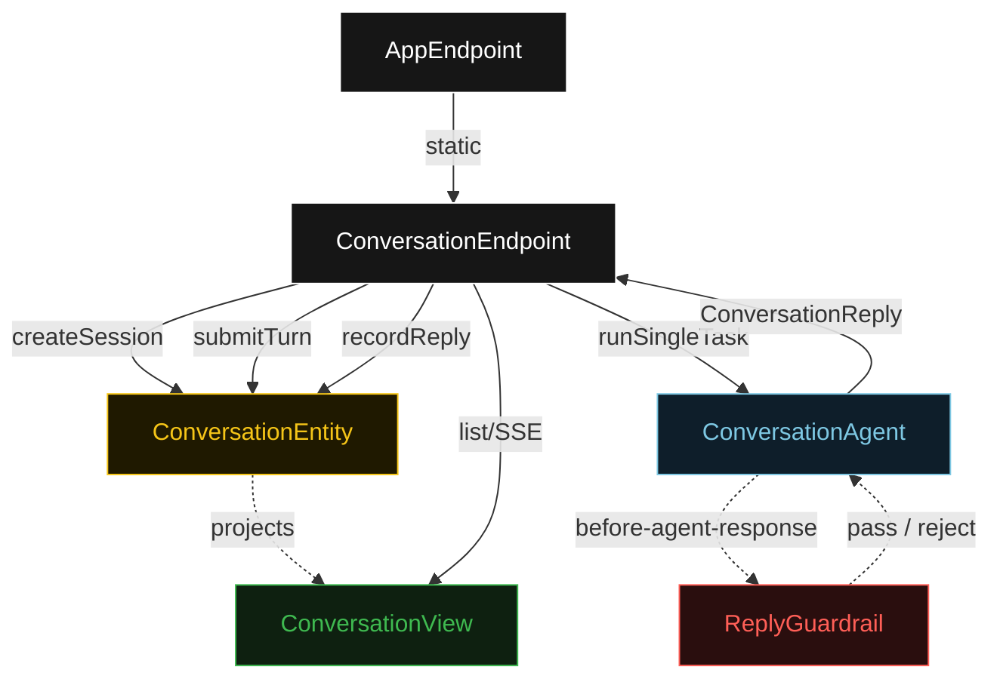
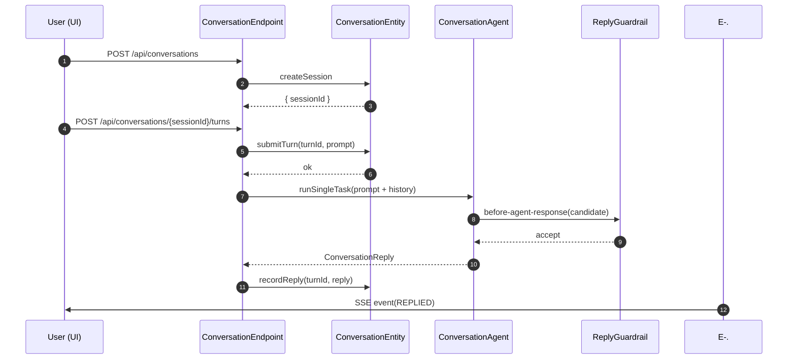
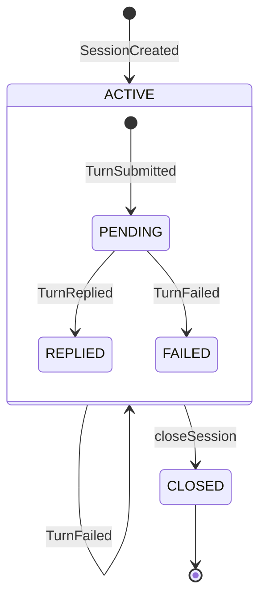
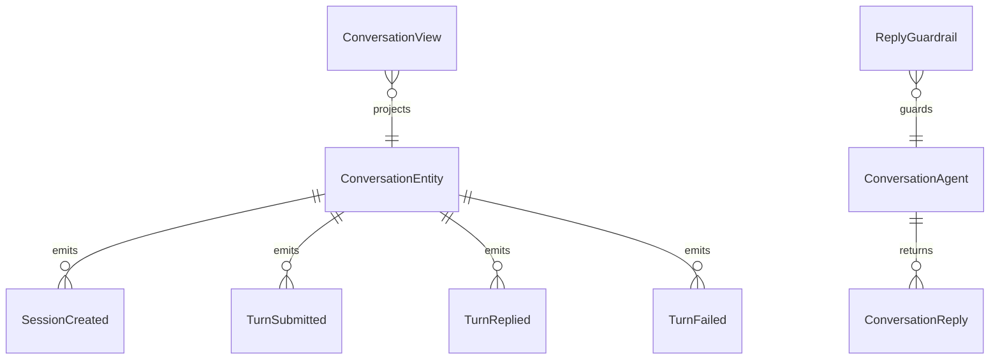

# PLAN — akka-llm-client-basic

Architectural sketch consumed by `/akka:plan` and rendered on the generated system's Architecture tab. The four mermaid diagrams below carry the theme variables and CSS overrides from Lesson 24; without them, state names render black-on-black and edge labels clip.

---

## Component graph

## Interaction sequence — J1 (happy path)

## State machine — `ConversationEntity` (session + turn)

## Entity model

## Component table — Java file targets

| Component | Path (generated) |
|---|---|
| `ConversationEndpoint` | `api/ConversationEndpoint.java` |
| `AppEndpoint` | `api/AppEndpoint.java` |
| `ConversationEntity` | `application/ConversationEntity.java` (state in `domain/ConversationSession.java`, events in `domain/ConversationEvent.java`) |
| `ConversationAgent` | `application/ConversationAgent.java` (tasks in `application/ConversationTasks.java`) |
| `ReplyGuardrail` | `application/ReplyGuardrail.java` |
| `ConversationView` | `application/ConversationView.java` |
| `MockModelProvider` (option-a only) | `application/MockModelProvider.java` |
| Bootstrap | `Bootstrap.java` |

## Concurrency notes

- **Inline agent call**: the agent is invoked directly from `ConversationEndpoint`'s POST `/turns` handler via `componentClient.forAutonomousAgent(...).runSingleTask(...)`. No intermediate Workflow is needed — the handler blocks on the result with a 30 s server-side timeout. This is the minimal-path design for the baseline.
- **Per-session agent context**: the AutonomousAgent instance id is `"agent-" + sessionId`, giving each session its own conversation context. Prior turns are formatted and passed as instruction text on each call; the agent does not maintain its own internal turn log independently of the entity.
- **Guardrail-driven retry**: when `ReplyGuardrail` rejects a candidate response, the rejection is returned as a structured error to the agent loop. The loop counts toward `maxIterationsPerTask(3)`; if all 3 iterations fail the guardrail, the endpoint's agent call throws, the handler calls `failTurn(reason)`, and the turn transitions to `FAILED`.
- **Idempotency**: `createSession` is the only minting operation; subsequent `submitTurn` calls on the same session append turns. The entity guards against duplicate `turnId` submissions.
- **No saga / no compensation**: the entity is append-only and every agent call is a single task. There is nothing external to roll back.
- **View query**: `ConversationView` exposes a single `getAllSessions` query; the UI filters and sorts client-side. No enum column indexing is attempted (Lesson 2).
