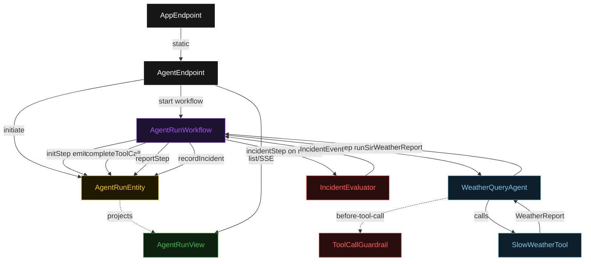
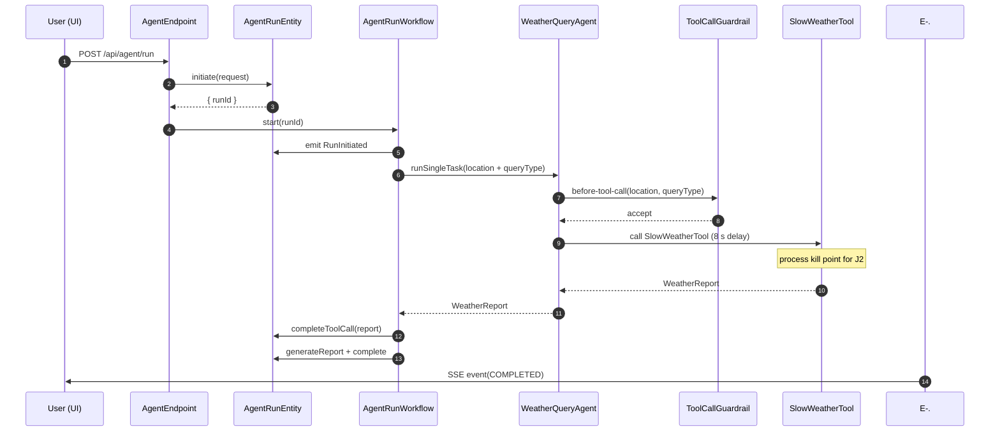
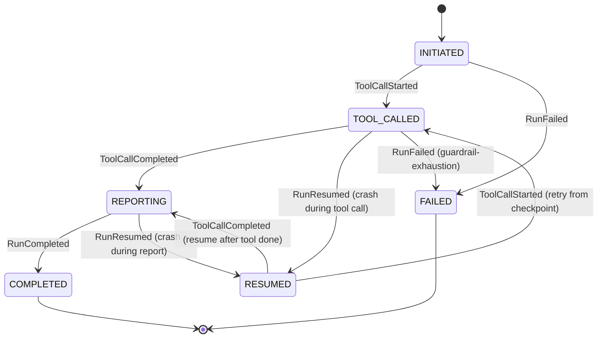
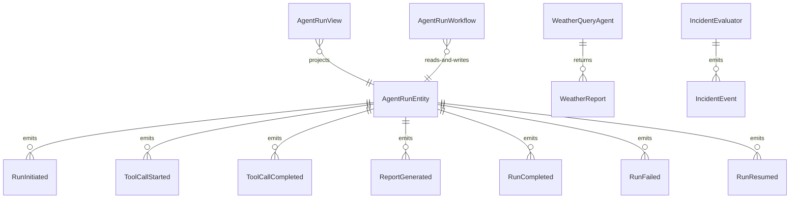

# PLAN — akka-resumable-agent-http

Architectural sketch consumed by `/akka:plan` and rendered on the generated system's Architecture tab. The four mermaid diagrams below carry the theme variables and CSS overrides from Lesson 24; without them, state names render black-on-black and edge labels clip.

---

## Component graph

## Interaction sequence — J1 (happy path)

## State machine — `AgentRunEntity`

## Entity model

## Component table — Java file targets

| Component | Path (generated) |
|---|---|
| `AgentEndpoint` | `api/AgentEndpoint.java` |
| `AppEndpoint` | `api/AppEndpoint.java` |
| `AgentRunEntity` | `application/AgentRunEntity.java` (state in `domain/AgentRun.java`, events in `domain/AgentRunEvent.java`) |
| `AgentRunWorkflow` | `application/AgentRunWorkflow.java` |
| `WeatherQueryAgent` | `application/WeatherQueryAgent.java` (tasks in `application/AgentTasks.java`) |
| `SlowWeatherTool` | `application/SlowWeatherTool.java` |
| `ToolCallGuardrail` | `application/ToolCallGuardrail.java` |
| `IncidentEvaluator` | `application/IncidentEvaluator.java` |
| `AgentRunView` | `application/AgentRunView.java` |
| `MockModelProvider` (option-a only) | `application/MockModelProvider.java` |
| Bootstrap | `Bootstrap.java` |

## Concurrency notes

- **Per-step timeout**: `initStep` 5 s, `toolCallStep` 120 s, `reportStep` 30 s, `incidentStep` 10 s, `error` 5 s. Default step recovery `maxRetries(2).failoverTo(AgentRunWorkflow::error)`. The 120 s on `toolCallStep` accommodates the configured tool delay plus LLM round-trip (Lesson 4).
- **Crash-resume checkpoint**: Akka Workflow persists each step's completion boundary. On restart the runtime replays from the last persisted step. The key invariant: once `toolCallStep` lands `ToolCallCompleted`, a crash in `reportStep` resumes at `reportStep`, not at `toolCallStep`. The agent and tool are NOT re-invoked.
- **Resume detection**: on `AgentRunWorkflow.onInit`, if `AgentRunEntity.getRun()` shows `status == TOOL_CALLED` or `status == REPORTING`, the workflow emits `RunResumed` and increments `resumeCount` before proceeding. This makes the resume observable without any external coordinator.
- **Idempotency**: workflow id is `"run-" + runId`; starting the workflow twice for the same `runId` is a no-op. `AgentRunEntity` commands are event-version-guarded so duplicate deliveries do not produce duplicate events.
- **Guardrail-driven retry**: when `ToolCallGuardrail` rejects a tool invocation, the agent loop consumes one iteration and retries the tool call with corrected arguments. If all 3 iterations fail, `toolCallStep` fails over to `error` and the entity transitions to `FAILED`.
- **One agent per run**: the AutonomousAgent instance id is `"agent-" + runId`, giving each run its own conversation context. The agent's `capability(...).maxIterationsPerTask(3)` caps guardrail-triggered retries at 3.
- **No saga / no compensation**: every step is append-only. The `SlowWeatherTool` is idempotent (same inputs return deterministically ordered mock outputs) so retry after crash is safe.
