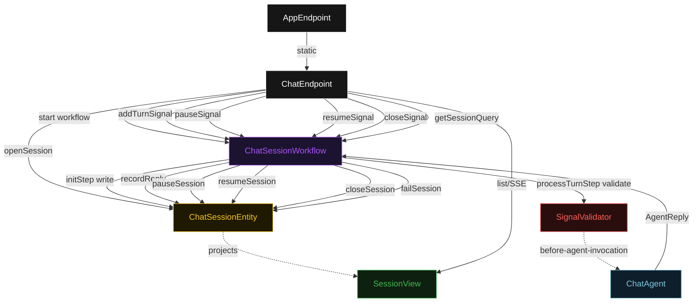
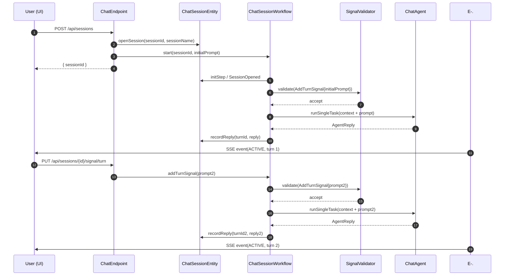
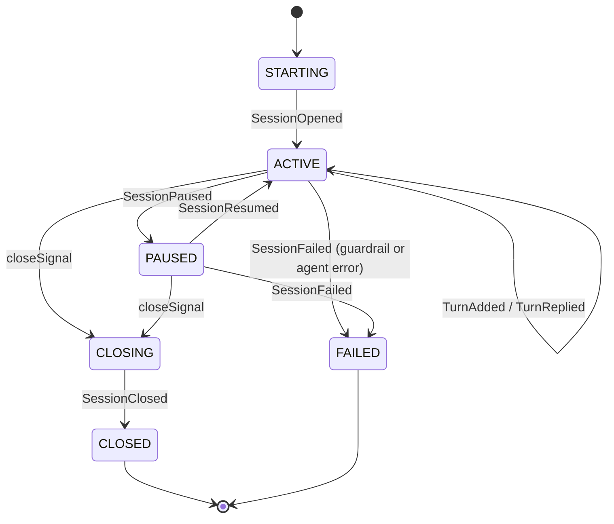
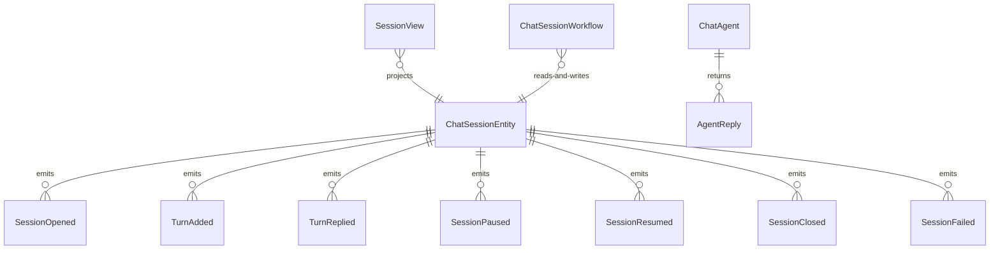

# PLAN — with Signals & Queries

Architectural sketch consumed by `/akka:plan` and rendered on the generated system's Architecture tab. The four mermaid diagrams below carry the theme variables and CSS overrides from Lesson 24; without them, state names render black-on-black and edge labels clip.

---

## Component graph

## Interaction sequence — J1 (happy path, two turns)

## State machine — `ChatSessionEntity`

## Entity model

## Component table — Java file targets

| Component | Path (generated) |
|---|---|
| `ChatEndpoint` | `api/ChatEndpoint.java` |
| `AppEndpoint` | `api/AppEndpoint.java` |
| `ChatSessionEntity` | `application/ChatSessionEntity.java` (state in `domain/SessionState.java`, events in `domain/SessionEvent.java`) |
| `ChatSessionWorkflow` | `application/ChatSessionWorkflow.java` |
| `ChatAgent` | `application/ChatAgent.java` (tasks in `application/ChatTasks.java`) |
| `SignalValidator` | `application/SignalValidator.java` |
| `SessionView` | `application/SessionView.java` |
| `MockModelProvider` (option-a only) | `application/MockModelProvider.java` |
| Bootstrap | `Bootstrap.java` |

## Concurrency notes

- **Per-step timeouts**: `initStep` 5 s, `processTurnStep` 60 s, `pausedStep` 300 s, `closeStep` 5 s, `failStep` 5 s. Default step recovery `maxRetries(2).failoverTo(ChatSessionWorkflow::failStep)`. The 60 s on `processTurnStep` accommodates LLM latency (Lesson 4).
- **Idempotency**: the workflow uses `"session-" + sessionId` as the workflow id; a duplicate `POST /api/sessions` with the same id is rejected at the entity level before the workflow starts.
- **One agent per session**: the AutonomousAgent instance id is `"chat-" + sessionId`. Each session has its own conversation context. `capability(...).maxIterationsPerTask(3)` caps retries.
- **Guardrail-driven rejection**: when `SignalValidator` rejects an inbound signal, the rejection propagates as a failed workflow step. The entity records `SessionFailed`; the UI displays the structured error message.
- **Query is side-effect-free**: `getSessionQuery()` reads the workflow's in-memory `SessionState` and returns it. It does not call `componentClient`, emit an event, or advance a step. The caller bears no latency beyond the workflow actor's mailbox processing time.
- **HITL pause window**: the `pausedStep` has a 300 s timeout. If no `resumeSignal` or `closeSignal` arrives within 5 minutes, the step times out with the configured recovery; the entity transitions to `FAILED`. Deployers extending this blueprint for production should increase the timeout or implement a durable pause pattern.
- **No saga / no compensation**: every step is either a pure read, an append-only entity write, or a single-task agent call with a bounded iteration budget.
