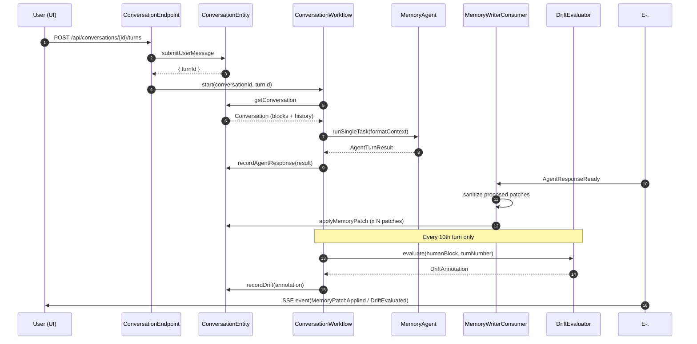
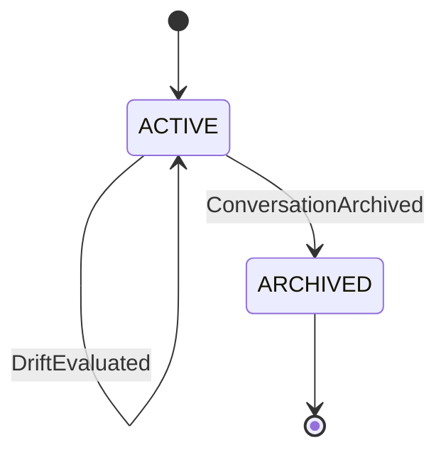
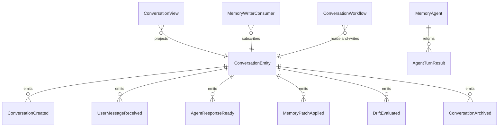

# PLAN — akka-stateful-memory-agent

Architectural sketch consumed by `/akka:plan` and rendered on the generated system's Architecture tab. The four mermaid diagrams below carry the theme variables and CSS overrides from Lesson 24; without them, state names render black-on-black and edge labels clip.

---

## Component graph

```mermaid
flowchart TB
  classDef agent fill:#0e1e2a,stroke:#7EC8E3,color:#7EC8E3;
  classDef wf fill:#1c1330,stroke:#A855F7,color:#A855F7;
  classDef ese fill:#1f1900,stroke:#F5C518,color:#F5C518;
  classDef view fill:#0e2010,stroke:#3fb950,color:#3fb950;
  classDef cons fill:#251503,stroke:#F97316,color:#F97316;
  classDef ep fill:#161616,stroke:#fff,color:#fff;
  classDef support fill:#2a0e0e,stroke:#ff5f57,color:#ff5f57;

  API[ConversationEndpoint]:::ep
  Entity[ConversationEntity]:::ese
  Writer[MemoryWriterConsumer]:::cons
  WF[ConversationWorkflow]:::wf
  Agent[MemoryAgent]:::agent
  Drift[DriftEvaluator]:::support
  View[ConversationView]:::view
  App[AppEndpoint]:::ep

  API -->|createConversation / submitUserMessage| Entity
  API -->|start workflow| WF
  Entity -.->|AgentResponseReady| Writer
  Writer -->|applyMemoryPatch (sanitized)| Entity
  WF -->|callAgentStep runSingleTask| Agent
  Agent -->|AgentTurnResult| WF
  WF -->|recordAgentResponse| Entity
  WF -->|applyMemoryStep waits| Entity
  WF -->|evalStep every 10 turns| Drift
  Drift -->|DriftAnnotation| WF
  WF -->|recordDrift| Entity
  Entity -.->|projects| View
  API -->|list / SSE| View
  App -->|static| API
```

## Interaction sequence — J1 (happy path, single turn)



## State machine — `ConversationEntity`



## Entity model



## Component table — Java file targets

| Component | Path (generated) |
|---|---|
| `ConversationEndpoint` | `api/ConversationEndpoint.java` |
| `AppEndpoint` | `api/AppEndpoint.java` |
| `ConversationEntity` | `application/ConversationEntity.java` (state in `domain/Conversation.java`, events in `domain/ConversationEvent.java`) |
| `MemoryWriterConsumer` | `application/MemoryWriterConsumer.java` |
| `ConversationWorkflow` | `application/ConversationWorkflow.java` |
| `MemoryAgent` | `application/MemoryAgent.java` (tasks in `application/AgentTasks.java`) |
| `DriftEvaluator` | `application/DriftEvaluator.java` |
| `ConversationView` | `application/ConversationView.java` |
| `MockModelProvider` (option-a only) | `application/MockModelProvider.java` |
| Bootstrap | `Bootstrap.java` |

## Concurrency notes

- **Per-step timeout**: `callAgentStep` 60 s, `applyMemoryStep` 15 s, `evalStep` 5 s, `error` 5 s. Default step recovery `maxRetries(2).failoverTo(ConversationWorkflow::error)`. The 60 s on `callAgentStep` accommodates LLM latency (Lesson 4).
- **Idempotency**: `MemoryWriterConsumer` can redeliver `AgentResponseReady` events; `ConversationEntity.applyMemoryPatch` is event-version-guarded and will not apply the same patch twice if the event-source log already contains it.
- **One agent per conversation**: the AutonomousAgent instance id is `"agent-" + conversationId`, which gives each conversation its own task context. The agent's `capability(...).maxIterationsPerTask(3)` allows the agent to revise its patches if an earlier iteration produces a malformed `AgentTurnResult`.
- **Drift evaluation is conditional**: `ConversationWorkflow.evalStep` fires only when `turnNumber % 10 == 0`. On other turns the step is skipped; `latestDrift` on the conversation state retains its last value until the next eval fires.
- **Eval is synchronous and deterministic**: `DriftEvaluator` runs in-process inside `evalStep`. No LLM call — the same human block content always produces the same risk score. This preserves the single-agent invariant.
- **Memory patch ordering**: patches from a single turn are applied sequentially in list order. If the agent proposes overlapping patches to the same block, the last patch wins — the block is overwritten, not merged character-by-character. The agent prompt instructs it to treat each proposed patch as a full rewrite of the block's content.
- **No saga / no compensation**: every step is either a pure read, an append-only event write, or a single-task agent call. There is nothing external to roll back.
