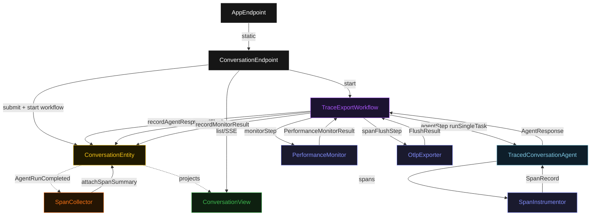
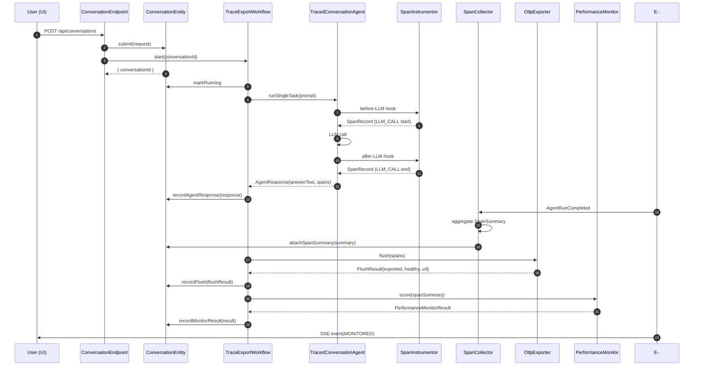
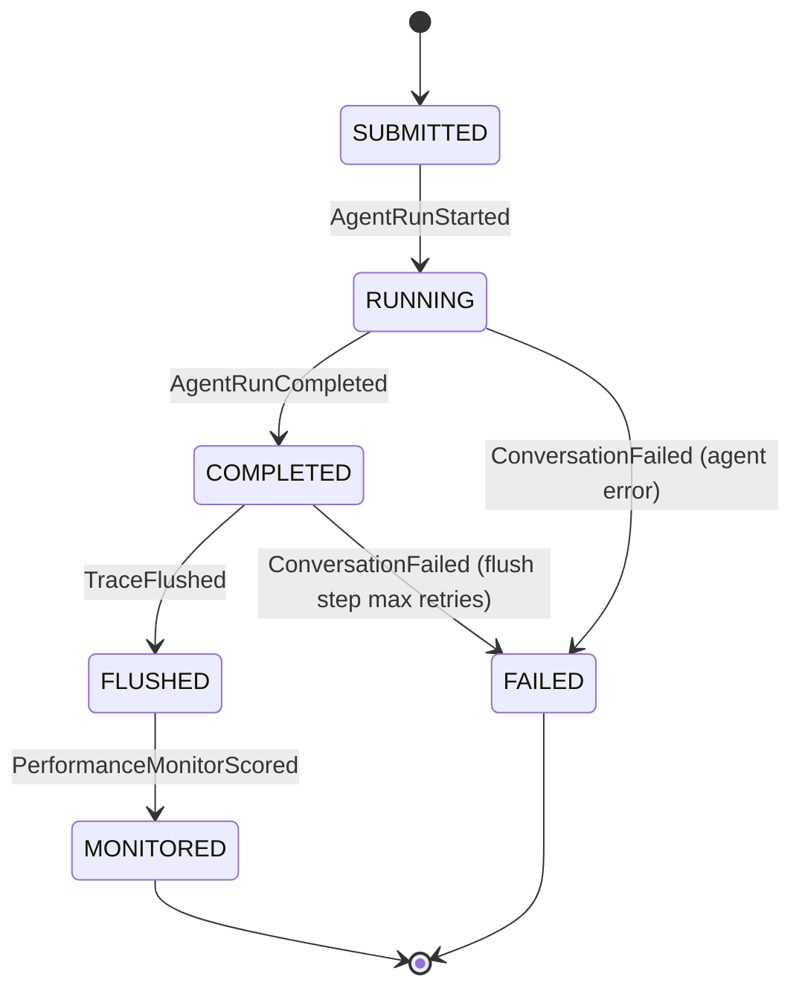
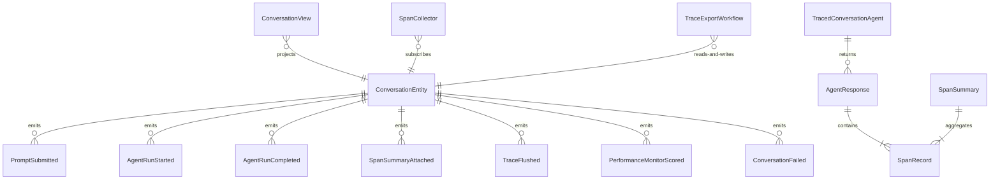

# PLAN — traced-agent-otel

Architectural sketch consumed by `/akka:plan` and rendered on the generated system's Architecture tab. The four mermaid diagrams below carry the theme variables and CSS overrides from Lesson 24; without them, state names render black-on-black and edge labels clip.

---

## Component graph

## Interaction sequence — J1 (happy path)

## State machine — `ConversationEntity`

## Entity model

## Component table — Java file targets

| Component | Path (generated) |
|---|---|
| `ConversationEndpoint` | `api/ConversationEndpoint.java` |
| `AppEndpoint` | `api/AppEndpoint.java` |
| `ConversationEntity` | `application/ConversationEntity.java` (state in `domain/Conversation.java`, events in `domain/ConversationEvent.java`) |
| `SpanCollector` | `application/SpanCollector.java` |
| `TraceExportWorkflow` | `application/TraceExportWorkflow.java` |
| `TracedConversationAgent` | `application/TracedConversationAgent.java` (tasks in `application/ConversationTasks.java`) |
| `SpanInstrumentor` | `application/SpanInstrumentor.java` |
| `PerformanceMonitor` | `application/PerformanceMonitor.java` |
| `OtlpExporter` / `ExporterPort` | `application/OtlpExporter.java`, `application/ExporterPort.java` |
| `ConversationView` | `application/ConversationView.java` |
| `MockModelProvider` (option-a only) | `application/MockModelProvider.java` |
| Bootstrap | `Bootstrap.java` |

## Concurrency notes

- **Per-step timeout**: `agentStep` 90 s, `spanFlushStep` 10 s, `monitorStep` 5 s, `error` 5 s. Default step recovery `maxRetries(2).failoverTo(TraceExportWorkflow::error)`. The 90 s on `agentStep` accommodates LLM latency for multi-turn conversations (Lesson 4).
- **Non-blocking flush**: `spanFlushStep` advances to `monitorStep` even when `exporterHealthy = false`. The FlushResult carries the failure detail; the deployer monitor reads it without stalling the conversation lifecycle.
- **Idempotency**: `"conv-" + conversationId` is the workflow id. `SpanCollector.attachSpanSummary` is event-version-guarded — a redelivery of `AgentRunCompleted` is a no-op if a `SpanSummaryAttached` event already exists.
- **One agent per conversation**: the AutonomousAgent instance id is `"agent-" + conversationId`. Each conversation gets its own context; `maxIterationsPerTask(5)` gives the agent room for multi-turn tool use within a single task.
- **SpanInstrumentor is not an Akka component**: it is a plain Java helper. The agent holds a reference and calls it synchronously. No component client, no entity state — just a builder that produces `SpanRecord` POJOs.
- **PerformanceMonitor is synchronous and deterministic**: runs in-process inside `monitorStep`. No LLM call. Same `SpanSummary` always produces the same score — the single-agent invariant holds.
