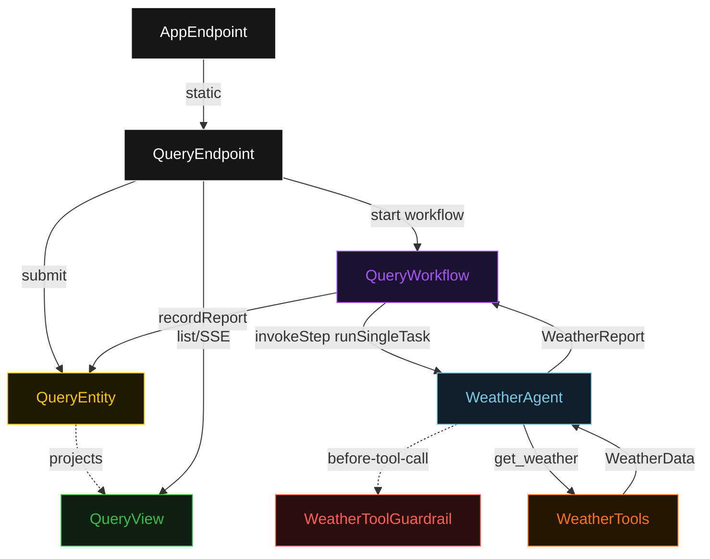
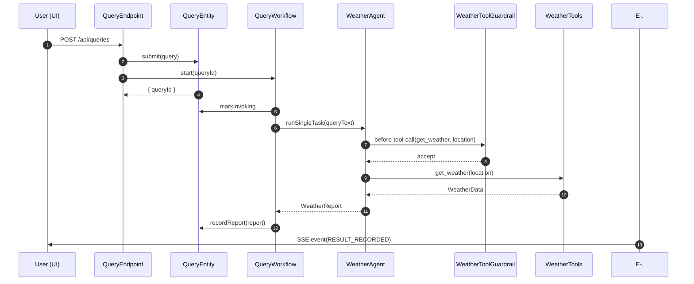
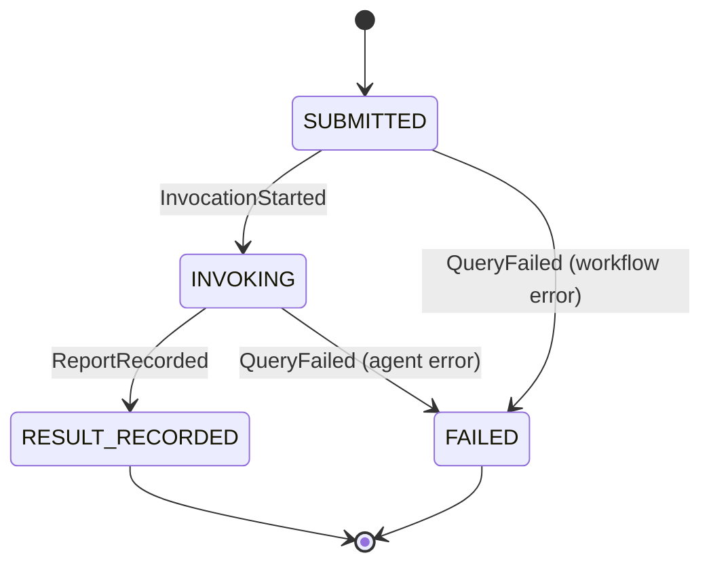
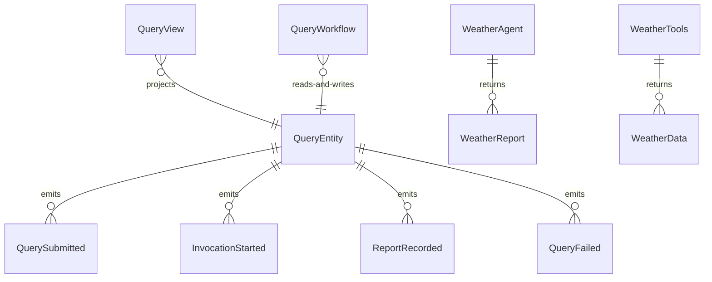

# PLAN — any-llm-tool-agent

Architectural sketch consumed by `/akka:plan` and rendered on the generated system's Architecture tab. The four mermaid diagrams below carry the theme variables and CSS overrides from Lesson 24; without them, state names render black-on-black and edge labels clip.

---

## Component graph

## Interaction sequence — J1 (happy path)

## State machine — `QueryEntity`

## Entity model

## Component table — Java file targets

| Component | Path (generated) |
|---|---|
| `QueryEndpoint` | `api/QueryEndpoint.java` |
| `AppEndpoint` | `api/AppEndpoint.java` |
| `QueryEntity` | `application/QueryEntity.java` (state in `domain/Query.java`, events in `domain/QueryEvent.java`) |
| `QueryWorkflow` | `application/QueryWorkflow.java` |
| `WeatherAgent` | `application/WeatherAgent.java` (tasks in `application/QueryTasks.java`) |
| `WeatherToolGuardrail` | `application/WeatherToolGuardrail.java` |
| `WeatherTools` | `application/WeatherTools.java` |
| `QueryView` | `application/QueryView.java` |
| `MockModelProvider` (option-a only) | `application/MockModelProvider.java` |
| Bootstrap | `Bootstrap.java` |

## Concurrency notes

- **Per-step timeout**: `invokeStep` 60 s, `recordStep` 10 s, `error` 10 s. Default step recovery `maxRetries(2).failoverTo(QueryWorkflow::error)`. The 60 s on `invokeStep` accommodates LLM latency across all supported backends (Lesson 4).
- **Idempotency**: every workflow uses `"query-" + queryId` as the workflow id. The `QueryEndpoint` mints the UUID; calling `start(queryId)` a second time is a no-op because the workflow is already running.
- **One agent per query**: the AutonomousAgent instance id is `"weather-" + queryId`, giving each task its own conversation context. The agent's `capability(...).maxIterationsPerTask(3)` caps guardrail-triggered retries.
- **Guardrail-driven clarification**: when `WeatherToolGuardrail` rejects a tool call, the rejection is returned as a structured error to the agent loop. The agent is expected to respond with a clarification report (e.g., "I could not determine a valid location from your query.") rather than retrying with the same input. The workflow records this clarification as the `WeatherReport.narrative` and transitions to `RESULT_RECORDED`.
- **No saga / no compensation**: every step is either pure read, append-only event write, or a single-task agent call. There is nothing external to roll back.
- **Backend selection**: `requestedBackend` is stored on `WeatherQuery` and forwarded to the workflow; the workflow passes it as a hint when constructing the `TaskDef`. The actual provider switch is handled by `application.conf` — the Java code does not branch on the backend value beyond logging it.
