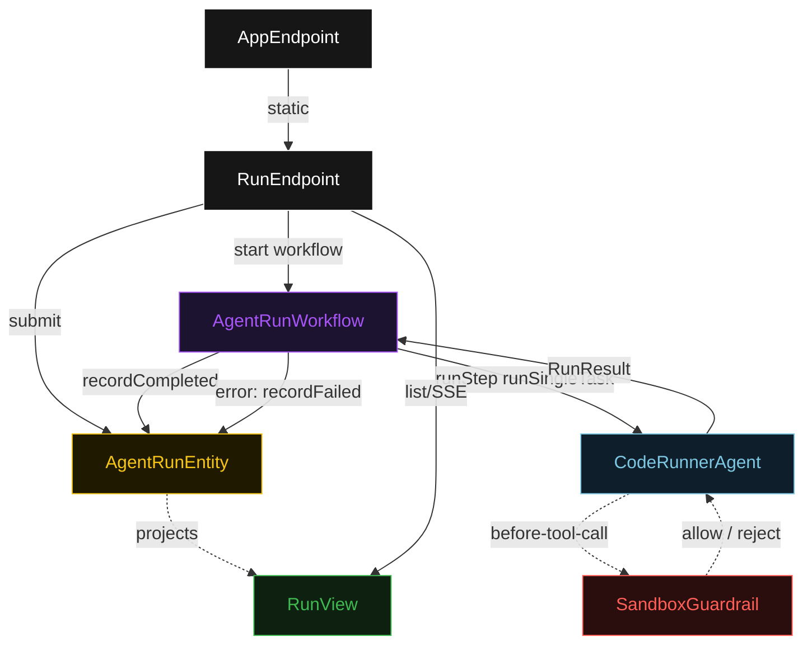
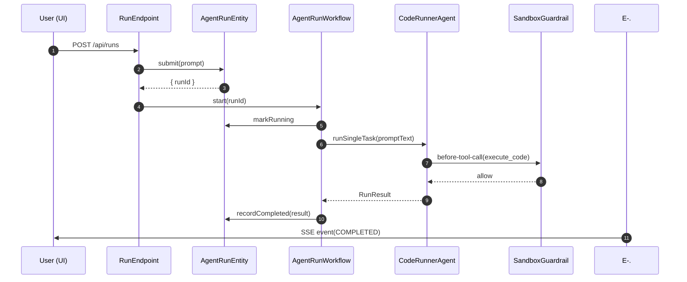
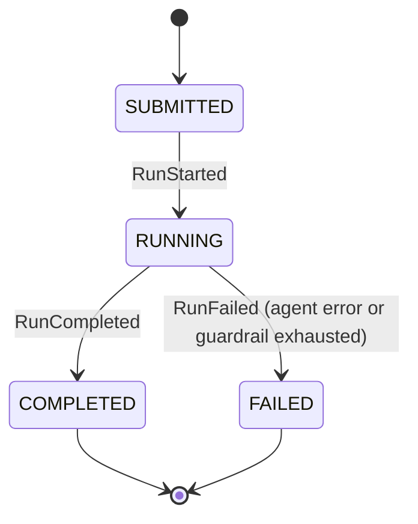
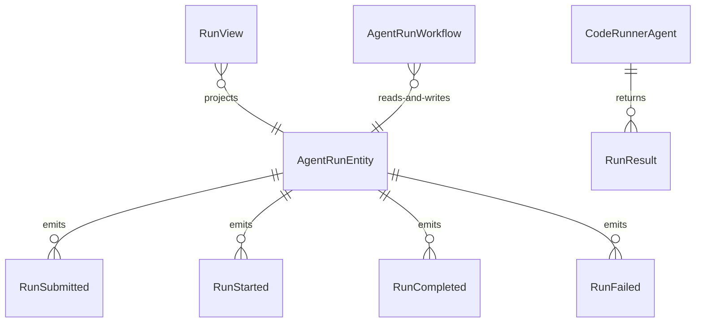

# PLAN — async-agent-endpoint

Architectural sketch consumed by `/akka:plan` and rendered on the generated system's Architecture tab. The four mermaid diagrams below carry the theme variables and CSS overrides from Lesson 24; without them, state names render black-on-black and edge labels clip.

---

## Component graph

## Interaction sequence — J1 (happy path)

## State machine — `AgentRunEntity`

## Entity model

## Component table — Java file targets

| Component | Path (generated) |
|---|---|
| `RunEndpoint` | `api/RunEndpoint.java` |
| `AppEndpoint` | `api/AppEndpoint.java` |
| `AgentRunEntity` | `application/AgentRunEntity.java` (state in `domain/AgentRun.java`, events in `domain/RunEvent.java`) |
| `AgentRunWorkflow` | `application/AgentRunWorkflow.java` |
| `CodeRunnerAgent` | `application/CodeRunnerAgent.java` (tasks in `application/RunTasks.java`) |
| `SandboxGuardrail` | `application/SandboxGuardrail.java` |
| `RunView` | `application/RunView.java` |
| `MockModelProvider` (option-a only) | `application/MockModelProvider.java` |
| Bootstrap | `Bootstrap.java` |

## Concurrency notes

- **Per-step timeout**: `runStep` 60 s, `error` 5 s. Default step recovery `maxRetries(1).failoverTo(AgentRunWorkflow::error)`. The 60 s on `runStep` accommodates LLM latency plus code execution time (Lesson 4).
- **Event-loop non-blocking**: the agent's tool execution is dispatched via `anyio.to_thread.run_sync` at the Python boundary; on the Java side the workflow's step is a standard async component call — the Akka runtime handles threading. Concurrent `runStep` executions do not serialize on the event loop.
- **Idempotency**: every workflow uses `"run-" + runId` as the workflow id; a duplicate `POST /api/runs` with the same runId is rejected by the entity's submit command before a workflow starts.
- **One agent per run**: the AutonomousAgent instance id is `"runner-" + runId`, giving each task its own conversation context. The agent's `capability(...).maxIterationsPerTask(3)` caps guardrail-triggered retries at 3.
- **Guardrail-driven retry**: when `SandboxGuardrail` rejects a tool call, the rejection is returned to the agent loop as a structured policy error. The loop counts toward `maxIterationsPerTask`; if all 3 iterations produce policy-violating code, the `runStep` fails over to `error` and the entity transitions to `FAILED`.
- **No saga / no compensation**: every step is either a pure write or a single-task agent call. There is nothing external to roll back.
