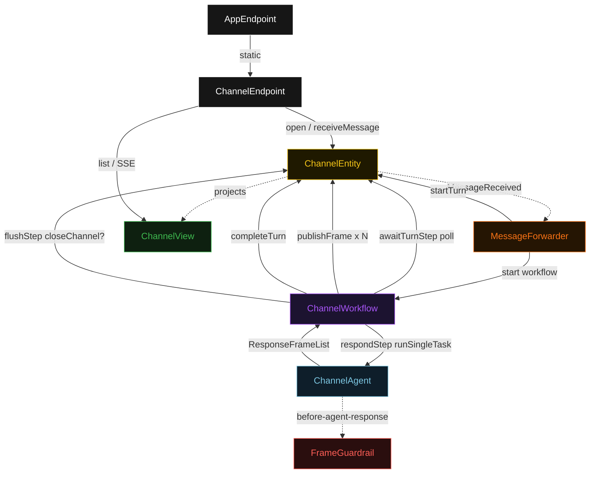
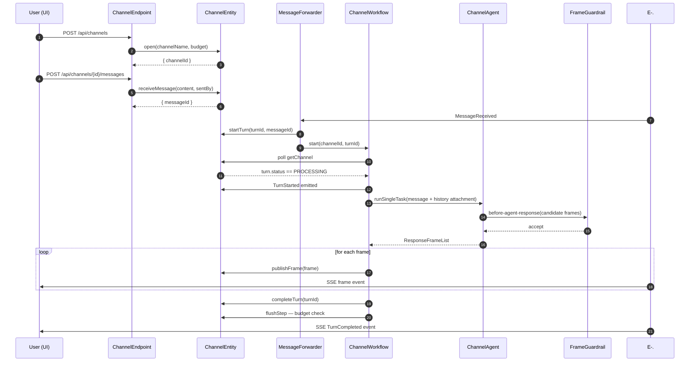
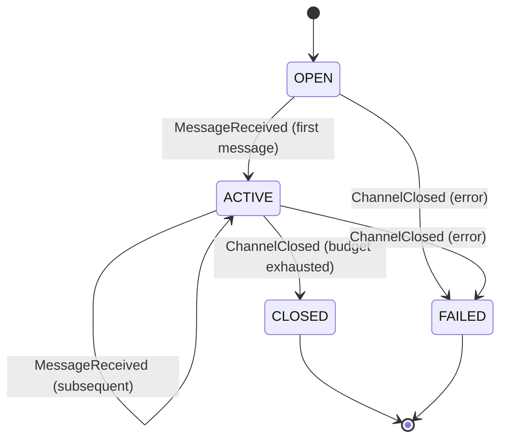
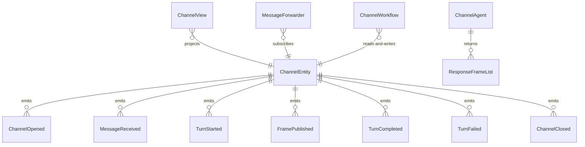

# PLAN — bidi-demo

Architectural sketch consumed by `/akka:plan` and rendered on the generated system's Architecture tab. The four mermaid diagrams below carry the theme variables and CSS overrides from Lesson 24; without them, state names render black-on-black and edge labels clip.

---

## Component graph

## Interaction sequence — J1 (happy path)

## State machine — `ChannelEntity`

## Entity model

## Component table — Java file targets

| Component | Path (generated) |
|---|---|
| `ChannelEndpoint` | `api/ChannelEndpoint.java` |
| `AppEndpoint` | `api/AppEndpoint.java` |
| `ChannelEntity` | `application/ChannelEntity.java` (state in `domain/Channel.java`, events in `domain/ChannelEvent.java`) |
| `MessageForwarder` | `application/MessageForwarder.java` |
| `ChannelWorkflow` | `application/ChannelWorkflow.java` |
| `ChannelAgent` | `application/ChannelAgent.java` (tasks in `application/ChannelTasks.java`) |
| `FrameGuardrail` | `application/FrameGuardrail.java` |
| `ChannelView` | `application/ChannelView.java` |
| `MockModelProvider` (option-a only) | `application/MockModelProvider.java` |
| Bootstrap | `Bootstrap.java` |

## Concurrency notes

- **Per-step timeout**: `awaitTurnStep` 10 s, `respondStep` 60 s, `flushStep` 5 s, `error` 5 s. Default step recovery `maxRetries(2).failoverTo(ChannelWorkflow::error)`. The 60 s on `respondStep` accommodates LLM latency (Lesson 4).
- **Idempotency**: every workflow uses `"workflow-" + turnId` as its id; `MessageForwarder` may redeliver `MessageReceived` events, but `ChannelEntity.startTurn` is event-version-guarded — a duplicate startTurn against an already-started turn is a no-op.
- **One agent per channel**: the `ChannelAgent` instance id is `"agent-" + channelId`, so the same conversation context accumulates across turns on that channel. `maxIterationsPerTask(3)` caps guardrail-triggered retries.
- **Frame-by-frame publishing**: `respondStep` iterates the returned `ResponseFrameList` and calls `ChannelEntity.publishFrame` for each. Each `FramePublished` event propagates to the SSE stream immediately, giving the client a streaming experience without requiring the agent to stream at the protocol level.
- **Turn budget enforcement**: `flushStep` checks `channel.turns().size() >= channel.turnBudget()` and calls `closeChannel` if true. The check is synchronous and deterministic — no LLM call.
- **No saga / no compensation**: frame publishing is append-only. A failed `respondStep` calls `failTurn`; partial frames remain in the entity log for audit but the turn is marked `FAILED`.
