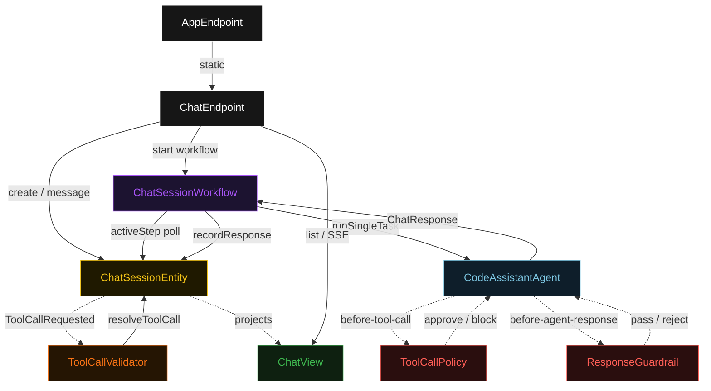
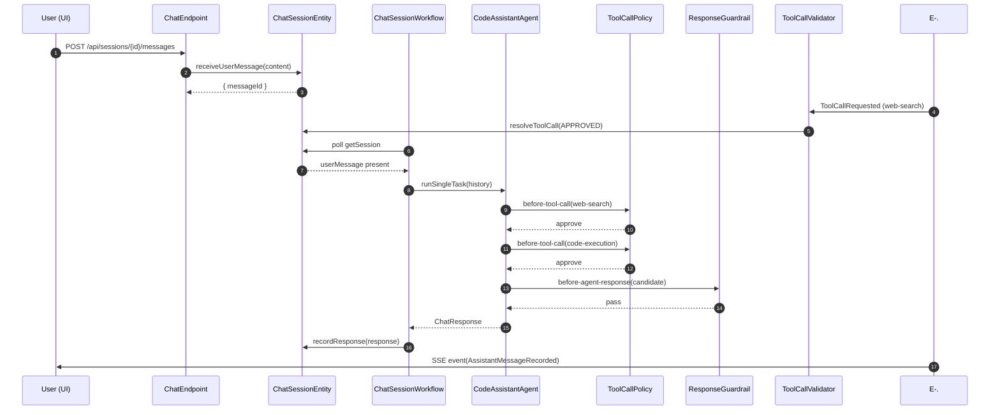
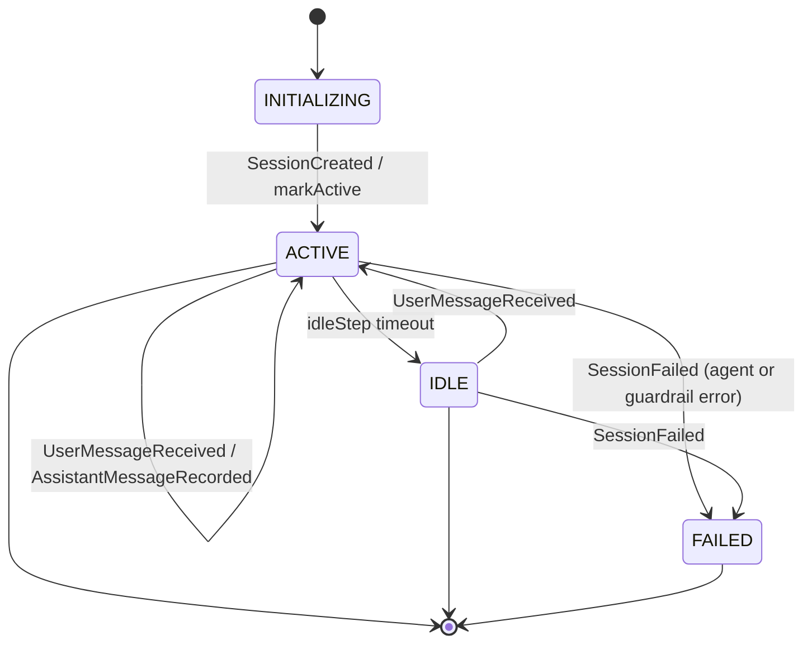
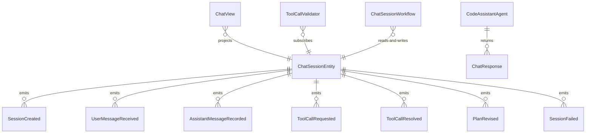

# PLAN — code-agent-chat-ui

Architectural sketch consumed by `/akka:plan` and rendered on the generated system's Architecture tab. The four mermaid diagrams below carry the theme variables and CSS overrides from Lesson 24; without them, state names render black-on-black and edge labels clip.

---

## Component graph

## Interaction sequence — J1 (happy path)

## State machine — `ChatSessionEntity`

## Entity model

## Component table — Java file targets

| Component | Path (generated) |
|---|---|
| `ChatEndpoint` | `api/ChatEndpoint.java` |
| `AppEndpoint` | `api/AppEndpoint.java` |
| `ChatSessionEntity` | `application/ChatSessionEntity.java` (state in `domain/ChatSession.java`, events in `domain/ChatSessionEvent.java`) |
| `ToolCallValidator` | `application/ToolCallValidator.java` |
| `ChatSessionWorkflow` | `application/ChatSessionWorkflow.java` |
| `CodeAssistantAgent` | `application/CodeAssistantAgent.java` (tasks in `application/AgentTasks.java`) |
| `ToolCallPolicy` | `application/ToolCallPolicy.java` |
| `ResponseGuardrail` | `application/ResponseGuardrail.java` |
| `WebSearchTool` | `application/WebSearchTool.java` |
| `CodeExecutionTool` | `application/CodeExecutionTool.java` |
| `ChatView` | `application/ChatView.java` |
| `MockModelProvider` (option-a only) | `application/MockModelProvider.java` |
| Bootstrap | `Bootstrap.java` |

## Concurrency notes

- **Per-step timeout**: `initStep` 5 s, `activeStep` 90 s, `idleStep` 30 s, `error` 5 s. Default step recovery `maxRetries(2).failoverTo(ChatSessionWorkflow::error)`. The 90 s on `activeStep` accommodates multi-tool LLM latency plus re-planning overhead (Lesson 4).
- **Idempotency**: `ChatSessionEntity.receiveUserMessage` is event-version-guarded; a redelivered `UserMessageReceived` for an already-active turn is a no-op.
- **One agent per session**: the AutonomousAgent instance id is `"agent-" + sessionId`, giving each session its own conversation context. `maxIterationsPerTask(12)` caps the planning loop at 12 iterations; guardrail rejections count toward this budget.
- **Guardrail-driven retry**: when `ToolCallPolicy` blocks a call, the rejection is returned as a structured error to the agent loop. When `ResponseGuardrail` rejects a candidate response, the agent loop retries. If all 12 iterations exhaust without a passing response, `activeStep` fails over to `error` and the entity transitions to `FAILED`.
- **Tool-call lifecycle**: every tool call is recorded via `ChatSessionEntity.ToolCallRequested` before execution and `ToolCallResolved` after. The `ToolCallValidator` Consumer handles the approval gate. This makes every tool invocation auditable regardless of the final session outcome.
- **Plan revision**: the agent emits a `PlanRevision` every 3 steps. The `ChatSessionWorkflow` records each revision via `ChatSessionEntity.recordPlanRevision`. The UI renders plan-revision badges inline in the chat thread.
- **No saga / no compensation**: each step is either a pure read, an append-only event write, or a single-task agent call. There is nothing external to roll back.
