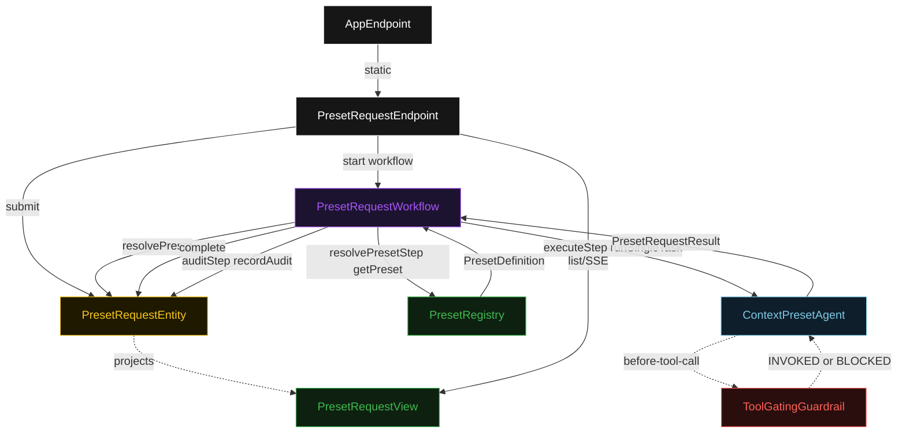
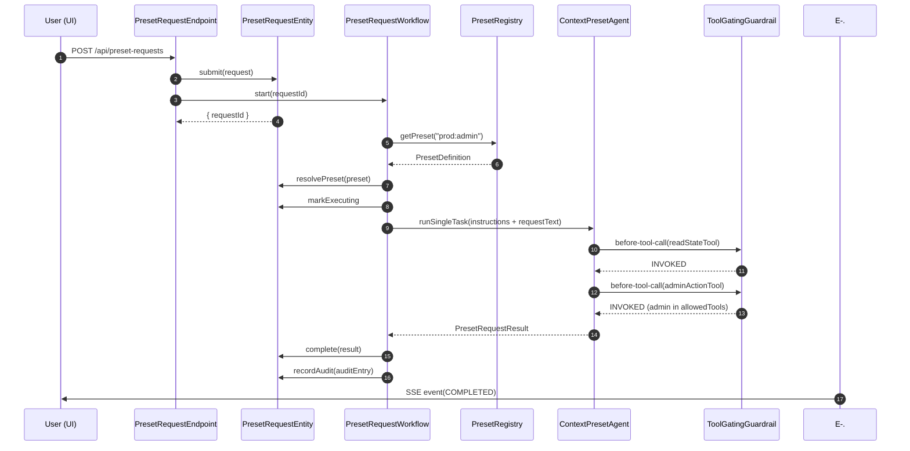
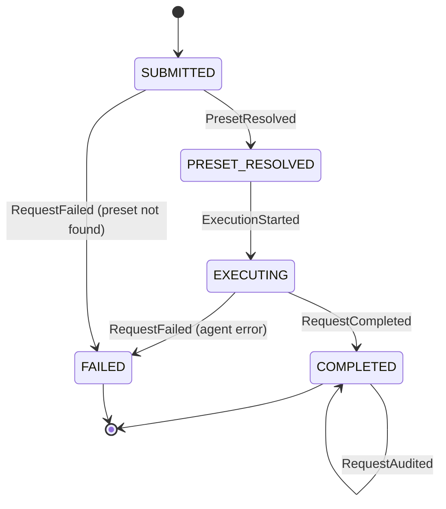
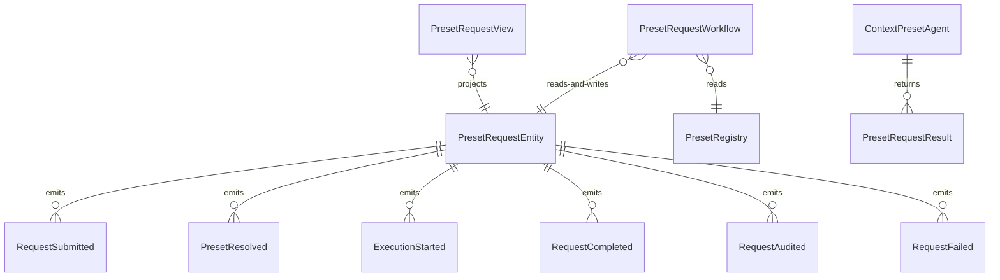

# PLAN — context-preset-agent

Architectural sketch consumed by `/akka:plan` and rendered on the generated system's Architecture tab. The four mermaid diagrams below carry the theme variables and CSS overrides from Lesson 24; without them, state names render black-on-black and edge labels clip.

---

## Component graph

## Interaction sequence — J1 (happy path: prod + admin)

## State machine — `PresetRequestEntity`

## Entity model

## Component table — Java file targets

| Component | Path (generated) |
|---|---|
| `PresetRequestEndpoint` | `api/PresetRequestEndpoint.java` |
| `AppEndpoint` | `api/AppEndpoint.java` |
| `PresetRequestEntity` | `application/PresetRequestEntity.java` (state in `domain/PresetRequestState.java`, events in `domain/PresetRequestEvent.java`) |
| `PresetRegistry` | `application/PresetRegistry.java` |
| `PresetRequestWorkflow` | `application/PresetRequestWorkflow.java` |
| `ContextPresetAgent` | `application/ContextPresetAgent.java` (tasks in `application/PresetRequestTasks.java`) |
| `ToolGatingGuardrail` | `application/ToolGatingGuardrail.java` |
| `PresetRequestView` | `application/PresetRequestView.java` |
| `MockModelProvider` (option-a only) | `application/MockModelProvider.java` |
| Bootstrap | `Bootstrap.java` |

## Concurrency notes

- **Per-step timeout**: `resolvePresetStep` 5 s, `executeStep` 60 s, `auditStep` 5 s, `error` 5 s. Default step recovery `maxRetries(2).failoverTo(PresetRequestWorkflow::error)`. The 60 s on `executeStep` accommodates LLM latency (Lesson 4).
- **Idempotency**: every workflow uses `"preset-req-" + requestId` as the workflow id; `PresetRequestEntity.resolvePreset` is event-version-guarded — a second resolve attempt against an already-resolved request is a no-op.
- **One agent per request**: the AutonomousAgent instance id is `"agent-" + requestId`, giving each task its own conversation context. The agent's `capability(...).maxIterationsPerTask(3)` bounds the call.
- **Guardrail-driven blocking**: when `ToolGatingGuardrail` blocks a tool call, the rejection is returned as a structured permission-denied error to the agent loop. The agent does not retry the blocked call — it explains the restriction and proceeds to completion. The blocked entry is recorded in `toolCallLog` with `status = BLOCKED`. This is different from a before-agent-response retry: the task still completes; it just completes with blocked-tool evidence in the log.
- **Audit is synchronous and deterministic**: `auditStep` counts INVOKED vs BLOCKED entries in the completed result's `toolCallLog` — no LLM call, no external service. This is a deliberate single-agent guarantee.
- **No saga / no compensation**: every step is either a pure Key-Value read, append-only event write, or a single-task agent call. Nothing external to roll back.
