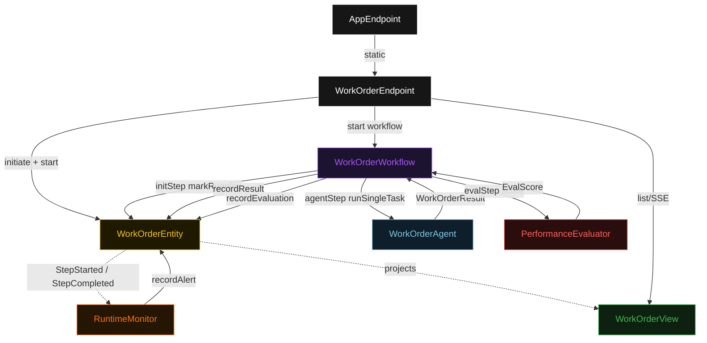
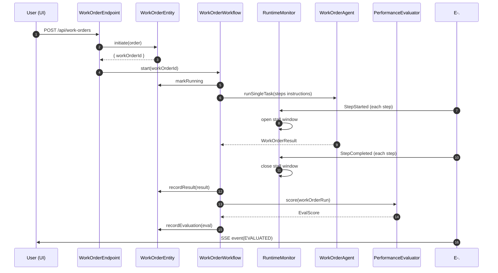
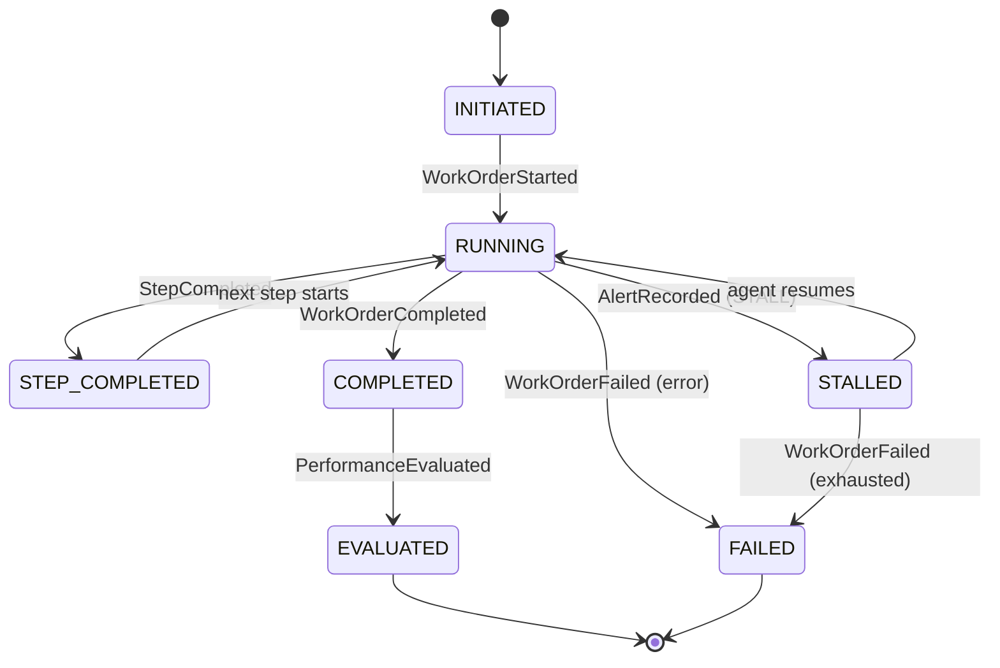
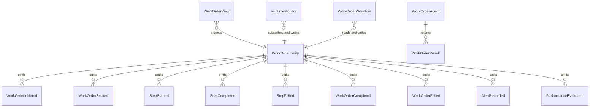

# PLAN — durable-agent-baseline

Architectural sketch consumed by `/akka:plan` and rendered on the generated system's Architecture tab. The four mermaid diagrams below carry the theme variables and CSS overrides from Lesson 24; without them, state names render black-on-black and edge labels clip.

---

## Component graph

## Interaction sequence — J1 (happy path)

## State machine — `WorkOrderEntity`

## Entity model

## Component table — Java file targets

| Component | Path (generated) |
|---|---|
| `WorkOrderEndpoint` | `api/WorkOrderEndpoint.java` |
| `AppEndpoint` | `api/AppEndpoint.java` |
| `WorkOrderEntity` | `application/WorkOrderEntity.java` (state in `domain/WorkOrderRun.java`, events in `domain/WorkOrderEvent.java`) |
| `RuntimeMonitor` | `application/RuntimeMonitor.java` |
| `WorkOrderWorkflow` | `application/WorkOrderWorkflow.java` |
| `WorkOrderAgent` | `application/WorkOrderAgent.java` (tasks in `application/WorkOrderTasks.java`) |
| `PerformanceEvaluator` | `application/PerformanceEvaluator.java` |
| `WorkOrderView` | `application/WorkOrderView.java` |
| `MockModelProvider` (option-a only) | `application/MockModelProvider.java` |
| Bootstrap | `Bootstrap.java` |

## Concurrency notes

- **Per-step timeout**: `initStep` 10 s, `agentStep` 120 s, `evalStep` 5 s, `error` 5 s. Default step recovery `maxRetries(2).failoverTo(WorkOrderWorkflow::error)`. The 120 s on `agentStep` accommodates multi-step LLM execution across potentially 5 iterations (Lesson 4).
- **Durability**: the Akka Workflow journals its step position; a JVM restart leaves `WorkOrderWorkflow` at its last committed step boundary. The `WorkOrderEntity`'s event log is the ground truth for step outcomes.
- **Idempotency**: every workflow uses `"wf-" + workOrderId` as the workflow id; re-submitting the same `workOrderId` returns the existing entity state rather than creating a duplicate.
- **One agent per work order**: the AutonomousAgent instance id is `"agent-" + workOrderId`, giving each run its own conversation context. `maxIterationsPerTask(5)` accommodates step-level retries within a single task.
- **Monitor restart recovery**: `RuntimeMonitor` re-reads the entity's open step windows on restart before committing to a stall check, so a JVM bounce during a long step does not suppress a legitimate stall alert.
- **Eval is synchronous and deterministic**: `PerformanceEvaluator` runs in-process inside `evalStep`. No LLM call — the same run always scores the same. This is the single-agent invariant.
- **No saga / no compensation**: every step is append-only event writes or a single-task agent call. Nothing external requires rollback.
