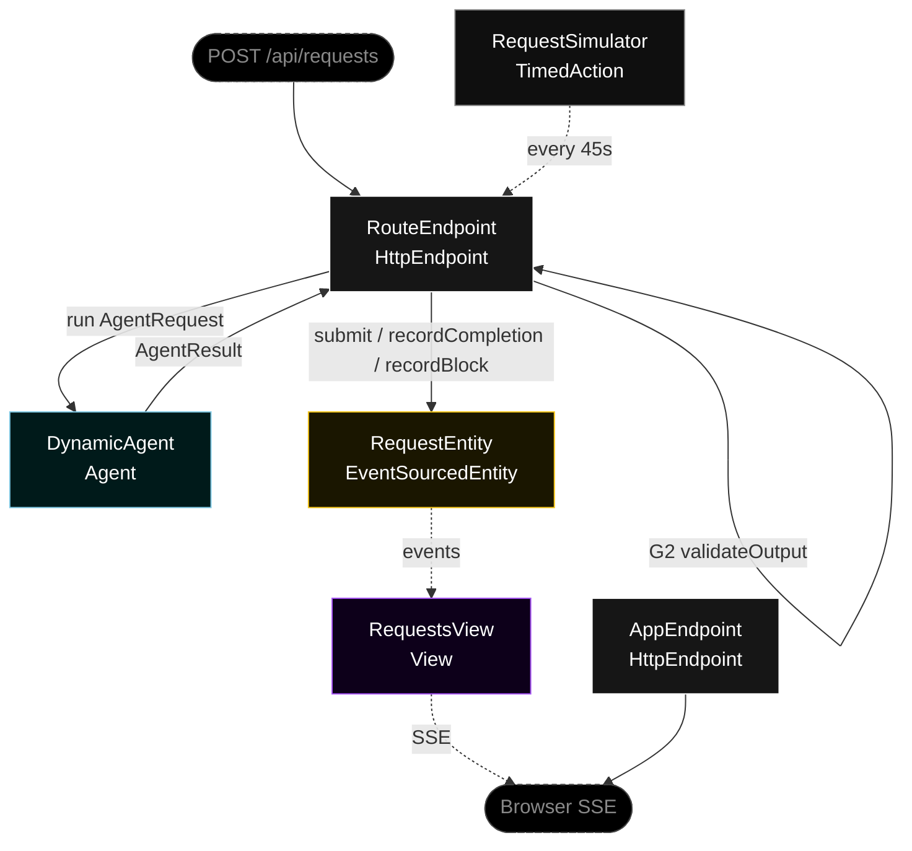
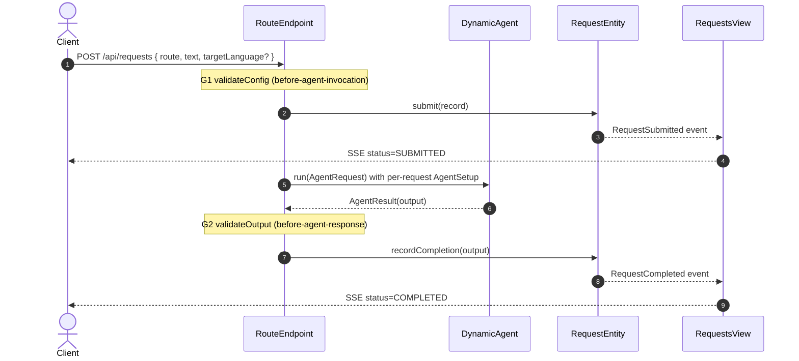
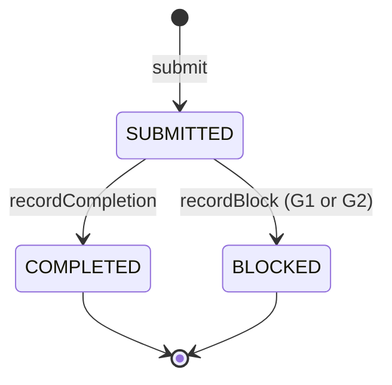
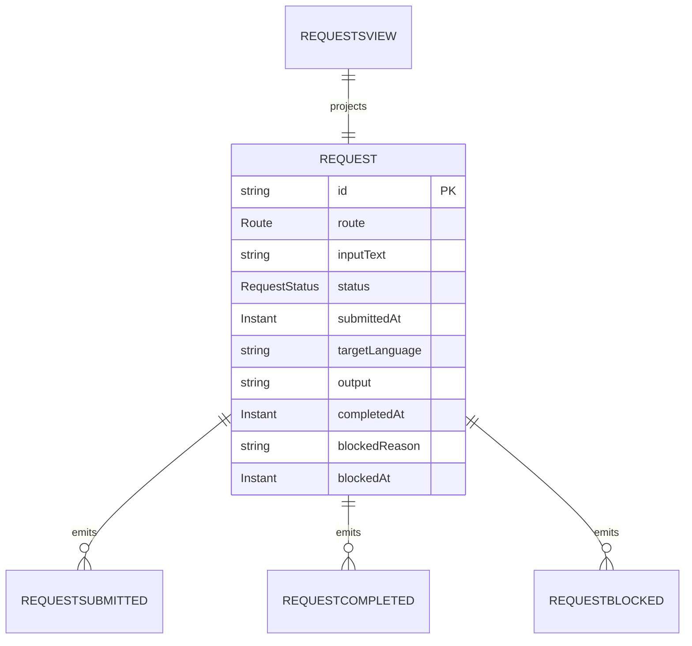

# PLAN — dynamic-route-agent

Architectural sketch. All four mermaid diagrams + the component table are required. The generated system renders these on the Architecture tab and must inherit the Lesson 24 state-label CSS overrides.

---

## Component graph

## Interaction sequence

## State machine

## Entity model

## Component table

| Component | Path (generated) |
|---|---|
| DynamicAgent | `application/DynamicAgent.java` |
| RequestEntity | `application/RequestEntity.java` |
| RequestsView | `application/RequestsView.java` |
| RouteEndpoint | `api/RouteEndpoint.java` |
| AppEndpoint | `api/AppEndpoint.java` |
| RequestSimulator | `application/RequestSimulator.java` |
| RequestRecord / AgentRequest / AgentResult / events | `domain/` |

## Concurrency notes

- The endpoint step that calls `DynamicAgent` uses an explicit 60-second timeout (Lesson 4); LLM calls exceed the 5-second default.
- Idempotency: each request gets a fresh UUID `requestId` at submit time; the entity rejects a second `submit` for the same id.
- No saga or compensation: the flow is single-agent and synchronous. A guardrail rejection (G1 or G2) is a terminal `BLOCKED` transition, not a rollback — nothing downstream has been committed when G1 fires, and only the entity record is written when G2 fires.
- The simulator and the live UI submit through the same endpoint path, so guardrails apply identically to both.
