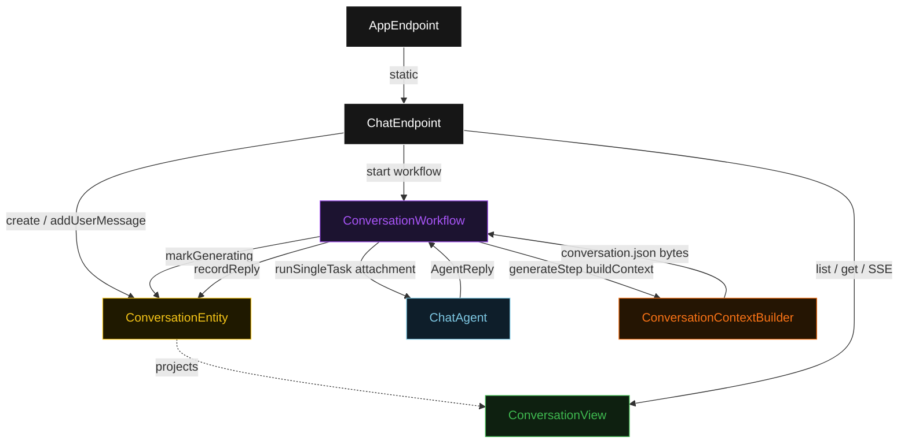
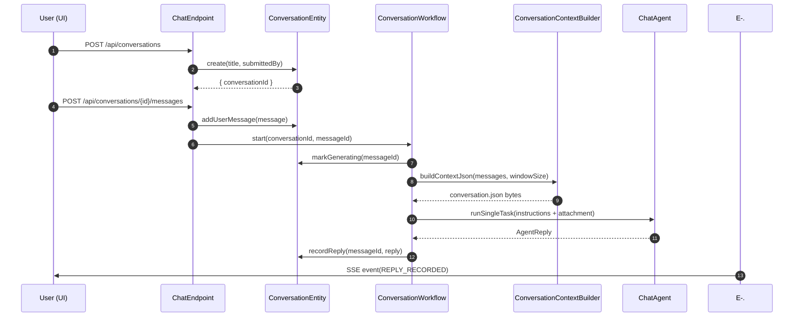
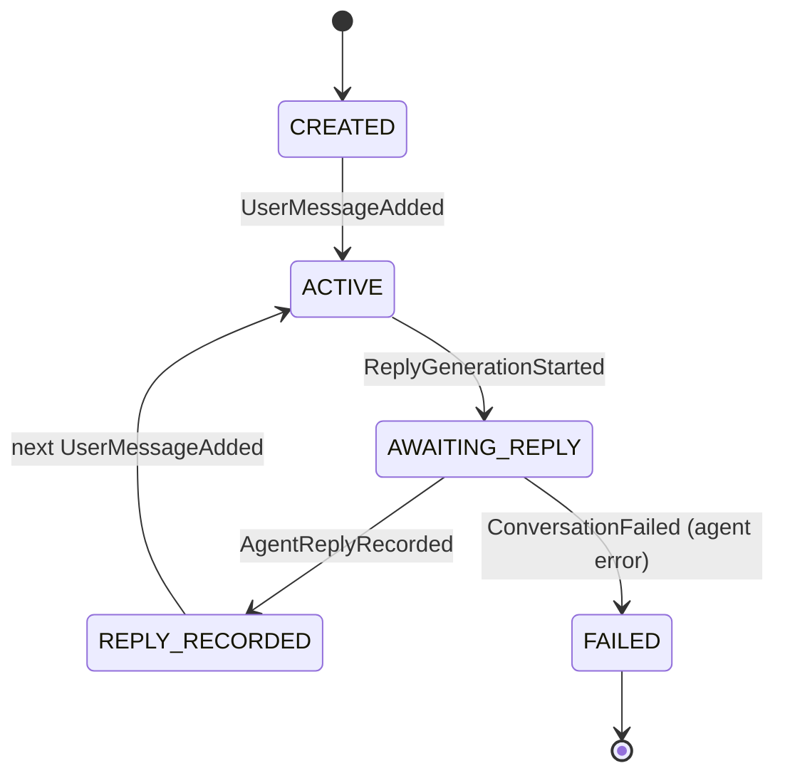
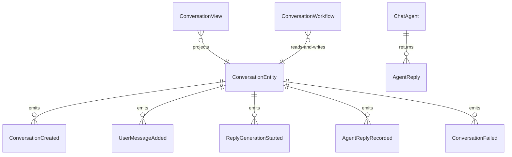

# PLAN — gemini-fullstack

Architectural sketch consumed by `/akka:plan` and rendered on the generated system's Architecture tab. The four mermaid diagrams below carry the theme variables and CSS overrides from Lesson 24; without them, state names render black-on-black and edge labels clip.

---

## Component graph

## Interaction sequence — J1 (happy path)

## State machine — `ConversationEntity`

## Entity model

## Component table — Java file targets

| Component | Path (generated) |
|---|---|
| `ChatEndpoint` | `api/ChatEndpoint.java` |
| `AppEndpoint` | `api/AppEndpoint.java` |
| `ConversationEntity` | `application/ConversationEntity.java` (state in `domain/Conversation.java`, events in `domain/ConversationEvent.java`) |
| `ConversationWorkflow` | `application/ConversationWorkflow.java` |
| `ChatAgent` | `application/ChatAgent.java` (tasks in `application/ChatTasks.java`) |
| `ConversationContextBuilder` | `application/ConversationContextBuilder.java` |
| `ConversationView` | `application/ConversationView.java` |
| `MockModelProvider` (option-a only) | `application/MockModelProvider.java` |
| Bootstrap | `Bootstrap.java` |

## Concurrency notes

- **Per-step timeout**: `generateStep` 60 s, `recordStep` 10 s, `error` 5 s. Default step recovery `maxRetries(1).failoverTo(ConversationWorkflow::error)`. The 60 s on `generateStep` accommodates LLM latency (Lesson 4).
- **Idempotency**: each workflow instance id is `"turn-" + conversationId + "-" + messageId`; the `ChatEndpoint` starts exactly one workflow per (conversationId, messageId) pair. A duplicate `POST /conversations/{id}/messages` with the same `messageId` is rejected by the endpoint before starting a second workflow.
- **One agent per conversation**: the AutonomousAgent instance id is `"chat-" + conversationId`, which anchors each agent's conversation context to the entity. `maxIterationsPerTask(2)` caps any internal retry within a single turn.
- **Context window management**: `ConversationContextBuilder` caps the context at the last 20 messages (configurable via `akka.javasdk.agent.context-window-size` in `application.conf`) so prompt size stays bounded as conversations grow.
- **SSE fan-out**: the `ConversationView` row is updated on every entity event; the SSE endpoint emits the full row on each update so late-joining clients receive current state immediately without replaying the event log.
- **No saga / no compensation**: `recordStep` is a single append-only write to the entity. If it fails after a retry, the entity transitions to `FAILED` with the error reason. The agent reply is not re-generated — the user can start a new turn.
