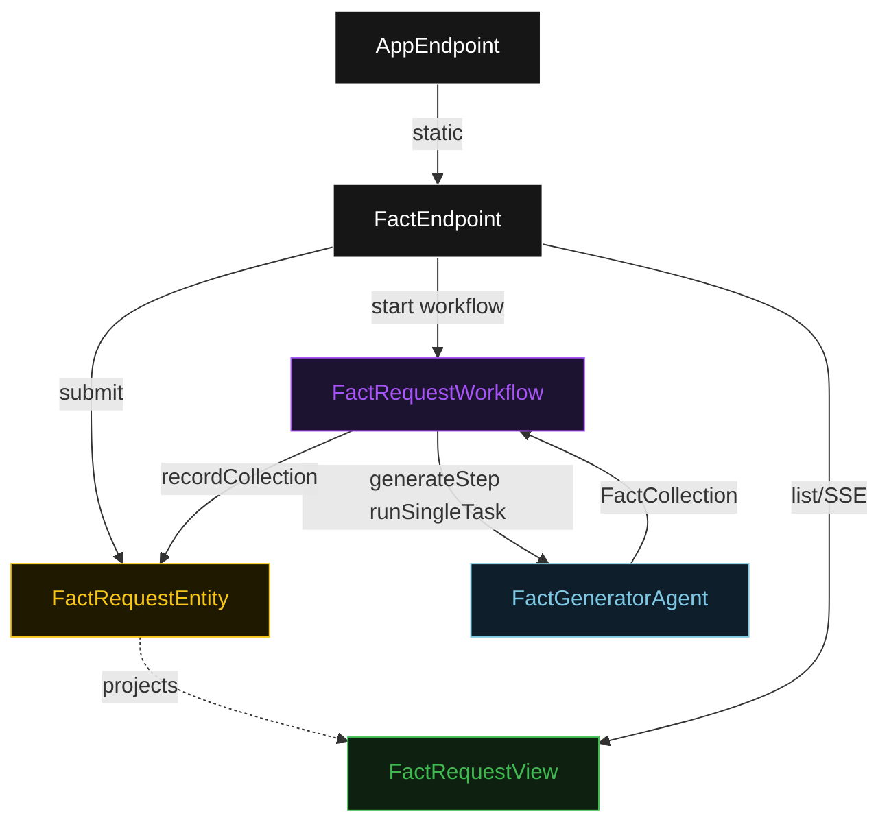
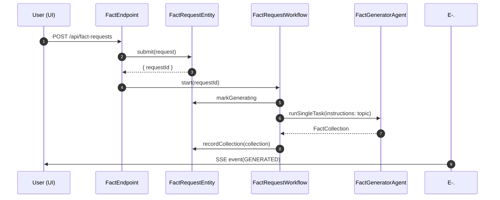
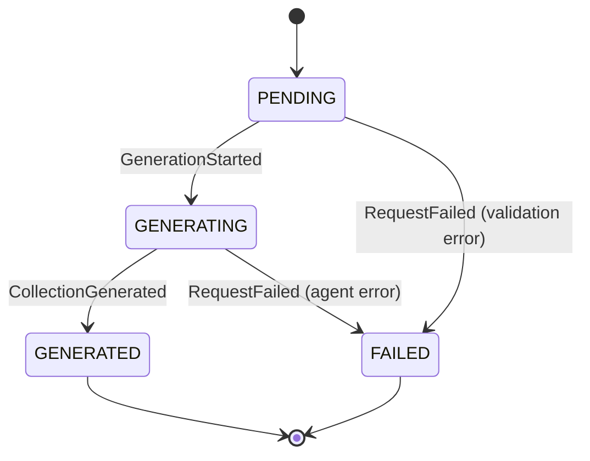
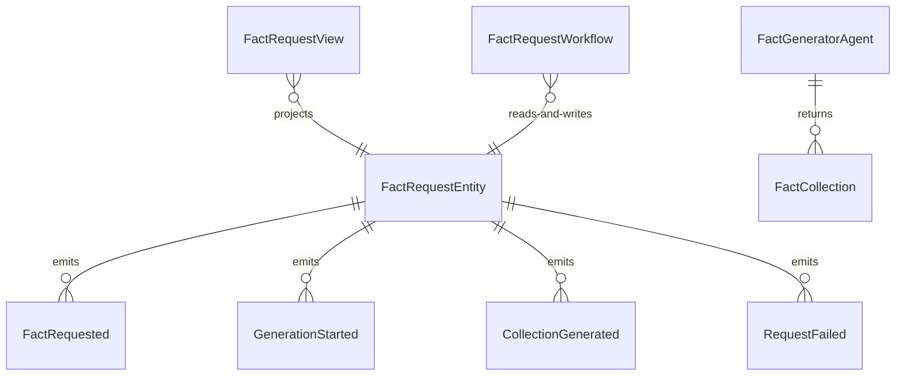

# PLAN — fun-facts

Architectural sketch consumed by `/akka:plan` and rendered on the generated system's Architecture tab. The four mermaid diagrams below carry the theme variables and CSS overrides from Lesson 24; without them, state names render black-on-black and edge labels clip.

---

## Component graph

## Interaction sequence — J1 (happy path)

## State machine — `FactRequestEntity`

## Entity model

## Component table — Java file targets

| Component | Path (generated) |
|---|---|
| `FactEndpoint` | `api/FactEndpoint.java` |
| `AppEndpoint` | `api/AppEndpoint.java` |
| `FactRequestEntity` | `application/FactRequestEntity.java` (state in `domain/FactRequestState.java`, events in `domain/FactRequestEvent.java`) |
| `FactRequestWorkflow` | `application/FactRequestWorkflow.java` |
| `FactGeneratorAgent` | `application/FactGeneratorAgent.java` (tasks in `application/FactTasks.java`) |
| `FactRequestView` | `application/FactRequestView.java` |
| `MockModelProvider` (option-a only) | `application/MockModelProvider.java` |
| Bootstrap | `Bootstrap.java` |

## Concurrency notes

- **Per-step timeout**: `generateStep` 60 s, `error` 5 s. Default step recovery `maxRetries(2).failoverTo(FactRequestWorkflow::error)`. The 60 s on `generateStep` accommodates LLM latency (Lesson 4).
- **Idempotency**: every workflow uses `"facts-" + requestId` as the workflow id; re-delivery of `FactRequested` is safe because `FactRequestEntity.submit` is version-guarded — a second submit against an already-initialized entity is a no-op.
- **One agent per request**: the AutonomousAgent instance id is `"generator-" + requestId`, giving each task its own conversation context. The agent's `capability(...).maxIterationsPerTask(2)` caps any retry at 2.
- **No saga / no compensation**: every step is either a single-task agent call or an entity write. There is nothing external to roll back.
- **No Consumer in this baseline**: the workflow starts directly from `FactEndpoint` after entity creation. There is no intermediate event-driven handoff — the smaller direct call is appropriate for a topic string that requires no pre-processing.
