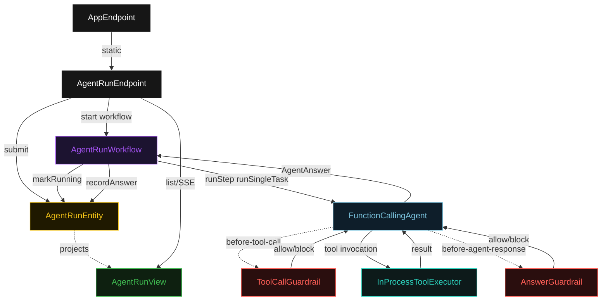
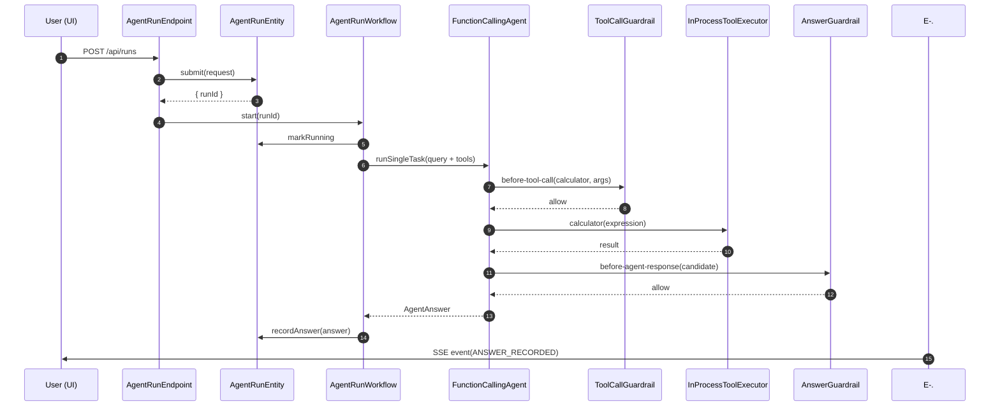
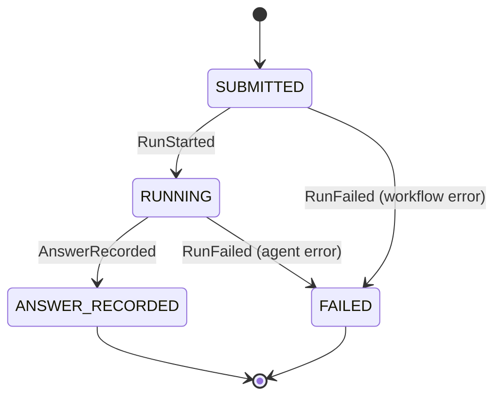
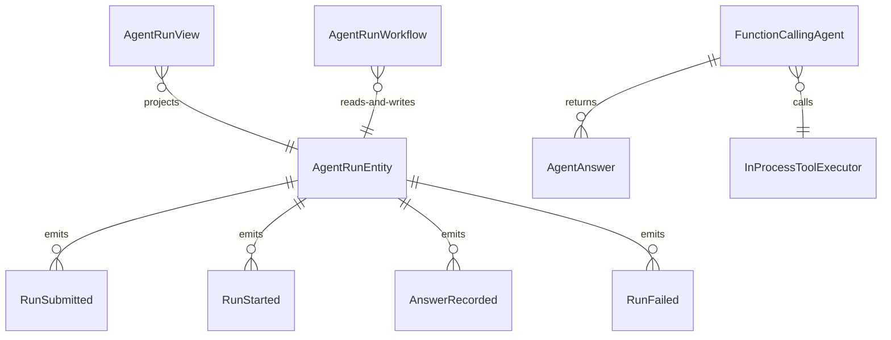

# PLAN — function-calling-agent-baseline

Architectural sketch consumed by `/akka:plan` and rendered on the generated system's Architecture tab. The four mermaid diagrams below carry the theme variables and CSS overrides from Lesson 24; without them, state names render black-on-black and edge labels clip.

---

## Component graph

## Interaction sequence — J1 (happy path)

## State machine — `AgentRunEntity`

## Entity model

## Component table — Java file targets

| Component | Path (generated) |
|---|---|
| `AgentRunEndpoint` | `api/AgentRunEndpoint.java` |
| `AppEndpoint` | `api/AppEndpoint.java` |
| `AgentRunEntity` | `application/AgentRunEntity.java` (state in `domain/AgentRun.java`, events in `domain/AgentRunEvent.java`) |
| `AgentRunWorkflow` | `application/AgentRunWorkflow.java` |
| `FunctionCallingAgent` | `application/FunctionCallingAgent.java` (tasks in `application/AgentRunTasks.java`) |
| `ToolCallGuardrail` | `application/ToolCallGuardrail.java` |
| `AnswerGuardrail` | `application/AnswerGuardrail.java` |
| `InProcessToolExecutor` | `application/InProcessToolExecutor.java` |
| `AgentRunView` | `application/AgentRunView.java` |
| `MockModelProvider` (option-a only) | `application/MockModelProvider.java` |
| Bootstrap | `Bootstrap.java` |

## Concurrency notes

- **Per-step timeout**: `startStep` 5 s, `runStep` 120 s, `recordStep` 5 s, `error` 5 s. Default step recovery `maxRetries(2).failoverTo(AgentRunWorkflow::error)`. The 120 s on `runStep` accommodates multi-iteration tool-calling loops where each LLM call and each tool call add latency (Lesson 4).
- **Idempotency**: every workflow uses `"run-" + runId` as the workflow id. `AgentRunEntity.markRunning` is event-version-guarded — a duplicate delivery from the workflow is a no-op if the entity is already in `RUNNING`.
- **One agent per run**: the AutonomousAgent instance id is `"agent-" + runId`, giving each task its own conversation context. The agent's `capability(...).maxIterationsPerTask(6)` caps guardrail-triggered retries and tool-calling rounds at 6.
- **Guardrail-driven retry**: when `ToolCallGuardrail` blocks a tool invocation, the rejection is returned as a structured error to the agent loop so the agent can propose a corrected call. When `AnswerGuardrail` blocks a final answer, the rejection causes the agent to revise. Both consume iterations toward `maxIterationsPerTask`; if all 6 iterations are exhausted, the workflow's `runStep` fails over to `error` and the entity transitions to `FAILED`.
- **Tool execution is synchronous and deterministic**: `InProcessToolExecutor` runs in-process inside the Akka function-calling mechanism. No LLM call, no network — the same input always returns the same output. This is a deliberate single-agent guarantee.
- **No saga / no compensation**: every step is either an append-only event write or a single-task agent call. There is nothing external to roll back.
