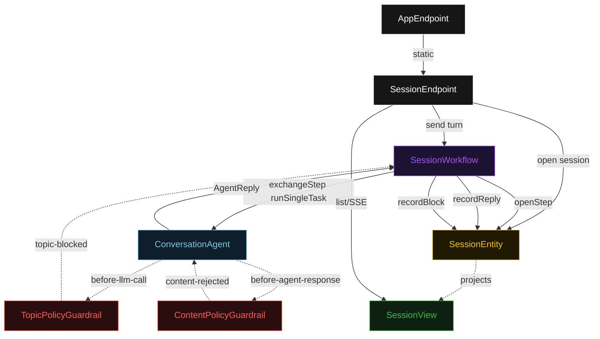
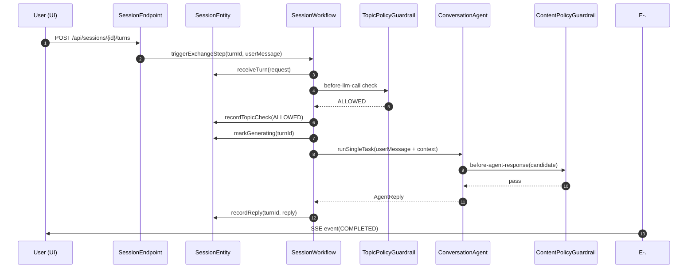
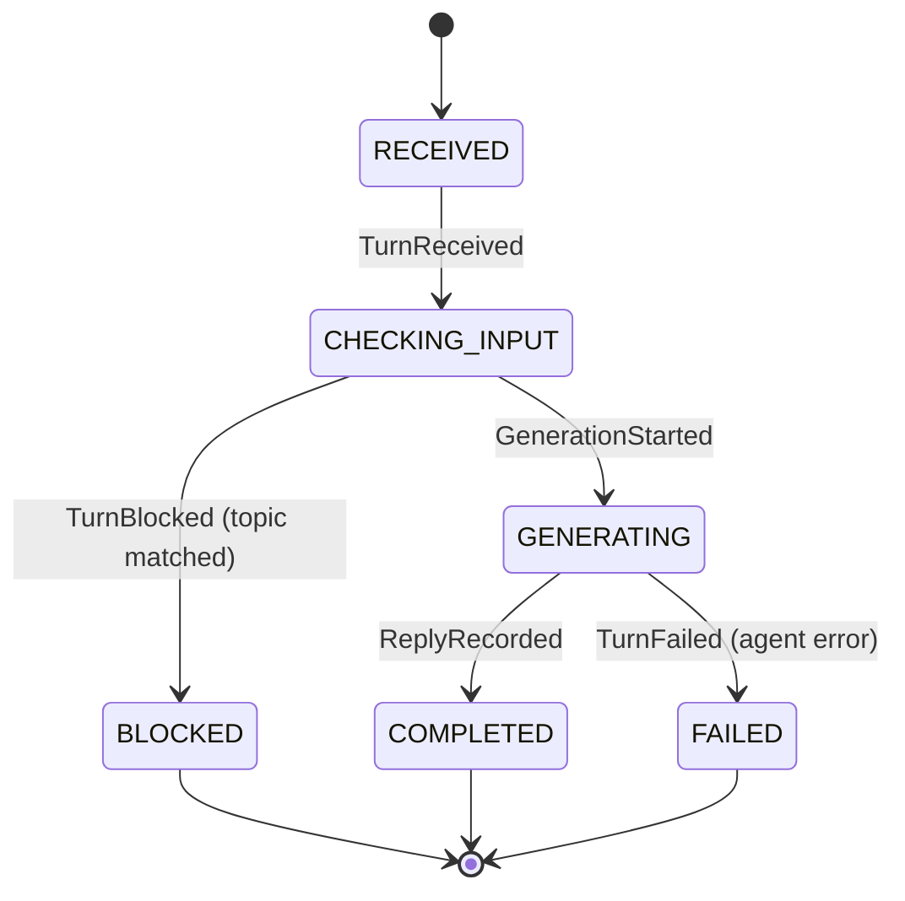
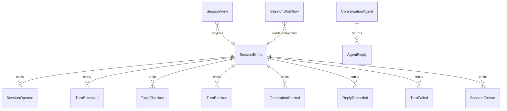

# PLAN — guardrails-demo

Architectural sketch consumed by `/akka:plan` and rendered on the generated system's Architecture tab. The four mermaid diagrams below carry the theme variables and CSS overrides from Lesson 24; without them, state names render black-on-black and edge labels clip.

---

## Component graph

## Interaction sequence — J1 (happy path)

## State machine — `SessionEntity` (per-turn view)

## Entity model

## Component table — Java file targets

| Component | Path (generated) |
|---|---|
| `SessionEndpoint` | `api/SessionEndpoint.java` |
| `AppEndpoint` | `api/AppEndpoint.java` |
| `SessionEntity` | `application/SessionEntity.java` (state in `domain/Session.java`, events in `domain/SessionEvent.java`) |
| `SessionWorkflow` | `application/SessionWorkflow.java` |
| `ConversationAgent` | `application/ConversationAgent.java` (tasks in `application/SessionTasks.java`) |
| `TopicPolicyGuardrail` | `application/TopicPolicyGuardrail.java` |
| `ContentPolicyGuardrail` | `application/ContentPolicyGuardrail.java` |
| `SessionView` | `application/SessionView.java` |
| `MockModelProvider` (option-a only) | `application/MockModelProvider.java` |
| Bootstrap | `Bootstrap.java` |

## Concurrency notes

- **Per-step timeout**: `openStep` 5 s, `exchangeStep` 60 s, `closeStep` 5 s, `error` 5 s. Default step recovery `maxRetries(2).failoverTo(SessionWorkflow::error)`. The 60 s on `exchangeStep` accommodates LLM latency plus up to 3 before-agent-response iterations (Lesson 4).
- **Idempotency**: the workflow id is `"session-" + sessionId`. Re-triggering `exchangeStep` for the same `turnId` is event-version-guarded on the entity — a re-delivered `TurnReceived` for an already-processed turn is a no-op.
- **One agent per session**: the AutonomousAgent instance id is `"agent-" + sessionId`. All turns within a session share the same agent instance, preserving conversational context. The `capability(...).maxIterationsPerTask(3)` caps content-policy retries at 3.
- **Before-llm-call intercept**: when `TopicPolicyGuardrail` fires, no model call is made. The rejection propagates from the guardrail hook back to `exchangeStep`, which records `TurnBlocked` directly without entering the agent's iteration loop.
- **Content-policy retry**: when `ContentPolicyGuardrail` rejects a candidate reply, the rejection returns to the agent loop. Each rejection consumes one iteration from the `maxIterationsPerTask(3)` budget. If all 3 iterations fail, `exchangeStep` fails over to `error` and the entity records `TurnFailed`.
- **No saga / no compensation**: turns are append-only; a failed turn leaves prior turns intact. The session remains `OPEN` after a `TurnFailed` so the user can continue with a new message.
