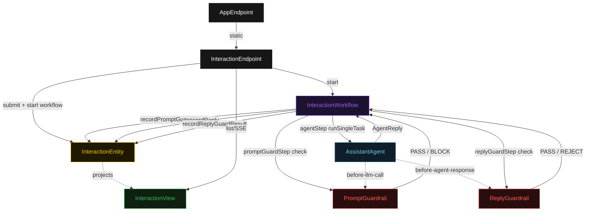
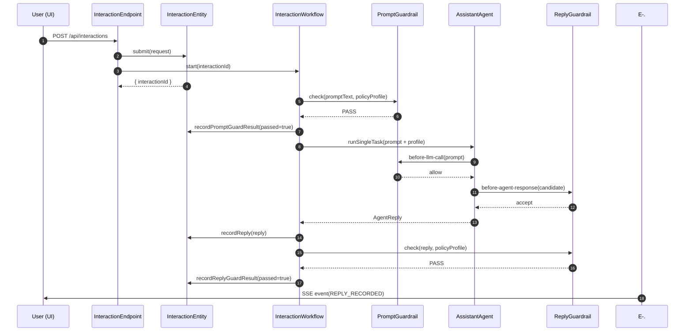
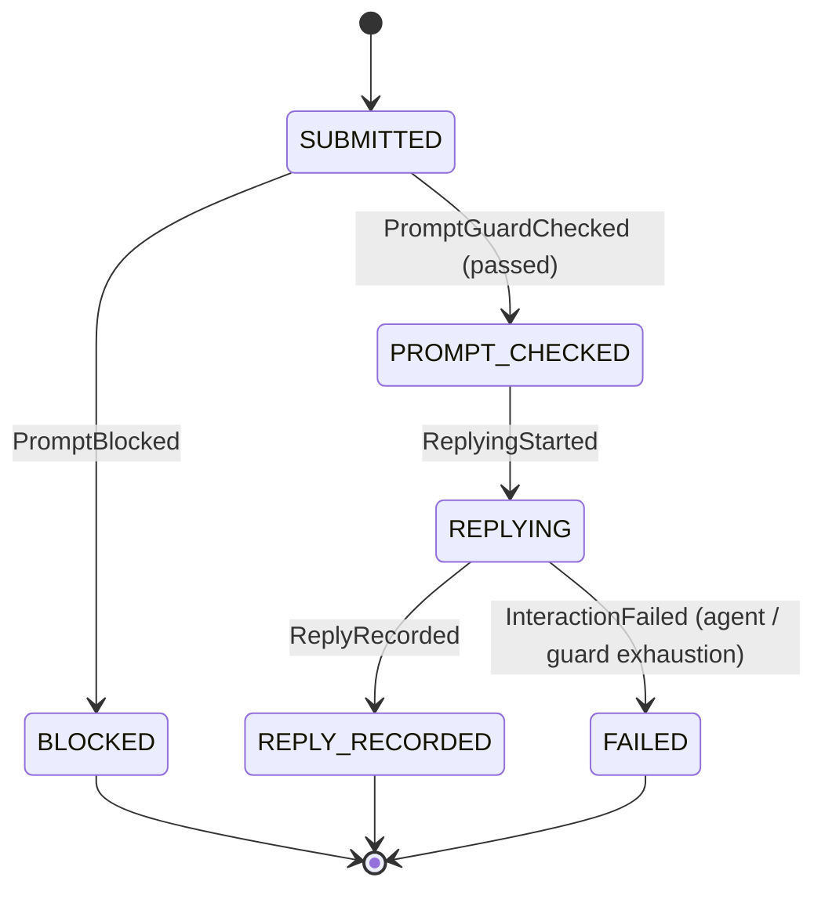
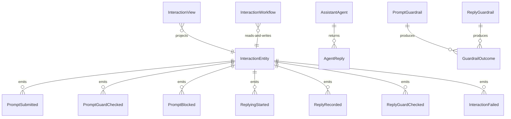

# PLAN — guardrails-pattern

Architectural sketch consumed by `/akka:plan` and rendered on the generated system's Architecture tab. The four mermaid diagrams below carry the theme variables and CSS overrides from Lesson 24; without them, state names render black-on-black and edge labels clip.

---

## Component graph

## Interaction sequence — J1 (happy path)

## State machine — `InteractionEntity`

## Entity model

## Component table — Java file targets

| Component | Path (generated) |
|---|---|
| `InteractionEndpoint` | `api/InteractionEndpoint.java` |
| `AppEndpoint` | `api/AppEndpoint.java` |
| `InteractionEntity` | `application/InteractionEntity.java` (state in `domain/Interaction.java`, events in `domain/InteractionEvent.java`) |
| `InteractionWorkflow` | `application/InteractionWorkflow.java` |
| `AssistantAgent` | `application/AssistantAgent.java` (tasks in `application/AssistantTasks.java`) |
| `PromptGuardrail` | `application/PromptGuardrail.java` |
| `ReplyGuardrail` | `application/ReplyGuardrail.java` |
| `InteractionView` | `application/InteractionView.java` |
| `MockModelProvider` (option-a only) | `application/MockModelProvider.java` |
| Bootstrap | `Bootstrap.java` |

## Concurrency notes

- **Per-step timeout**: `promptGuardStep` 5 s, `agentStep` 60 s, `replyGuardStep` 5 s, `error` 5 s. Default step recovery `maxRetries(2).failoverTo(InteractionWorkflow::error)`. The 60 s on `agentStep` accommodates LLM latency (Lesson 4).
- **Idempotency**: every workflow uses `"interaction-" + interactionId` as the workflow id. The `InteractionEntity.submit` command is version-guarded — a duplicate submission is a no-op.
- **One agent per interaction**: the AutonomousAgent instance id is `"assistant-" + interactionId`, giving each task its own conversation context. `maxIterationsPerTask(3)` caps guardrail-triggered retries.
- **Two guardrail hooks, one agent**: `PromptGuardrail` is bound to `before-llm-call`; `ReplyGuardrail` is bound to `before-agent-response`. Both are registered on `AssistantAgent`. The workflow's `replyGuardStep` calls `ReplyGuardrail.check()` a second time for record-keeping — it does not invoke a second agent.
- **Blocked interactions are terminal**: when `PromptGuardrail` blocks, the entity transitions to `BLOCKED` and no model call is made. This is the key property demonstrated: the model never sees a non-compliant prompt.
- **No saga / no compensation**: every step is either a pure check, a direct entity write, or a single-task agent call. There is nothing external to roll back.
