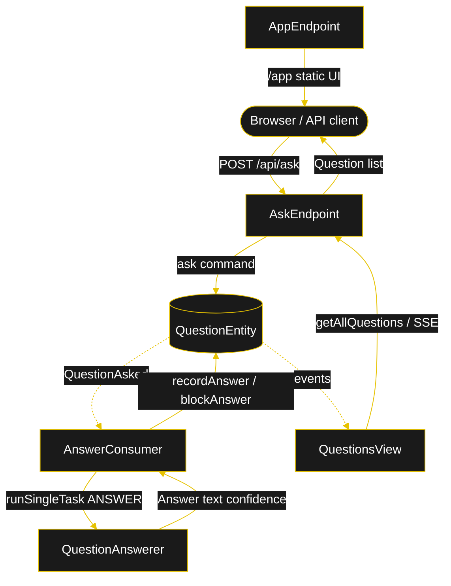
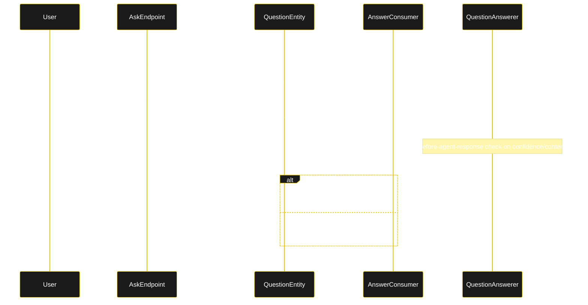
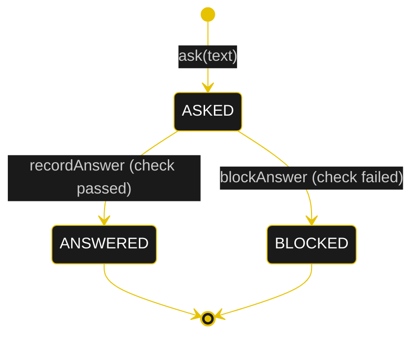
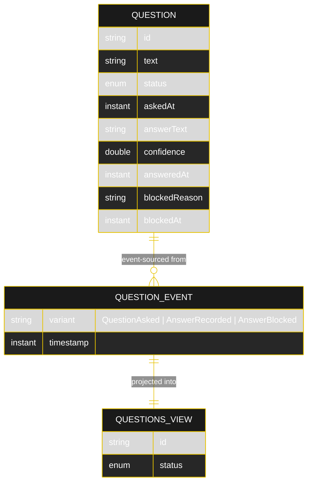

# Implementation Plan — `helloworld`

The architecture this blueprint resolves to once [`SPEC.md`](./SPEC.md) runs through `/akka:specify` → `/akka:plan`. Diagrams are rendered on the Architecture tab of the embedded UI; they carry the Akka theme variables and the Lesson 24 CSS overrides for state-diagram labels.

---

## Component graph

Solid arrows are synchronous commands; dashed arrows are event subscriptions.

## Interaction sequence

## State machine

State boxes and transition labels need the CSS overrides in Lesson 24 (white `.stateLabel`, `overflow:visible` on edge-label `foreignObject`). The generated `index.html` must inherit them.

## Entity model

## Component table

| Component | Kind | File | Purpose |
|---|---|---|---|
| `QuestionAnswerer` | AutonomousAgent | `application/QuestionAnswerer.java` | Answers one question; returns `Answer`. |
| `AnswererTasks` | task definitions | `application/AnswererTasks.java` | The `ANSWER` `Task<Answer>` constant. |
| `Answer` | record | `application/Answer.java` | `{ text, confidence }`. |
| `QuestionEntity` | EventSourcedEntity | `application/QuestionEntity.java` | Per-question lifecycle. Commands: `ask`, `recordAnswer`, `blockAnswer`, `getQuestion`. |
| `QuestionsView` | View | `application/QuestionsView.java` | Row type `Question`; one query `getAllQuestions`. |
| `AnswerConsumer` | Consumer | `application/AnswerConsumer.java` | On `QuestionAsked`, runs the ANSWER task and records the result. |
| `AskEndpoint` | HttpEndpoint | `api/AskEndpoint.java` | `/api/*` HTTP API + SSE + metadata. |
| `AppEndpoint` | HttpEndpoint | `api/AppEndpoint.java` | Serves `/` redirect and `/app/*`. |
| `Question` / `QuestionStatus` / `QuestionEvent` | domain | `domain/*.java` | State, enum, sealed events. |
| `Bootstrap` | service-setup | `Bootstrap.java` | Startup wiring. |

Akka component count: **2 http-endpoint · 1 view · 1 consumer · 1 autonomous-agent · 1 event-sourced-entity · 1 service-setup**.

## Concurrency notes

- **Step / call timeouts (Lesson 4).** `AnswerConsumer`'s call to `runSingleTask` + `forTask(taskId).result(ANSWER)` must allow for a 10–30s LLM round-trip; configure the consumer's effect timeout to at least 60s. Never rely on the 5s default.
- **Idempotency.** `AnswerConsumer` keys the agent session on `"answer-"+questionId`, so a redelivered `QuestionAsked` event reuses the same task session rather than spawning a duplicate answer.
- **No saga / compensation.** Single agent, single write-back; there is no multi-step transaction to compensate. A failed answer call surfaces as the question remaining in `ASKED`; the consumer retries on redelivery.
- **View indexing (Lesson 2).** `QuestionsView` exposes one query over all rows; status filtering happens client-side in `AskEndpoint` because the enum column cannot be auto-indexed.
