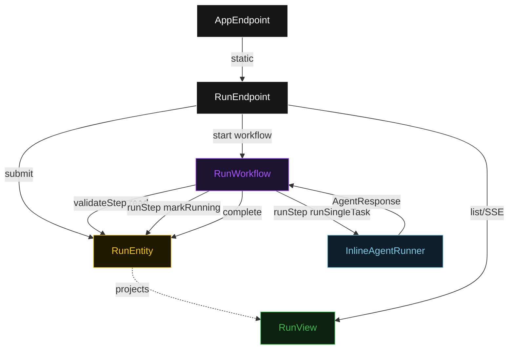
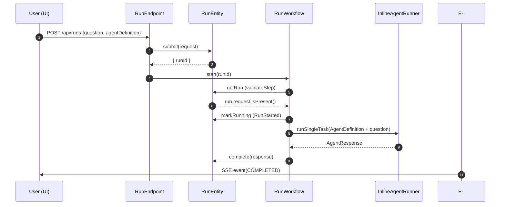
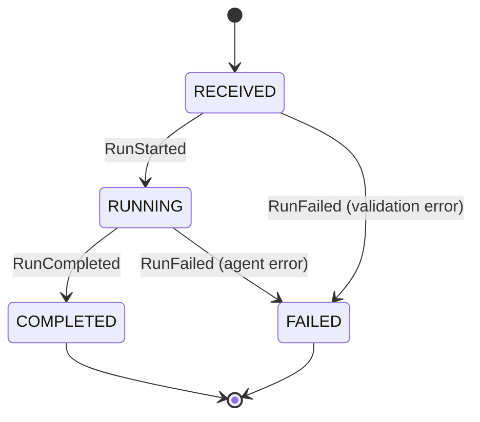
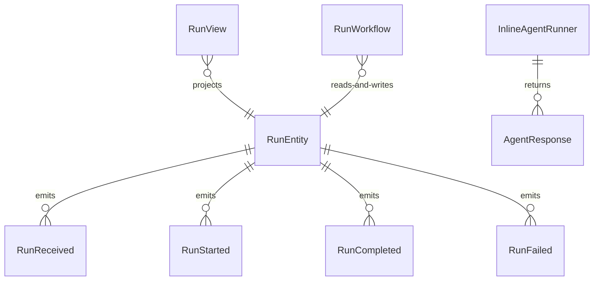

# PLAN — inline-agent-demo

Architectural sketch consumed by `/akka:plan` and rendered on the generated system's Architecture tab. The four mermaid diagrams below carry the theme variables and CSS overrides from Lesson 24; without them, state names render black-on-black and edge labels clip.

---

## Component graph

## Interaction sequence — J1 (happy path)

## State machine — `RunEntity`

## Entity model

## Component table — Java file targets

| Component | Path (generated) |
|---|---|
| `RunEndpoint` | `api/RunEndpoint.java` |
| `AppEndpoint` | `api/AppEndpoint.java` |
| `RunEntity` | `application/RunEntity.java` (state in `domain/Run.java`, events in `domain/RunEvent.java`) |
| `RunWorkflow` | `application/RunWorkflow.java` |
| `InlineAgentRunner` | `application/InlineAgentRunner.java` (tasks in `application/RunTasks.java`) |
| `RunView` | `application/RunView.java` |
| `MockModelProvider` (option-a only) | `application/MockModelProvider.java` |
| Bootstrap | `Bootstrap.java` |

## Concurrency notes

- **Per-step timeout**: `validateStep` 5 s, `runStep` 60 s, `error` 5 s. Default step recovery `maxRetries(2).failoverTo(RunWorkflow::error)`. The 60 s on `runStep` accommodates LLM latency (Lesson 4).
- **Idempotency**: every workflow uses `"run-" + runId` as the workflow id. The `RunEndpoint` starts the workflow only after the entity write succeeds; a duplicate submission on the same `runId` hits an already-running workflow, which is a no-op.
- **One agent per run**: the AutonomousAgent instance id is `"runner-" + runId`, which gives each task its own conversation context. The agent's `capability(...).maxIterationsPerTask(3)` caps internal retries.
- **Inline agent construction**: the `AgentDefinition` object passed to `InlineAgentRunner` is built inside `runStep` from the `InlineAgentRequest` stored on the entity. The base system prompt from `prompts/inline-agent-runner.md` is loaded at startup and prepended to the caller-supplied `systemPrompt` at task time.
- **No saga / no compensation**: the only external call is the single LLM task. There is nothing external to roll back.
- **Validation is synchronous**: `validateStep` reads the entity and checks fields in-process. Malformed requests fail fast without ever reaching the LLM.
