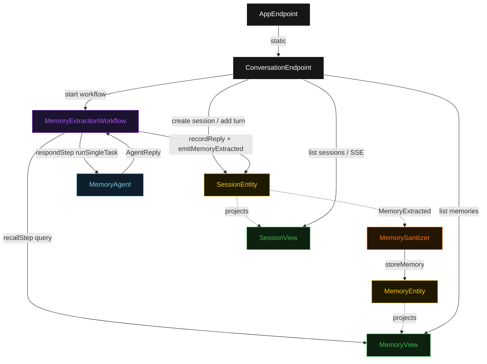
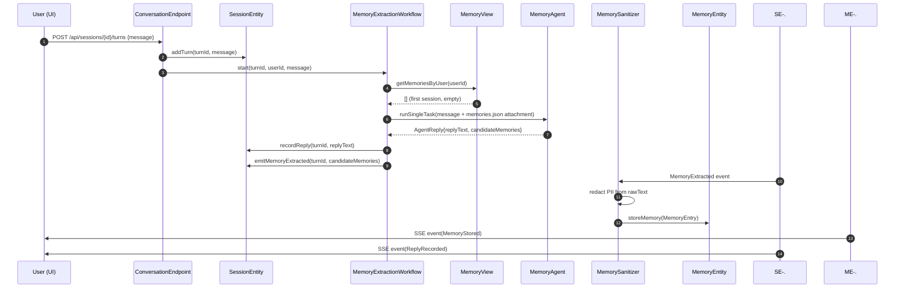
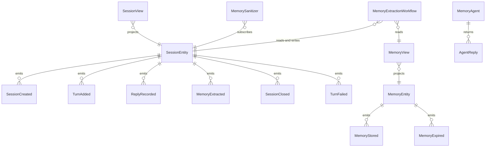

# PLAN — long-term-memory-agent

Architectural sketch consumed by `/akka:plan` and rendered on the generated system's Architecture tab. The four mermaid diagrams below carry the theme variables and CSS overrides from Lesson 24; without them, state names render black-on-black and edge labels clip.

---

## Component graph

## Interaction sequence — J1 (happy path: first turn)

## State machine — `SessionEntity`

```mermaid
stateDiagram-v2
  [*] --> ACTIVE
  ACTIVE --> ACTIVE: TurnAdded / ReplyRecorded / MemoryExtracted
  ACTIVE --> CLOSING: max turns reached
  CLOSING --> CLOSED: SessionClosed
  ACTIVE --> CLOSED: SessionClosed (explicit close)
  ACTIVE --> ACTIVE: TurnFailed (turn fails; session stays open)
  CLOSED --> [*]
```

## Entity model

## Component table — Java file targets

| Component | Path (generated) |
|---|---|
| `ConversationEndpoint` | `api/ConversationEndpoint.java` |
| `AppEndpoint` | `api/AppEndpoint.java` |
| `SessionEntity` | `application/SessionEntity.java` (state in `domain/Session.java`, events in `domain/SessionEvent.java`) |
| `MemoryEntity` | `application/MemoryEntity.java` (state in `domain/UserMemoryStore.java`, events in `domain/MemoryEvent.java`) |
| `MemorySanitizer` | `application/MemorySanitizer.java` |
| `MemoryExtractionWorkflow` | `application/MemoryExtractionWorkflow.java` |
| `MemoryAgent` | `application/MemoryAgent.java` (tasks in `application/MemoryTasks.java`) |
| `SessionView` | `application/SessionView.java` |
| `MemoryView` | `application/MemoryView.java` |
| `MockModelProvider` (option-a only) | `application/MockModelProvider.java` |
| Bootstrap | `Bootstrap.java` |

## Concurrency notes

- **Per-step timeout**: `recallStep` 5 s, `respondStep` 60 s, `extractStep` 5 s, `error` 5 s. Default step recovery `maxRetries(2).failoverTo(MemoryExtractionWorkflow::error)`. The 60 s on `respondStep` accommodates LLM latency (Lesson 4).
- **Idempotency**: every workflow uses `"turn-" + turnId` as the workflow id; the `MemorySanitizer` Consumer is allowed to redeliver `MemoryExtracted` events because `MemoryEntity.storeMemory` is guarded by `entryId` uniqueness — a duplicate write for the same entryId is a no-op.
- **One agent per user**: the AutonomousAgent instance id is `"agent-" + userId`, giving each user their own conversation context and iteration budget. The agent's `capability(...).maxIterationsPerTask(2)` limits retries.
- **Memory recall is read-only**: `recallStep` queries `MemoryView` — a projection, not the entity directly. The view is eventually consistent; on the very first turn the view is empty, which is a valid and handled case.
- **Sanitizer is asynchronous**: the `extractStep` completes as soon as `MemoryExtracted` events are emitted onto `SessionEntity`. The `MemorySanitizer` Consumer processes them asynchronously. The UI receives a `MemoryStored` SSE event when persistence completes. There is no saga / no compensation — memory writes are append-only.
- **Session cap**: `SessionEntity.addTurn` rejects if `turns.size() >= 50`. This keeps entity state bounded. A deployer who needs longer conversations creates a new session; prior sessions' memories remain accessible via `MemoryEntity`.
