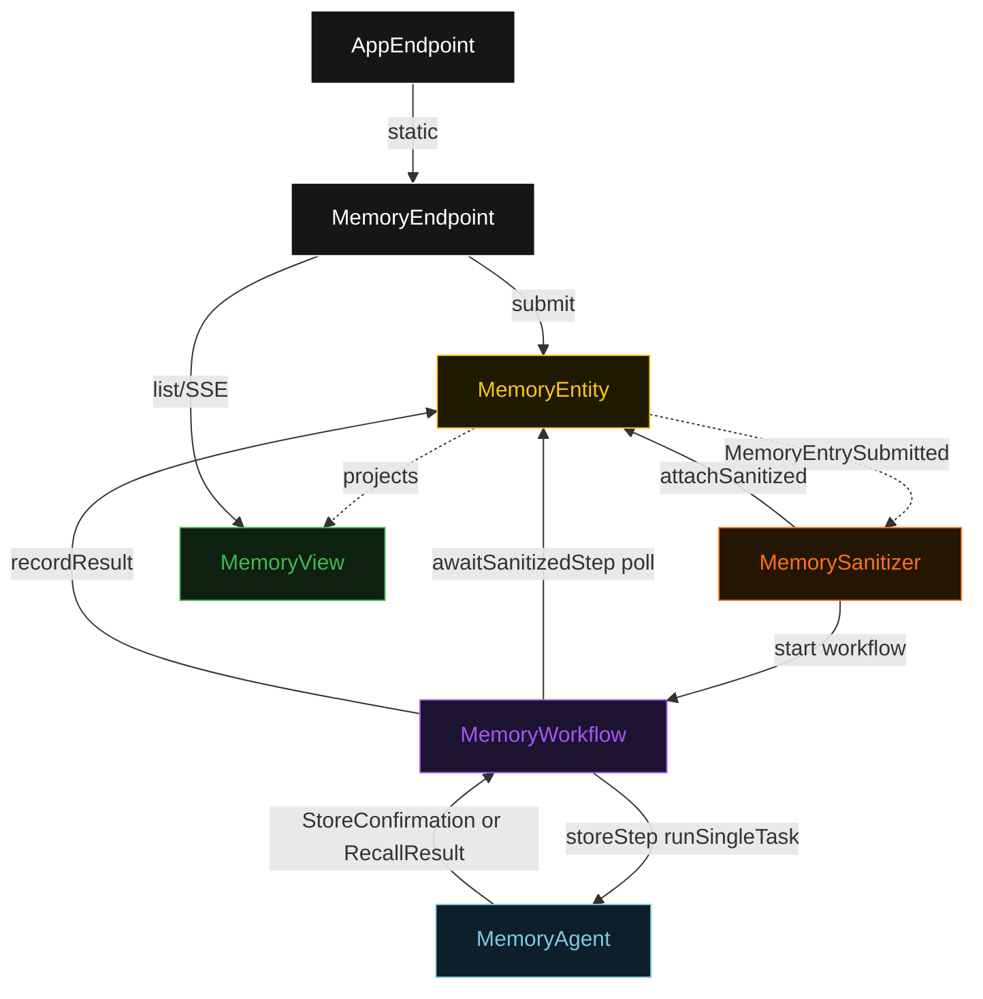
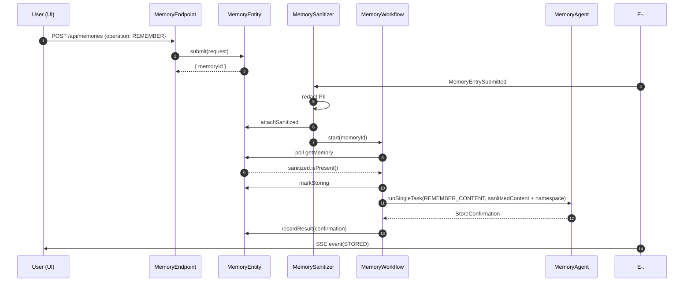
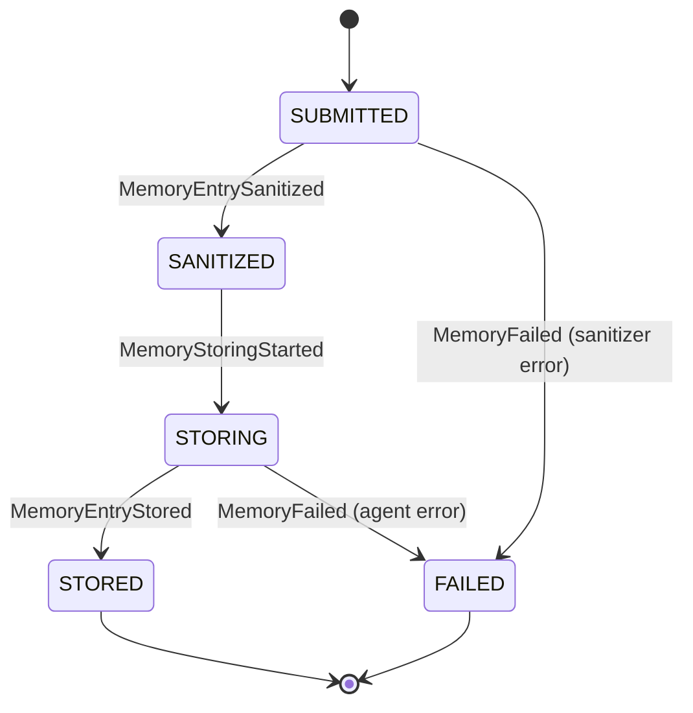
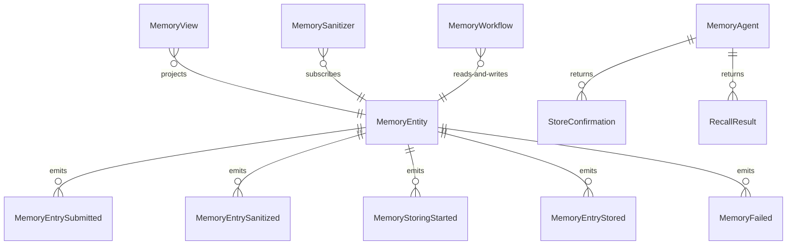

# PLAN — memory-bank

Architectural sketch consumed by `/akka:plan` and rendered on the generated system's Architecture tab. The four mermaid diagrams below carry the theme variables and CSS overrides from Lesson 24; without them, state names render black-on-black and edge labels clip.

---

## Component graph

## Interaction sequence — J1 (happy path: REMEMBER)

## State machine — `MemoryEntity`

## Entity model

## Component table — Java file targets

| Component | Path (generated) |
|---|---|
| `MemoryEndpoint` | `api/MemoryEndpoint.java` |
| `AppEndpoint` | `api/AppEndpoint.java` |
| `MemoryEntity` | `application/MemoryEntity.java` (state in `domain/Memory.java`, events in `domain/MemoryEvent.java`) |
| `MemorySanitizer` | `application/MemorySanitizer.java` |
| `MemoryWorkflow` | `application/MemoryWorkflow.java` |
| `MemoryAgent` | `application/MemoryAgent.java` (tasks in `application/MemoryTasks.java`) |
| `MemoryView` | `application/MemoryView.java` |
| `MockModelProvider` (option-a only) | `application/MockModelProvider.java` |
| Bootstrap | `Bootstrap.java` |

## Concurrency notes

- **Per-step timeout**: `awaitSanitizedStep` 15 s, `storeStep` 30 s, `error` 5 s. Default step recovery `maxRetries(2).failoverTo(MemoryWorkflow::error)`. The 30 s on `storeStep` accommodates LLM latency for both REMEMBER and RECALL task types (Lesson 4).
- **Idempotency**: every workflow uses `"memory-" + memoryId` as the workflow id; `MemorySanitizer` is allowed to redeliver `MemoryEntrySubmitted` events because `MemoryEntity.attachSanitized` is event-version-guarded — a second sanitize attempt against an already-sanitized entry is a no-op.
- **One agent, two task types**: `MemoryAgent` handles both `REMEMBER_CONTENT` and `RECALL_CONTENT` tasks. The instance id is `"memory-" + memoryId`, giving each operation its own conversation context. `maxIterationsPerTask(3)` caps retries per task.
- **Recall context injection**: for RECALL operations, `MemoryWorkflow.storeStep` fetches stored entries from `MemoryView` and injects them into the task instructions string before calling the agent. This keeps the single-agent invariant — no second agent mediates the context lookup.
- **No saga / no compensation**: every step is either pure read, append-only event write, or a single-task agent call. There is nothing external to roll back.
