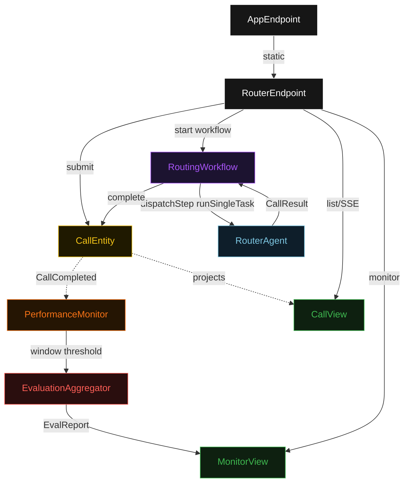
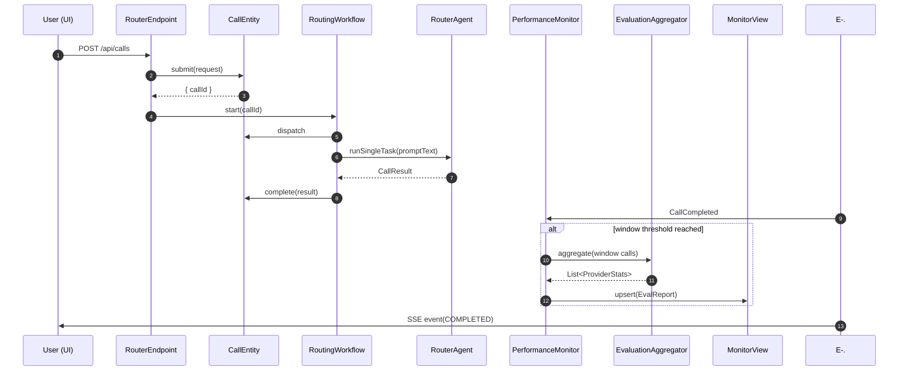
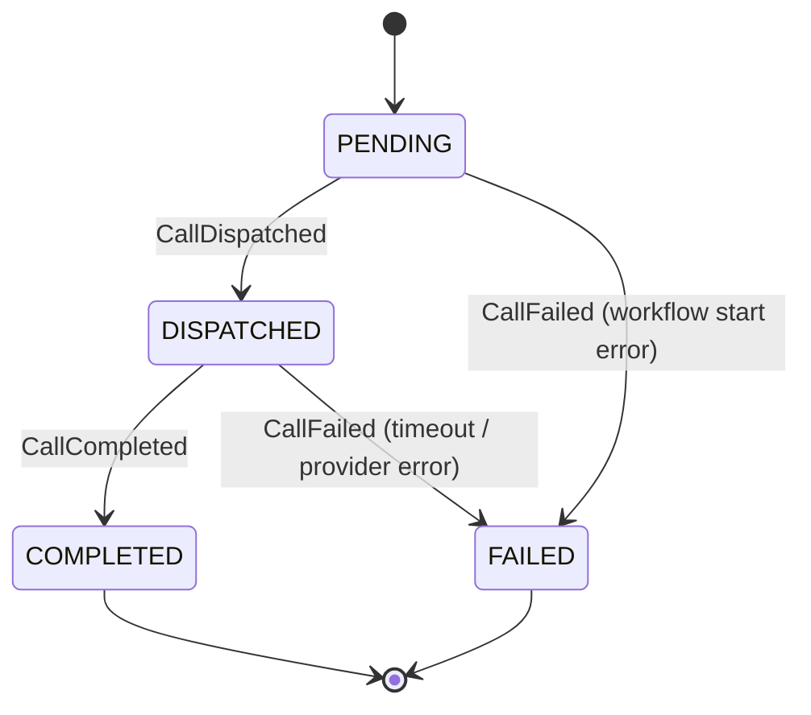
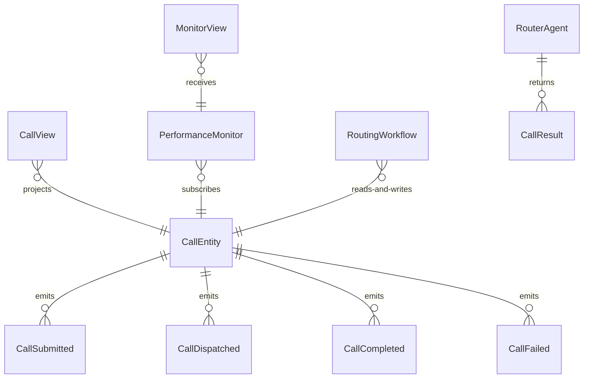

# PLAN — multi-provider-router

Architectural sketch consumed by `/akka:plan` and rendered on the generated system's Architecture tab. The four mermaid diagrams below carry the theme variables and CSS overrides from Lesson 24; without them, state names render black-on-black and edge labels clip.

---

## Component graph

## Interaction sequence — J1 (happy path)

## State machine — `CallEntity`

## Entity model

## Component table — Java file targets

| Component | Path (generated) |
|---|---|
| `RouterEndpoint` | `api/RouterEndpoint.java` |
| `AppEndpoint` | `api/AppEndpoint.java` |
| `CallEntity` | `application/CallEntity.java` (state in `domain/CallRecord.java`, events in `domain/CallEvent.java`) |
| `RoutingWorkflow` | `application/RoutingWorkflow.java` |
| `RouterAgent` | `application/RouterAgent.java` (tasks in `application/RouterTasks.java`) |
| `PerformanceMonitor` | `application/PerformanceMonitor.java` |
| `EvaluationAggregator` | `application/EvaluationAggregator.java` |
| `CallView` | `application/CallView.java` |
| `MonitorView` | `application/MonitorView.java` |
| `MockModelProvider` (option-a only) | `application/MockModelProvider.java` |
| Bootstrap | `Bootstrap.java` |

## Concurrency notes

- **Per-step timeout**: `dispatchStep` 60 s, `recordStep` 5 s, `error` 5 s. Default step recovery `maxRetries(1).failoverTo(RoutingWorkflow::error)`. The 60 s on `dispatchStep` accommodates provider latency variance across the two backends (Lesson 4).
- **Idempotency**: every workflow uses `"routing-" + callId` as the workflow id; the `RouterEndpoint` is responsible for minting unique callIds. A duplicate POST with the same callId is a client error (400).
- **One agent per call**: the AutonomousAgent instance id is `"router-" + callId`, giving each task its own conversation context. The agent's `capability(...).maxIterationsPerTask(2)` bounds any retry on malformed output.
- **Provider selection**: the LiteLLMRouterModel shuffle strategy picks a backend per call without locking. The RoutingWorkflow does not control which backend is selected — that is the model-provider's concern. A ProviderHint of OPENAI or ANTHROPIC pins the call; AUTO lets the router decide.
- **Eval is asynchronous and deterministic**: `EvaluationAggregator` runs in-process inside `PerformanceMonitor` after the window threshold is crossed. No LLM call, no external service — the same set of call records always produces the same stats. This is a deliberate single-agent guarantee.
- **No saga / no compensation**: every step is either pure read, append-only event write, or a single-task agent call. Nothing external to roll back.
