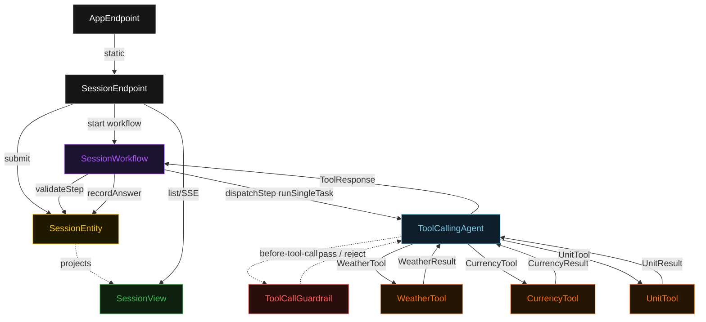
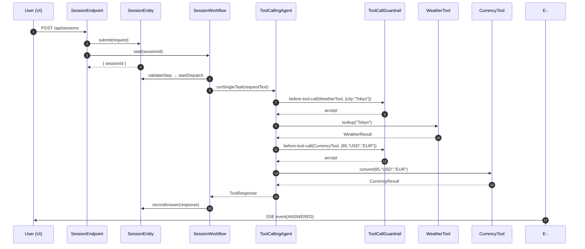
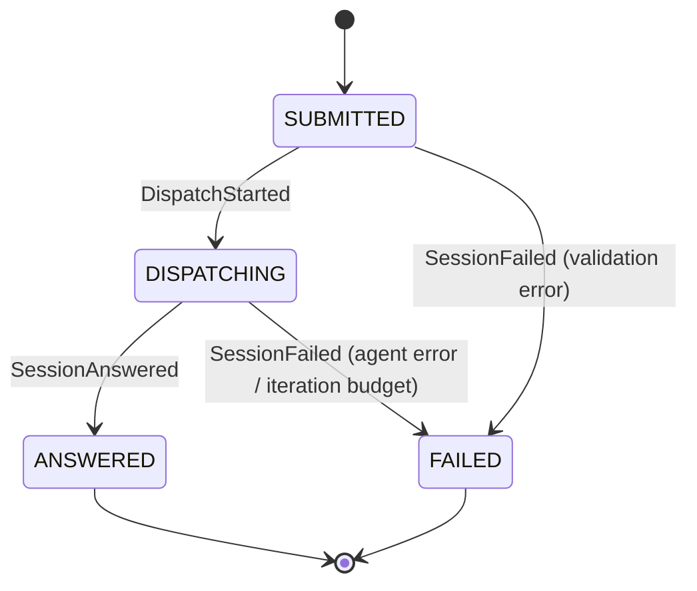
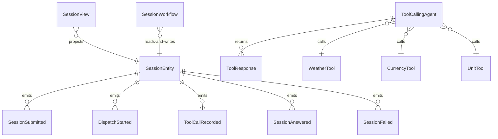

# PLAN — multi-tool-agent

Architectural sketch consumed by `/akka:plan` and rendered on the generated system's Architecture tab. The four mermaid diagrams below carry the theme variables and CSS overrides from Lesson 24; without them, state names render black-on-black and edge labels clip.

---

## Component graph

## Interaction sequence — J1 (happy path)

## State machine — `SessionEntity`

## Entity model

## Component table — Java file targets

| Component | Path (generated) |
|---|---|
| `SessionEndpoint` | `api/SessionEndpoint.java` |
| `AppEndpoint` | `api/AppEndpoint.java` |
| `SessionEntity` | `application/SessionEntity.java` (state in `domain/Session.java`, events in `domain/SessionEvent.java`) |
| `SessionWorkflow` | `application/SessionWorkflow.java` |
| `ToolCallingAgent` | `application/ToolCallingAgent.java` (tasks in `application/SessionTasks.java`) |
| `ToolCallGuardrail` | `application/ToolCallGuardrail.java` |
| `WeatherTool` | `application/WeatherTool.java` |
| `CurrencyTool` | `application/CurrencyTool.java` |
| `UnitTool` | `application/UnitTool.java` |
| `SessionView` | `application/SessionView.java` |
| `MockModelProvider` (option-a only) | `application/MockModelProvider.java` |
| Bootstrap | `Bootstrap.java` |

## Concurrency notes

- **Per-step timeout**: `validateStep` 5 s, `dispatchStep` 120 s, `summarizeStep` 5 s, `error` 5 s. Default step recovery `maxRetries(1).failoverTo(SessionWorkflow::error)`. The 120 s on `dispatchStep` accommodates multiple sequential tool calls plus LLM latency (Lesson 4).
- **Idempotency**: every workflow uses `"session-" + sessionId` as the workflow id; `SessionEndpoint` guards against duplicate submits by checking entity state before starting the workflow.
- **One agent per session**: the AutonomousAgent instance id is `"agent-" + sessionId`, giving each session its own conversation context. The agent's `capability(...).maxIterationsPerTask(5)` caps guardrail-triggered retries at 5.
- **Guardrail-driven reformulation**: when `ToolCallGuardrail` rejects a tool call, the rejection is returned as a structured `invalid-tool-call` error to the agent loop. The loop counts toward `maxIterationsPerTask`; if all 5 iterations fail to produce a valid tool call, the workflow's `dispatchStep` fails over to `error` and the entity transitions to `FAILED`.
- **Tool adapters are synchronous and in-process**: `WeatherTool`, `CurrencyTool`, and `UnitTool` return immediately from seeded data. No external HTTP. This is deliberate — the blueprint demonstrates the guardrail and agent pattern; a real deployer swaps the adapters for real HTTP clients.
- **No saga / no compensation**: every step is either pure validation, append-only event write, or a single-task agent call. There is nothing external to roll back.
