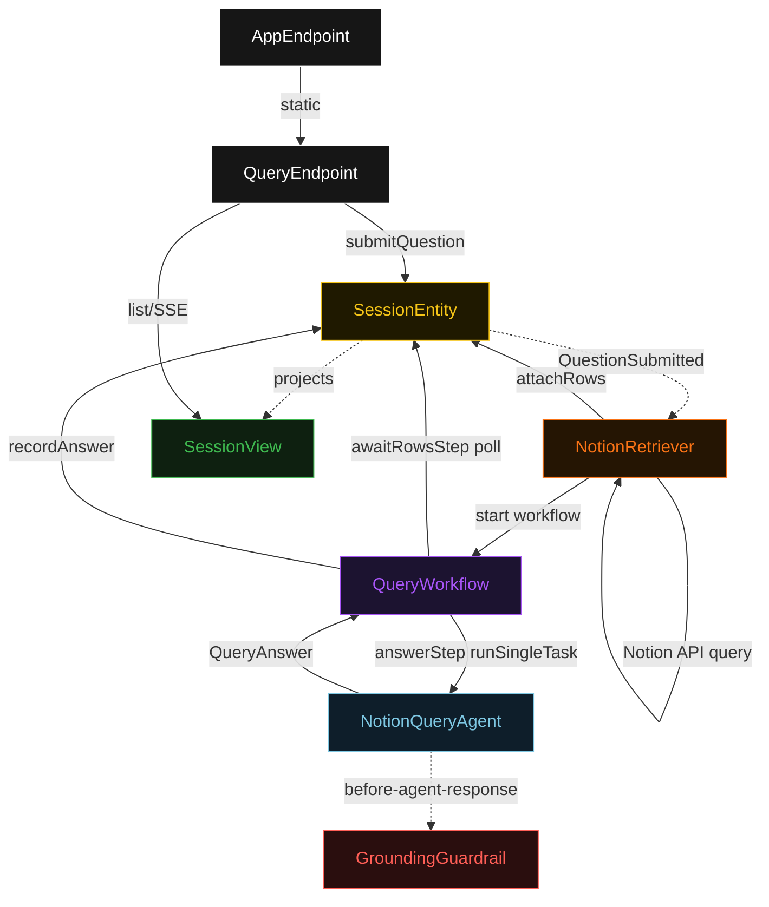
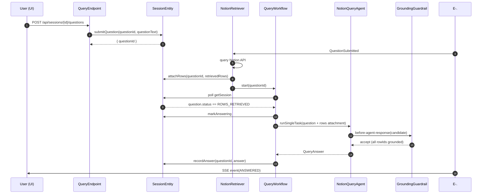
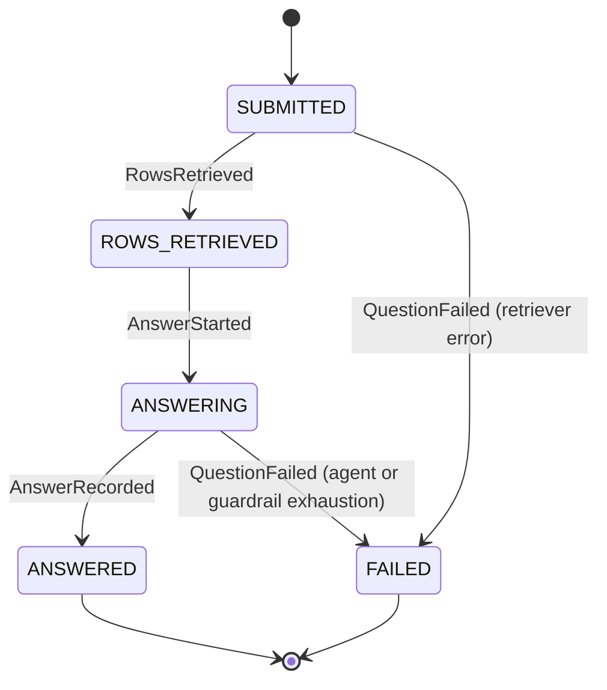
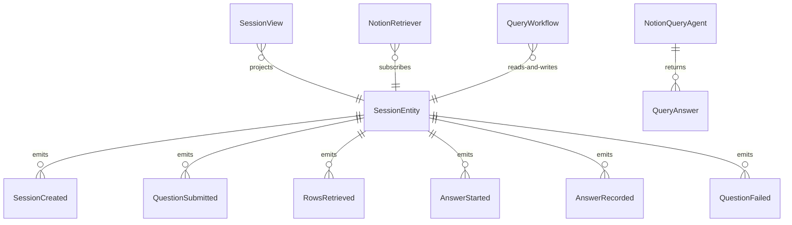

# PLAN — notion-rag

Architectural sketch consumed by `/akka:plan` and rendered on the generated system's Architecture tab. The four mermaid diagrams below carry the theme variables and CSS overrides from Lesson 24; without them, state names render black-on-black and edge labels clip.

---

## Component graph

## Interaction sequence — J1 (happy path)

## State machine — `QuestionStatus` inside `SessionEntity`

## Entity model

## Component table — Java file targets

| Component | Path (generated) |
|---|---|
| `QueryEndpoint` | `api/QueryEndpoint.java` |
| `AppEndpoint` | `api/AppEndpoint.java` |
| `SessionEntity` | `application/SessionEntity.java` (state in `domain/Session.java`, events in `domain/SessionEvent.java`) |
| `NotionRetriever` | `application/NotionRetriever.java` |
| `QueryWorkflow` | `application/QueryWorkflow.java` |
| `NotionQueryAgent` | `application/NotionQueryAgent.java` (tasks in `application/QueryTasks.java`) |
| `GroundingGuardrail` | `application/GroundingGuardrail.java` |
| `SessionView` | `application/SessionView.java` |
| `MockModelProvider` (option-a only) | `application/MockModelProvider.java` |
| Bootstrap | `Bootstrap.java` |

## Concurrency notes

- **Per-step timeout**: `awaitRowsStep` 15 s, `answerStep` 60 s, `error` 5 s. Default step recovery `maxRetries(2).failoverTo(QueryWorkflow::error)`. The 60 s on `answerStep` accommodates LLM latency (Lesson 4).
- **Idempotency**: every workflow uses `"query-" + questionId` as the workflow id; `NotionRetriever` may redeliver `QuestionSubmitted` events but `SessionEntity.attachRows` is event-version-guarded — a second attach attempt against an already-retrieved question is a no-op.
- **One agent per question**: the AutonomousAgent instance id is `"agent-" + questionId`, giving each task its own conversation context. The agent's `capability(...).maxIterationsPerTask(3)` caps guardrail-triggered retries.
- **Guardrail-driven retry**: when `GroundingGuardrail` rejects a candidate response, the agent loop counts one iteration toward `maxIterationsPerTask`. If all 3 fail, the workflow's `answerStep` fails over to `error` and the question transitions to `FAILED`.
- **Retriever is not an LLM**: `NotionRetriever` is a Consumer that calls the Notion HTTP API. The single-agent invariant is preserved — only `NotionQueryAgent` calls a model.
- **No saga / no compensation**: every step is a pure read, an append-only event write, or a single-task agent call. Nothing external needs rolling back.
