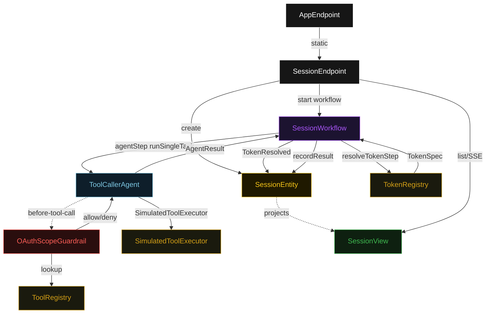
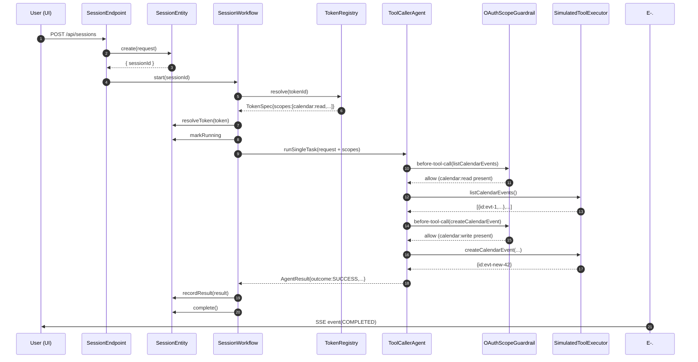
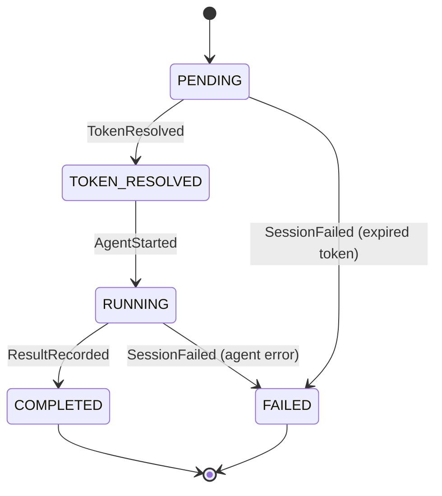
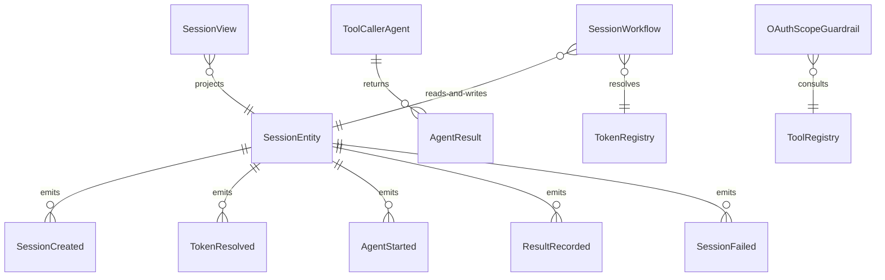

# PLAN — ae-oauth

Architectural sketch consumed by `/akka:plan` and rendered on the generated system's Architecture tab. The four mermaid diagrams below carry the theme variables and CSS overrides from Lesson 24; without them, state names render black-on-black and edge labels clip.

---

## Component graph

## Interaction sequence — J1 (happy path: full-access token)

## State machine — `SessionEntity`

## Entity model

## Component table — Java file targets

| Component | Path (generated) |
|---|---|
| `SessionEndpoint` | `api/SessionEndpoint.java` |
| `AppEndpoint` | `api/AppEndpoint.java` |
| `SessionEntity` | `application/SessionEntity.java` (state in `domain/Session.java`, events in `domain/SessionEvent.java`) |
| `SessionWorkflow` | `application/SessionWorkflow.java` |
| `ToolCallerAgent` | `application/ToolCallerAgent.java` (tasks in `application/SessionTasks.java`) |
| `OAuthScopeGuardrail` | `application/OAuthScopeGuardrail.java` |
| `TokenRegistry` | `application/TokenRegistry.java` |
| `ToolRegistry` | `application/ToolRegistry.java` |
| `SimulatedToolExecutor` | `application/SimulatedToolExecutor.java` |
| `SessionView` | `application/SessionView.java` |
| `MockModelProvider` (option-a only) | `application/MockModelProvider.java` |
| Bootstrap | `Bootstrap.java` |

## Concurrency notes

- **Per-step timeout**: `resolveTokenStep` 5 s, `agentStep` 90 s, `recordStep` 5 s, `error` 5 s. Default step recovery `maxRetries(1).failoverTo(SessionWorkflow::error)`. The 90 s on `agentStep` accommodates multi-tool LLM round trips (Lesson 4).
- **Idempotency**: every workflow uses `"session-" + sessionId` as the workflow id. `SessionEntity.resolveToken` is version-guarded — a second `TokenResolved` event against an already-resolved session is a no-op.
- **One agent per session**: the AutonomousAgent instance id is `"agent-" + sessionId`, giving each task its own conversation context. `capability(...).maxIterationsPerTask(5)` allows multiple tool-call rounds without re-starting the task.
- **Guardrail is per-call, not per-task**: `OAuthScopeGuardrail` fires on each individual proposed tool call inside the task, not once at the start. The agent may receive a mix of allow and deny responses in a single task execution, producing `outcome: PARTIAL`.
- **Expired-token fast-fail**: token expiry is checked in `resolveTokenStep`, before `ToolCallerAgent` is ever invoked. This avoids an LLM call on invalid credentials and produces a `FAILED` session with a clear reason.
- **No external API calls**: `SimulatedToolExecutor` returns deterministic in-process responses. The guardrail enforces real scope logic against `ToolRegistry`; the executor provides realistic-looking output without network dependency.
