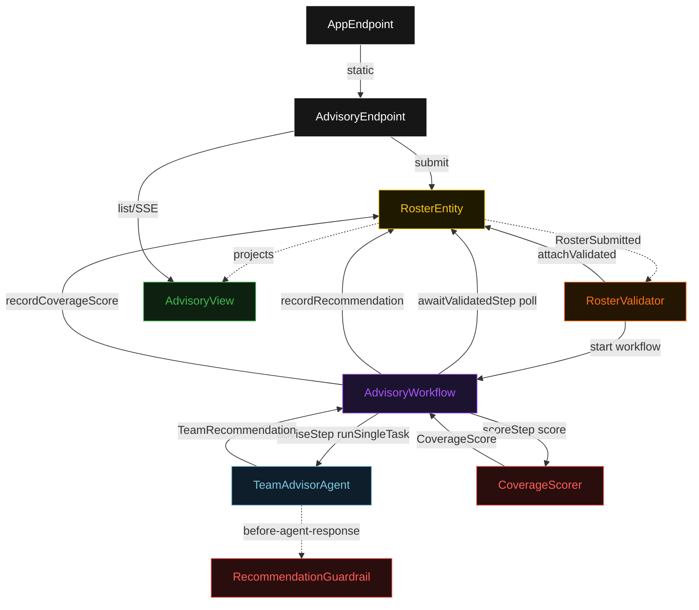
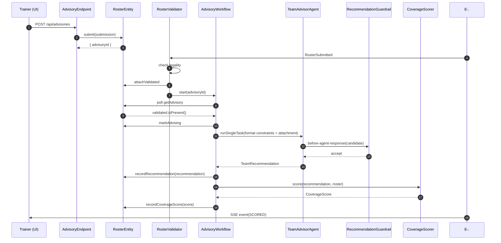
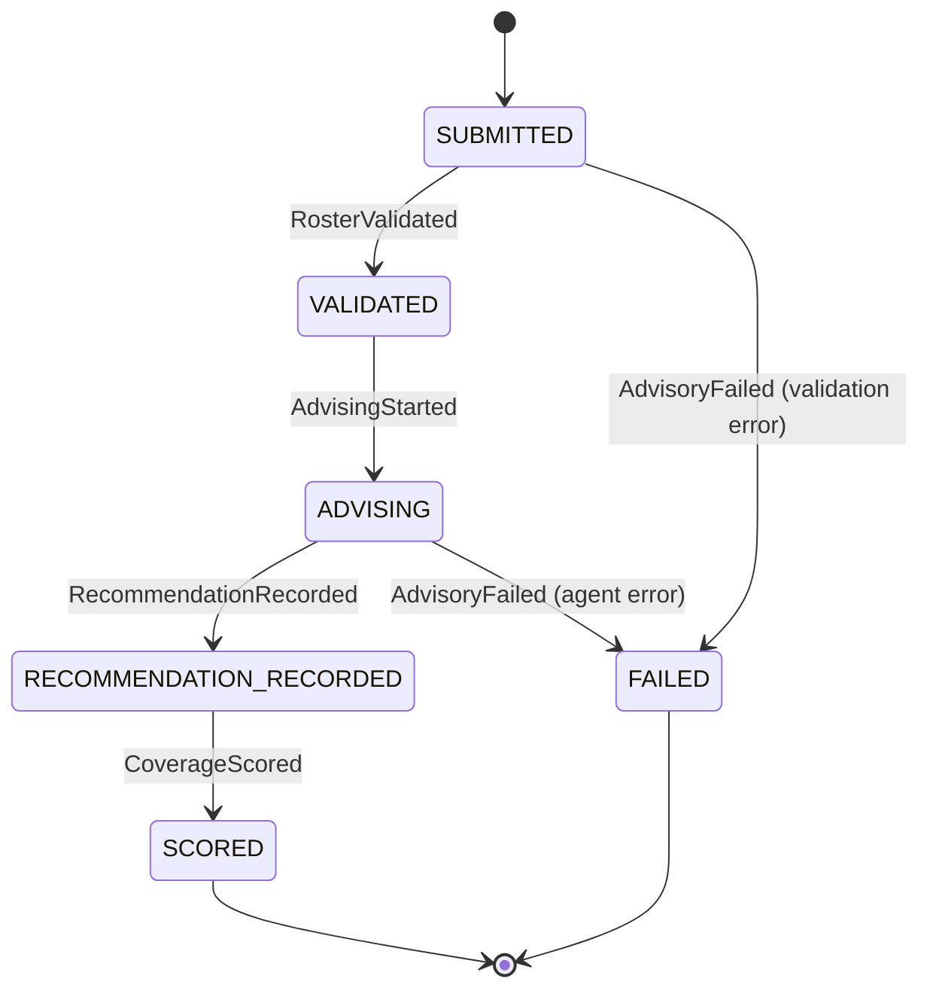
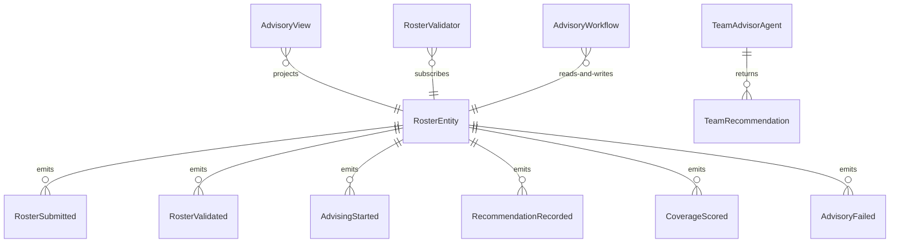

# PLAN — pokemon-advisor

Architectural sketch consumed by `/akka:plan` and rendered on the generated system's Architecture tab. The four mermaid diagrams below carry the theme variables and CSS overrides from Lesson 24; without them, state names render black-on-black and edge labels clip.

---

## Component graph

## Interaction sequence — J1 (happy path)

## State machine — `RosterEntity`

## Entity model

## Component table — Java file targets

| Component | Path (generated) |
|---|---|
| `AdvisoryEndpoint` | `api/AdvisoryEndpoint.java` |
| `AppEndpoint` | `api/AppEndpoint.java` |
| `RosterEntity` | `application/RosterEntity.java` (state in `domain/Advisory.java`, events in `domain/AdvisoryEvent.java`) |
| `RosterValidator` | `application/RosterValidator.java` |
| `AdvisoryWorkflow` | `application/AdvisoryWorkflow.java` |
| `TeamAdvisorAgent` | `application/TeamAdvisorAgent.java` (tasks in `application/AdvisoryTasks.java`) |
| `RecommendationGuardrail` | `application/RecommendationGuardrail.java` |
| `CoverageScorer` | `application/CoverageScorer.java` |
| `AdvisoryView` | `application/AdvisoryView.java` |
| `MockModelProvider` (option-a only) | `application/MockModelProvider.java` |
| Bootstrap | `Bootstrap.java` |

## Concurrency notes

- **Per-step timeout**: `awaitValidatedStep` 15 s, `adviseStep` 60 s, `scoreStep` 5 s, `error` 5 s. Default step recovery `maxRetries(2).failoverTo(AdvisoryWorkflow::error)`. The 60 s on `adviseStep` accommodates LLM latency (Lesson 4).
- **Idempotency**: every workflow uses `"advisory-" + advisoryId` as the workflow id; the `RosterValidator` Consumer is allowed to redeliver `RosterSubmitted` events because `RosterEntity.attachValidated` is event-version-guarded — a second validate attempt against an already-validated advisory is a no-op.
- **One agent per advisory**: the AutonomousAgent instance id is `"advisor-" + advisoryId`, giving each task its own conversation context. The agent's `capability(...).maxIterationsPerTask(3)` caps guardrail-triggered retries at 3.
- **Guardrail-driven retry**: when `RecommendationGuardrail` rejects a candidate response, the rejection is returned as a structured error to the agent loop. The loop counts toward `maxIterationsPerTask`; if all 3 iterations fail validation, the workflow's `adviseStep` fails over to `error` and the entity transitions to `FAILED`.
- **Scoring is synchronous and deterministic**: `CoverageScorer` runs in-process inside `scoreStep`. No LLM call, no external service — the same recommendation always scores the same. This is a deliberate single-agent guarantee.
- **No saga / no compensation**: every step is either pure read, append-only event write, or a single-task agent call. There is nothing external to roll back.
