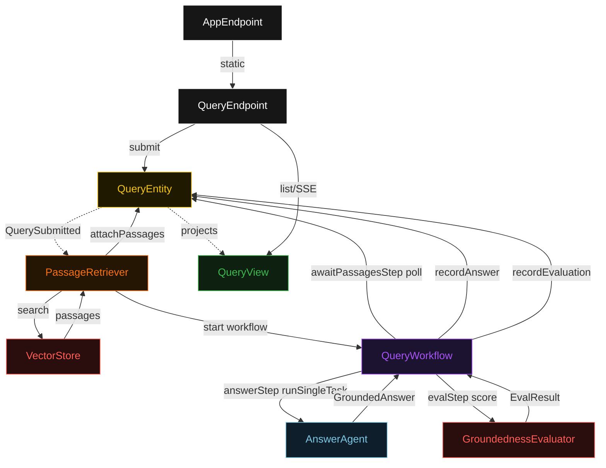
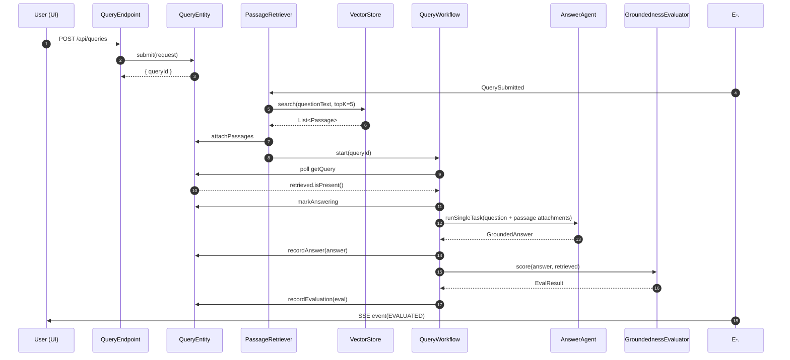
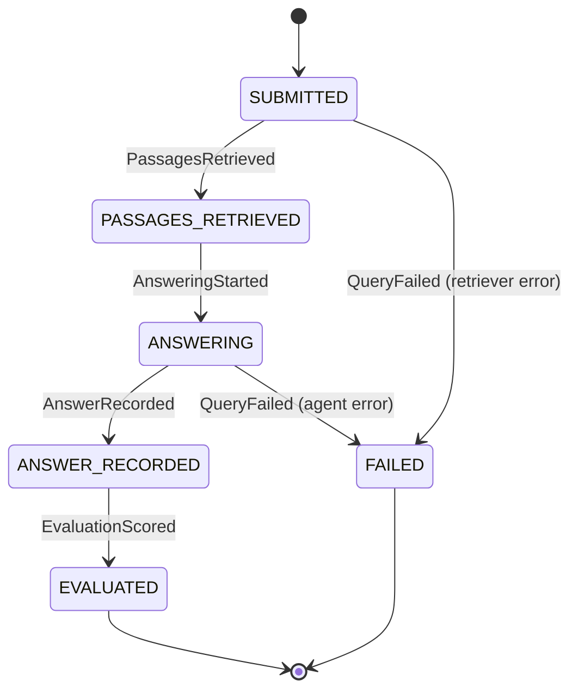
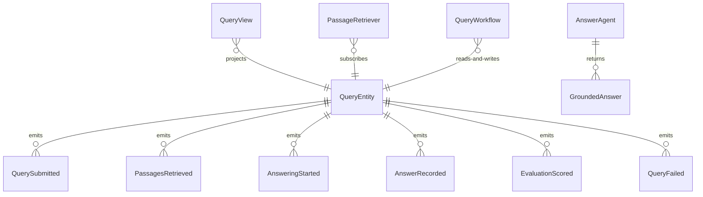

# PLAN — rag-baseline

Architectural sketch consumed by `/akka:plan` and rendered on the generated system's Architecture tab. The four mermaid diagrams below carry the theme variables and CSS overrides from Lesson 24; without them, state names render black-on-black and edge labels clip.

---

## Component graph

## Interaction sequence — J1 (happy path)

## State machine — `QueryEntity`

## Entity model

## Component table — Java file targets

| Component | Path (generated) |
|---|---|
| `QueryEndpoint` | `api/QueryEndpoint.java` |
| `AppEndpoint` | `api/AppEndpoint.java` |
| `QueryEntity` | `application/QueryEntity.java` (state in `domain/Query.java`, events in `domain/QueryEvent.java`) |
| `PassageRetriever` | `application/PassageRetriever.java` |
| `QueryWorkflow` | `application/QueryWorkflow.java` |
| `AnswerAgent` | `application/AnswerAgent.java` (tasks in `application/QueryTasks.java`) |
| `GroundednessEvaluator` | `application/GroundednessEvaluator.java` |
| `VectorStore` | `application/VectorStore.java` |
| `QueryView` | `application/QueryView.java` |
| `MockModelProvider` (option-a only) | `application/MockModelProvider.java` |
| Bootstrap | `Bootstrap.java` |

## Concurrency notes

- **Per-step timeout**: `awaitPassagesStep` 15 s, `answerStep` 60 s, `evalStep` 5 s, `error` 5 s. Default step recovery `maxRetries(2).failoverTo(QueryWorkflow::error)`. The 60 s on `answerStep` accommodates LLM latency (Lesson 4).
- **Idempotency**: every workflow uses `"query-" + queryId` as the workflow id; the `PassageRetriever` Consumer is allowed to redeliver `QuerySubmitted` events because `QueryEntity.attachPassages` is event-version-guarded — a second retrieval attempt against an already-retrieved query is a no-op.
- **One agent per query**: the AutonomousAgent instance id is `"answerer-" + queryId`, giving each task its own conversation context. `maxIterationsPerTask(2)` caps any retry within the agent loop.
- **Eval is synchronous and deterministic**: `GroundednessEvaluator` runs in-process inside `evalStep`. No LLM call, no external service — the same answer always scores the same. This is a deliberate single-agent guarantee.
- **VectorStore is read-only at runtime**: loaded once from the classpath on startup; no writes during query processing. Thread-safe for concurrent reads.
- **No saga / no compensation**: every step is either a pure read, an append-only event write, or a single-task agent call. Nothing external to roll back.
