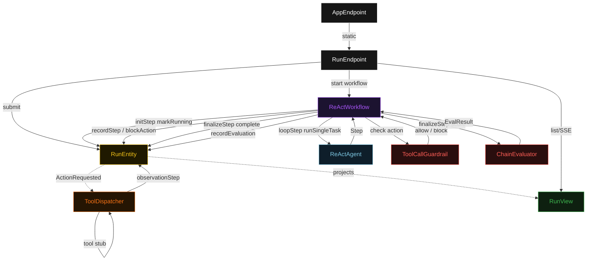
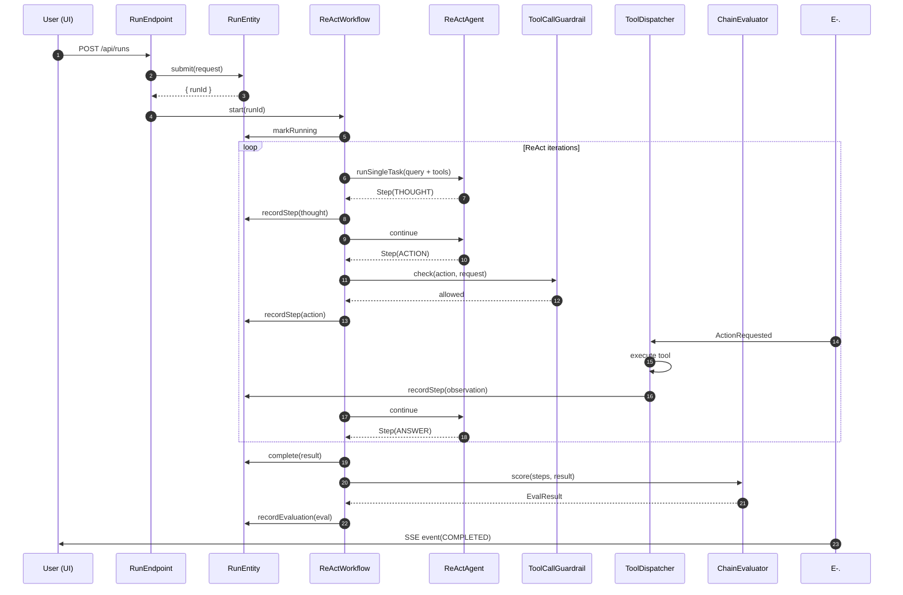
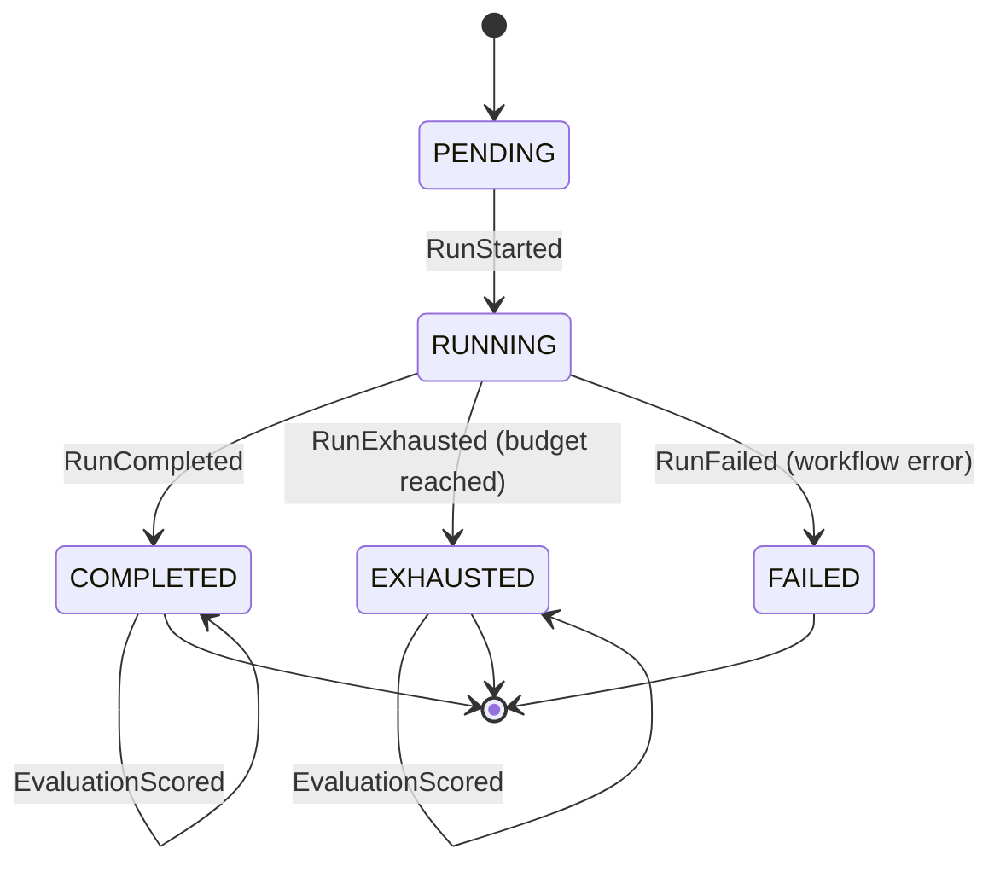
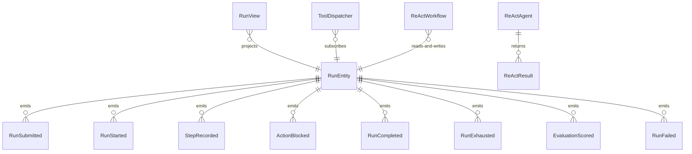

# PLAN — react-loop-agent

Architectural sketch consumed by `/akka:plan` and rendered on the generated system's Architecture tab. The four mermaid diagrams below carry the theme variables and CSS overrides from Lesson 24; without them, state names render black-on-black and edge labels clip.

---

## Component graph

## Interaction sequence — J1 (happy path)

## State machine — `RunEntity`

## Entity model

## Component table — Java file targets

| Component | Path (generated) |
|---|---|
| `RunEndpoint` | `api/RunEndpoint.java` |
| `AppEndpoint` | `api/AppEndpoint.java` |
| `RunEntity` | `application/RunEntity.java` (state in `domain/Run.java`, events in `domain/RunEvent.java`) |
| `ToolDispatcher` | `application/ToolDispatcher.java` |
| `ReActWorkflow` | `application/ReActWorkflow.java` |
| `ReActAgent` | `application/ReActAgent.java` (tasks in `application/RunTasks.java`) |
| `ToolCallGuardrail` | `application/ToolCallGuardrail.java` |
| `ChainEvaluator` | `application/ChainEvaluator.java` |
| `RunView` | `application/RunView.java` |
| `CalculatorTool` | `application/tools/CalculatorTool.java` |
| `WebLookupTool` | `application/tools/WebLookupTool.java` |
| `DataFetchTool` | `application/tools/DataFetchTool.java` |
| `MockModelProvider` (option-a only) | `application/MockModelProvider.java` |
| Bootstrap | `Bootstrap.java` |

## Concurrency notes

- **Per-step timeout**: `initStep` 5 s, `loopStep` 60 s, `finalizeStep` 10 s, `error` 5 s. Default step recovery `maxRetries(2).failoverTo(ReActWorkflow::error)`. The 60 s on `loopStep` accommodates LLM latency per ReAct iteration (Lesson 4).
- **Idempotency**: every workflow uses `"run-" + runId` as the workflow id. `RunEntity.markRunning` is event-version-guarded — a redelivered `RunStarted` against an already-running entity is a no-op.
- **One agent per run**: the AutonomousAgent instance id is `"agent-" + runId`, giving each run its own conversation context. `maxIterationsPerTask(10)` caps the ReAct loop.
- **Tool guardrail is not an agent hook**: `ToolCallGuardrail` is called synchronously by `loopStep` before forwarding an ACTION to `ToolDispatcher`. A blocked call produces a synthetic OBSERVATION step that the agent receives on its next iteration. The block is recorded as `ActionBlocked` on the entity — the audit trail is complete regardless of whether the agent recovers.
- **Eval is synchronous and deterministic**: `ChainEvaluator` runs in-process inside `finalizeStep`. No LLM call — the same step trace always scores the same. This maintains the single-agent guarantee.
- **Terminal states are COMPLETED, EXHAUSTED, FAILED**: `EvaluationScored` is appended to a COMPLETED or EXHAUSTED run without changing the terminal status. A FAILED run does not receive an eval — the partial trace is preserved for inspection.
