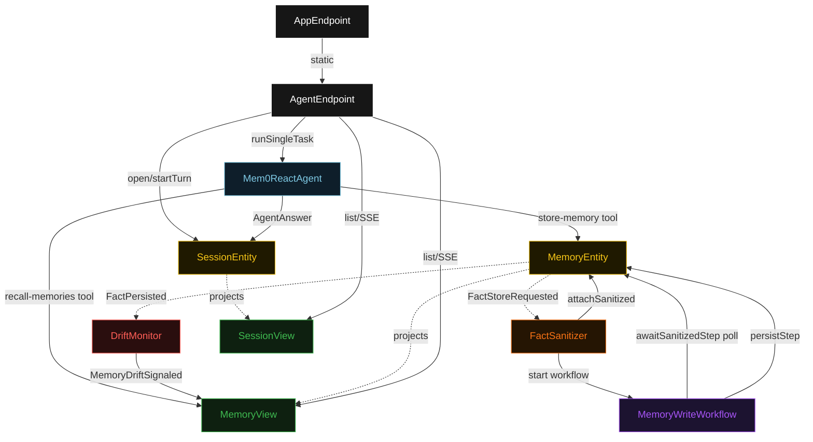
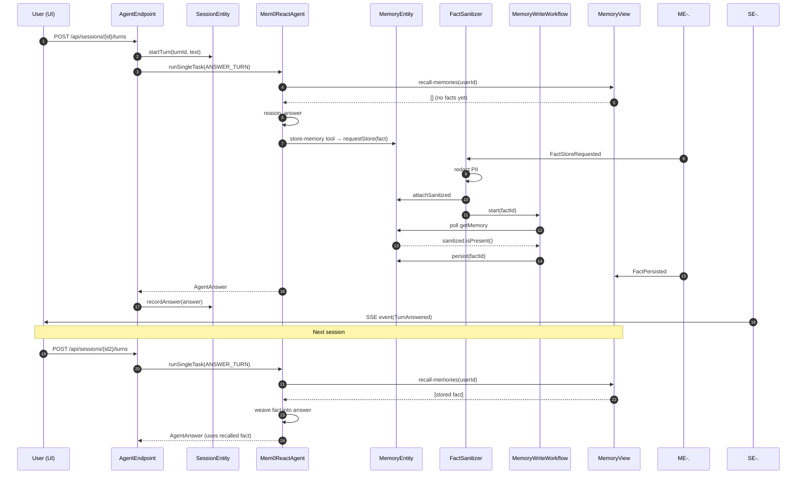
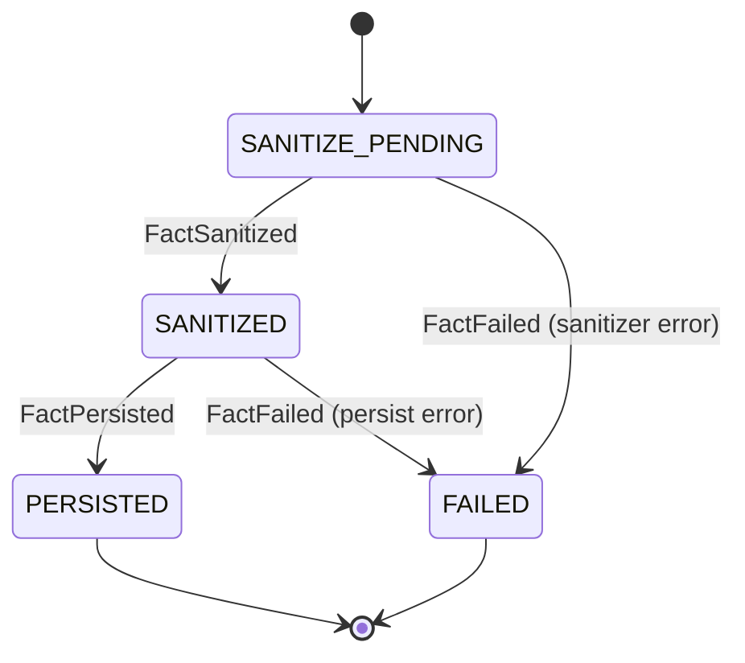
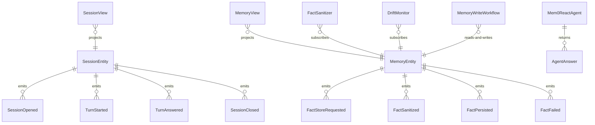

# PLAN — mem0-react-agent

Architectural sketch consumed by `/akka:plan` and rendered on the generated system's Architecture tab. The four mermaid diagrams below carry the theme variables and CSS overrides from Lesson 24; without them, state names render black-on-black and edge labels clip.

---

## Component graph

## Interaction sequence — J1 (happy path: user sends message, fact stored, recalled next session)

## State machine — `MemoryEntity`

## Entity model

## Component table — Java file targets

| Component | Path (generated) |
|---|---|
| `AgentEndpoint` | `api/AgentEndpoint.java` |
| `AppEndpoint` | `api/AppEndpoint.java` |
| `SessionEntity` | `application/SessionEntity.java` (state in `domain/Session.java`, events in `domain/SessionEvent.java`) |
| `MemoryEntity` | `application/MemoryEntity.java` (state in `domain/Memory.java`, events in `domain/MemoryEvent.java`) |
| `FactSanitizer` | `application/FactSanitizer.java` |
| `MemoryWriteWorkflow` | `application/MemoryWriteWorkflow.java` |
| `DriftMonitor` | `application/DriftMonitor.java` |
| `Mem0ReactAgent` | `application/Mem0ReactAgent.java` (tasks in `application/AgentTasks.java`) |
| `SessionView` | `application/SessionView.java` |
| `MemoryView` | `application/MemoryView.java` |
| `MockModelProvider` (option-a only) | `application/MockModelProvider.java` |
| Bootstrap | `Bootstrap.java` |

## Concurrency notes

- **Per-step timeout**: `awaitSanitizedStep` 15 s, `persistStep` 10 s, `error` 5 s. Default step recovery `maxRetries(2).failoverTo(MemoryWriteWorkflow::error)`. The 10 s on `persistStep` is generous for an in-process write (Lesson 4).
- **Agent turn timeout**: `ANSWER_TURN` task uses `maxIterationsPerTask(8)`, accommodating up to 8 ReAct reasoning steps including tool calls within one turn.
- **Idempotency**: `MemoryWriteWorkflow` uses `"mem-" + factId` as its id; `FactSanitizer` is allowed to redeliver because `MemoryEntity.attachSanitized` is version-guarded — a second sanitize against an already-sanitized fact is a no-op.
- **DriftMonitor is eventually consistent**: the monitor reads `MemoryView.countByUserId` after each `FactPersisted` event; the view may lag by one event in high-throughput bursts. The threshold is advisory, not a hard cap.
- **One agent per session**: the AutonomousAgent instance id is `"agent-" + sessionId`. Each session gets its own conversation context; facts are shared across sessions via `MemoryView`.
- **No saga / no compensation**: every step is either a pure read, an append-only event write, or a single-task agent call. There is nothing external to roll back.
