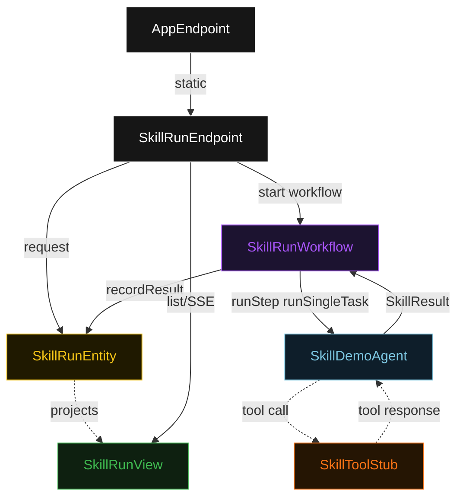
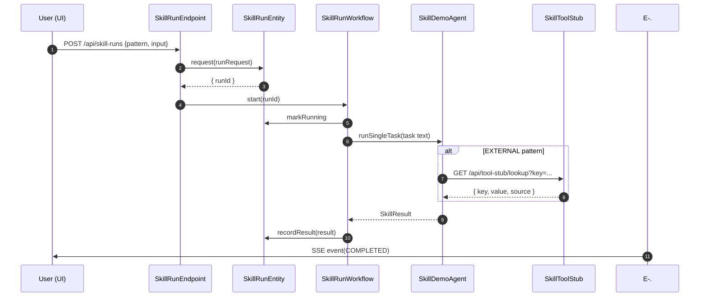
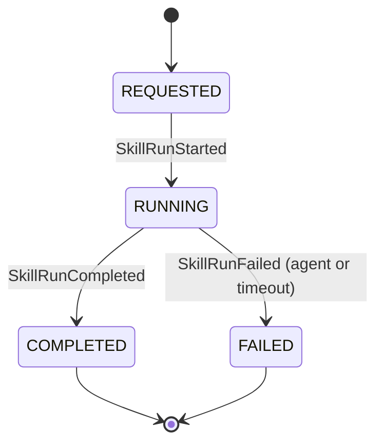
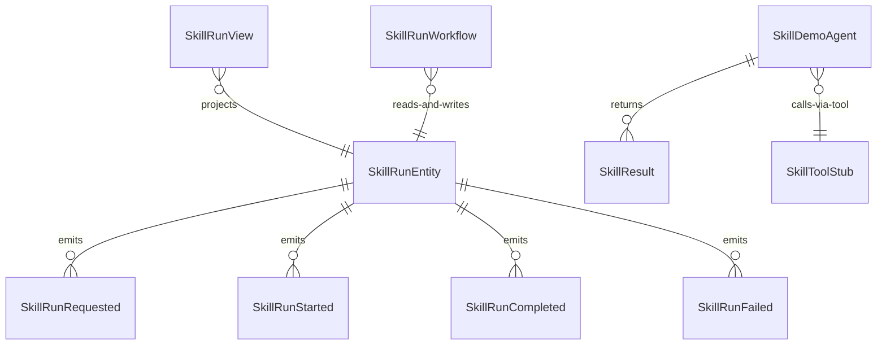

# PLAN — skill-patterns-tutorial

Architectural sketch consumed by `/akka:plan` and rendered on the generated system's Architecture tab. The four mermaid diagrams below carry the theme variables and CSS overrides from Lesson 24; without them, state names render black-on-black and edge labels clip.

---

## Component graph

## Interaction sequence — J1 (happy path, any pattern)

## State machine — `SkillRunEntity`

## Entity model

## Component table — Java file targets

| Component | Path (generated) |
|---|---|
| `SkillRunEndpoint` | `api/SkillRunEndpoint.java` |
| `AppEndpoint` | `api/AppEndpoint.java` |
| `SkillToolStub` | `api/SkillToolStub.java` |
| `SkillRunEntity` | `application/SkillRunEntity.java` (state in `domain/SkillRun.java`, events in `domain/SkillRunEvent.java`) |
| `SkillRunWorkflow` | `application/SkillRunWorkflow.java` |
| `SkillDemoAgent` | `application/SkillDemoAgent.java` (tasks in `application/SkillDemoTasks.java`) |
| `SkillRunView` | `application/SkillRunView.java` |
| `MockModelProvider` (option-a only) | `application/MockModelProvider.java` |
| Bootstrap | `Bootstrap.java` |

## Concurrency notes

- **Per-step timeout**: `runStep` 90 s, `recordStep` 10 s, `errorStep` 5 s. Default step recovery `maxRetries(1).failoverTo(SkillRunWorkflow::errorStep)`. The 90 s on `runStep` accommodates LLM latency for the more open-ended meta-creator path (Lesson 4).
- **Idempotency**: every workflow uses `"skill-run-" + runId` as the workflow id; re-delivering a `SkillRunRequested` event to the entity is a no-op because the entity guards against double-request on a non-empty run.
- **One agent per run**: the AutonomousAgent instance id is `"skill-agent-" + runId`, scoping each task's conversation context to the invocation.
- **Concurrent pattern invocations**: all four patterns run through the same `SkillDemoAgent` class but distinct instance ids, so concurrent runs for different patterns do not share state.
- **In-process tool stub**: `SkillToolStub` is a standard `HttpEndpoint` registered in Bootstrap. The external-skill pattern's `ToolDefinition.http(...)` resolves against `http://localhost:9588/api/tool-stub/lookup` — no network hop needed.
- **Dynamic skill registry**: registered `SkillDefinition` objects live in an `AtomicReference<List<SkillDefinition>>` on `SkillRunEndpoint`. They are not replicated and reset on restart. This is intentional for a tutorial sample — a production deployer would persist them to an entity.
