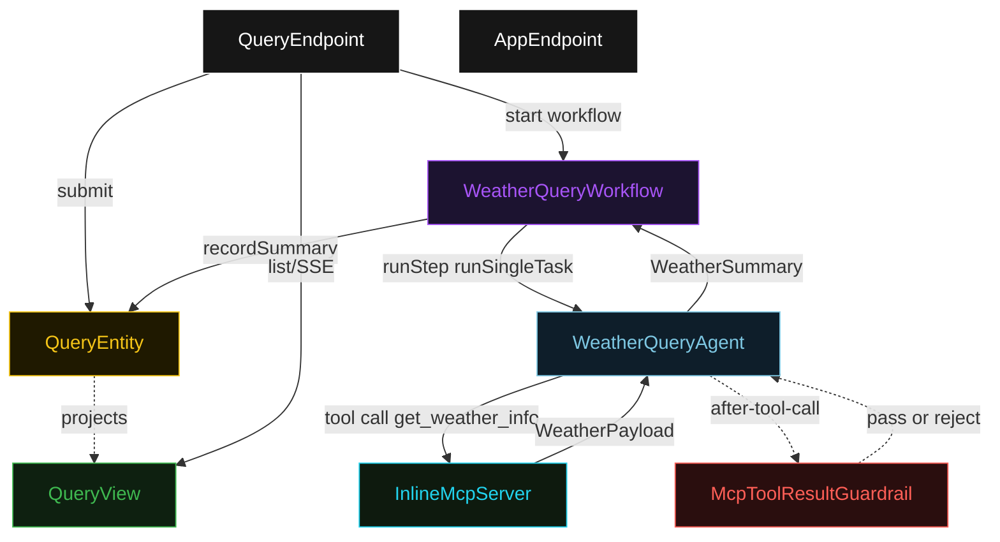
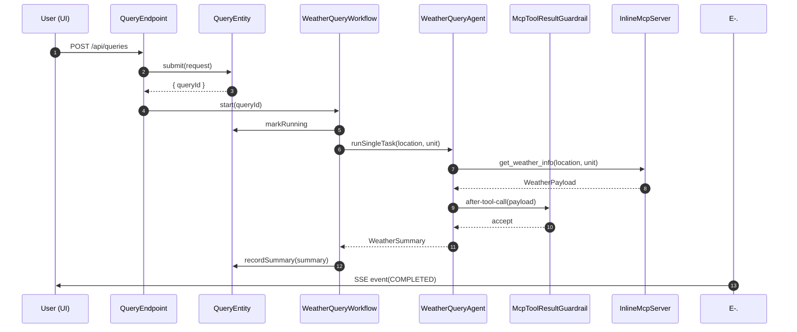
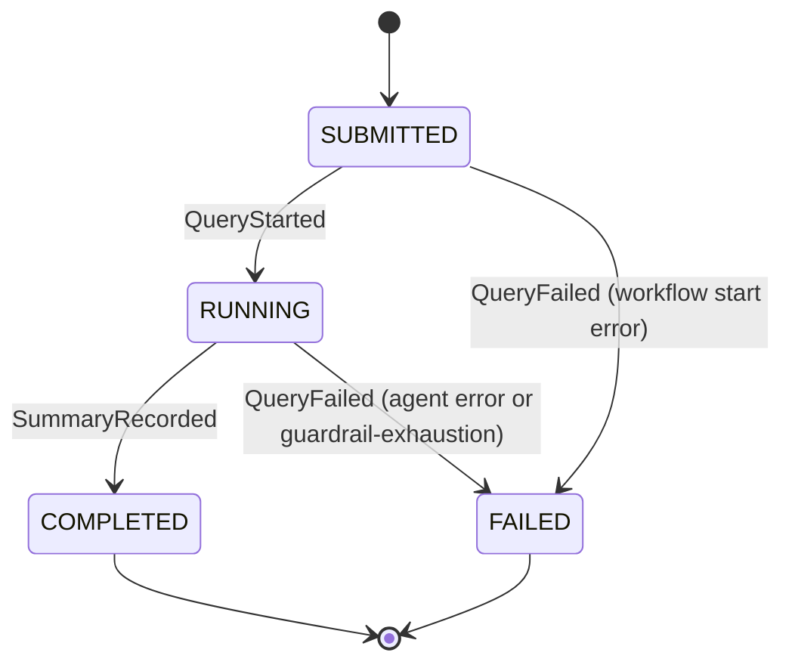
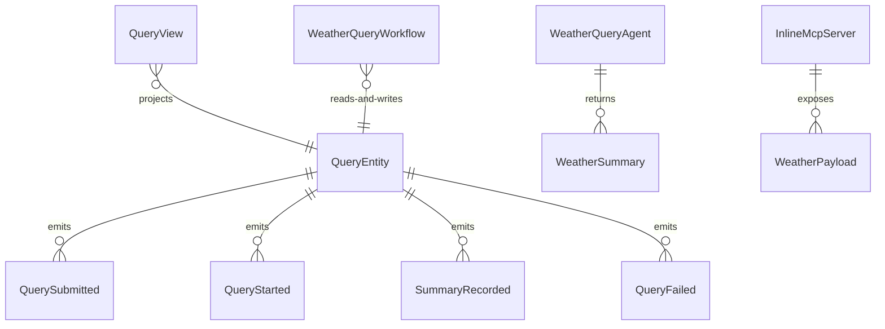

# PLAN — structured-mcp-tool

Architectural sketch consumed by `/akka:plan` and rendered on the generated system's Architecture tab. The four mermaid diagrams below carry the theme variables and CSS overrides from Lesson 24; without them, state names render black-on-black and edge labels clip.

---

## Component graph

## Interaction sequence — J1 (happy path)

## State machine — `QueryEntity`

## Entity model

## Component table — Java file targets

| Component | Path (generated) |
|---|---|
| `QueryEndpoint` | `api/QueryEndpoint.java` |
| `AppEndpoint` | `api/AppEndpoint.java` |
| `QueryEntity` | `application/QueryEntity.java` (state in `domain/Query.java`, events in `domain/QueryEvent.java`) |
| `WeatherQueryWorkflow` | `application/WeatherQueryWorkflow.java` |
| `WeatherQueryAgent` | `application/WeatherQueryAgent.java` (tasks in `application/WeatherQueryTasks.java`) |
| `McpToolResultGuardrail` | `application/McpToolResultGuardrail.java` |
| `InlineMcpServer` | `application/InlineMcpServer.java` |
| `QueryView` | `application/QueryView.java` |
| `MockModelProvider` (option-a only) | `application/MockModelProvider.java` |
| Bootstrap | `Bootstrap.java` |

## Concurrency notes

- **Per-step timeout**: `runStep` 60 s, `error` 5 s. Default step recovery `maxRetries(2).failoverTo(WeatherQueryWorkflow::error)`. The 60 s on `runStep` accommodates LLM latency and retry tool calls (Lesson 4).
- **Idempotency**: every workflow uses `"wq-" + queryId` as the workflow id. If the endpoint receives a duplicate POST for the same `queryId`, the entity's `submit` command is idempotent — it only emits `QuerySubmitted` if the entity is in its initial empty state; subsequent calls are no-ops.
- **One agent per query**: the AutonomousAgent instance id is `"query-agent-" + queryId`, giving each query its own conversation context. `capability(...).maxIterationsPerTask(3)` caps guardrail-triggered tool-call retries at 3.
- **Guardrail-driven retry**: when `McpToolResultGuardrail` rejects a tool response, the rejection is returned to the agent loop as a structured error. The loop counts toward `maxIterationsPerTask`; if all 3 iterations fail validation, the workflow's `runStep` fails over to `error` and the entity transitions to `FAILED`.
- **No saga / no compensation**: the only external call is to the in-process `InlineMcpServer`. Nothing external requires rollback.
- **InlineMcpServer is stateless**: each `get_weather_info` call is independent. Seeded-location data is constant; all other locations derive from `location.hashCode()`. Determinism makes J2 and J3 reproducible.
