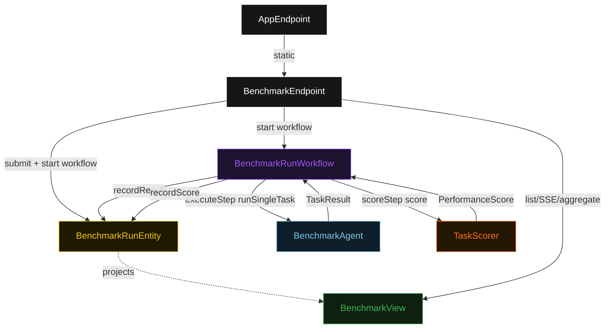
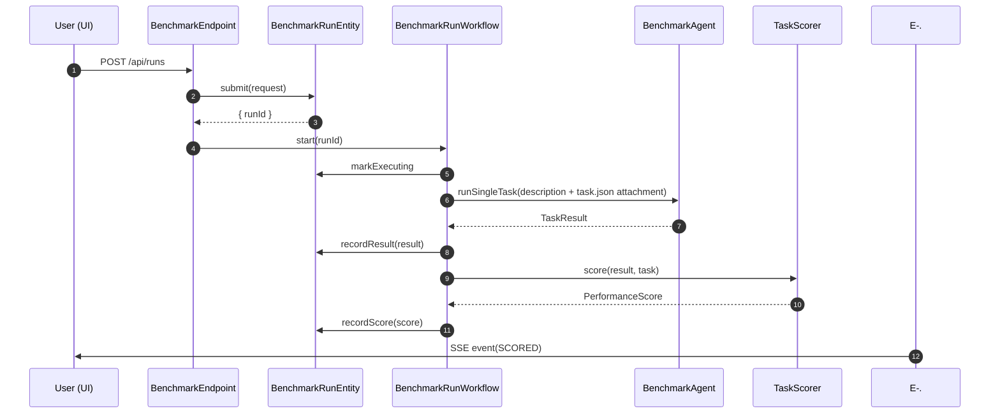
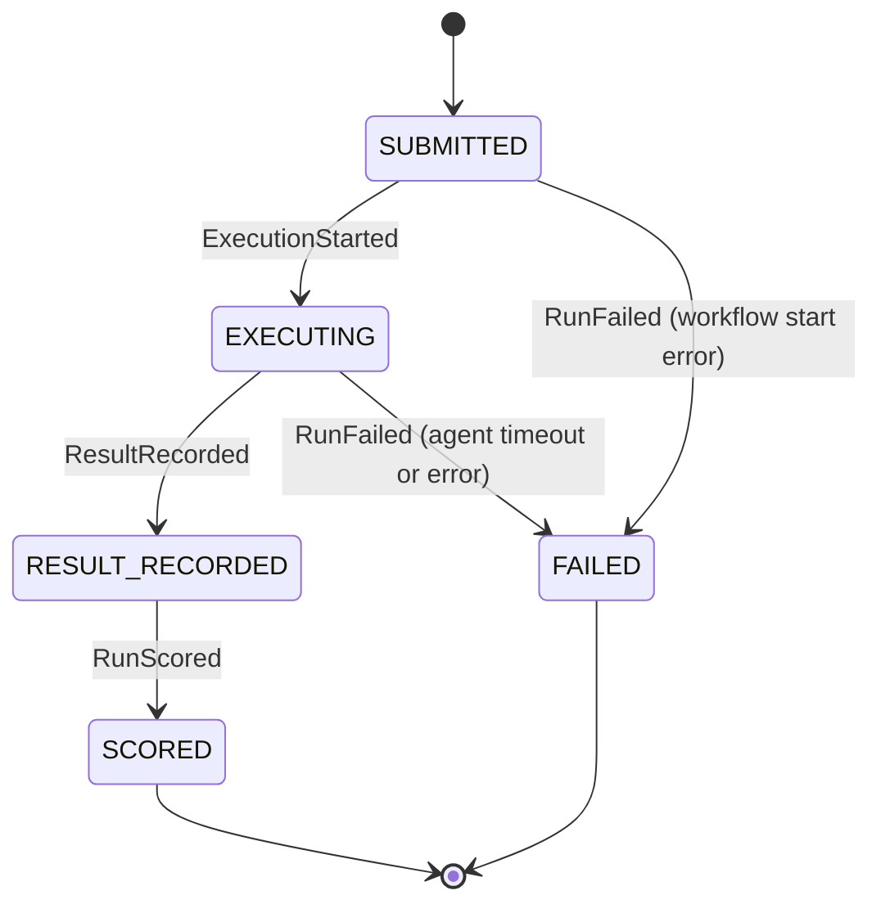
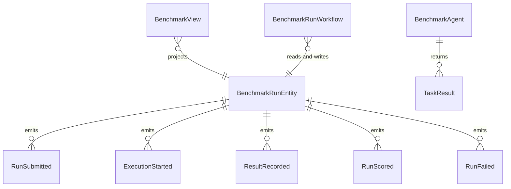

# PLAN — tau2-benchmark-agent

Architectural sketch consumed by `/akka:plan` and rendered on the generated system's Architecture tab. The four mermaid diagrams below carry the theme variables and CSS overrides from Lesson 24; without them, state names render black-on-black and edge labels clip.

---

## Component graph

## Interaction sequence — J1 (happy path)

## State machine — `BenchmarkRunEntity`

## Entity model

## Component table — Java file targets

| Component | Path (generated) |
|---|---|
| `BenchmarkEndpoint` | `api/BenchmarkEndpoint.java` |
| `AppEndpoint` | `api/AppEndpoint.java` |
| `BenchmarkRunEntity` | `application/BenchmarkRunEntity.java` (state in `domain/BenchmarkRun.java`, events in `domain/BenchmarkRunEvent.java`) |
| `BenchmarkRunWorkflow` | `application/BenchmarkRunWorkflow.java` |
| `BenchmarkAgent` | `application/BenchmarkAgent.java` (tasks in `application/BenchmarkTasks.java`) |
| `TaskScorer` | `application/TaskScorer.java` |
| `BenchmarkView` | `application/BenchmarkView.java` |
| `MockModelProvider` (option-a only) | `application/MockModelProvider.java` |
| Bootstrap | `Bootstrap.java` |

## Concurrency notes

- **Per-step timeout**: `executeStep` 60 s, `scoreStep` 5 s, `error` 5 s. Default step recovery `maxRetries(2).failoverTo(BenchmarkRunWorkflow::error)`. The 60 s on `executeStep` accommodates LLM latency for multi-step reasoning tasks (Lesson 4).
- **Idempotency**: every workflow uses `"run-" + runId` as the workflow id; duplicate `POST /api/runs` calls with the same `runId` are rejected by `BenchmarkRunEntity.submit` once the entity is in a non-initial state.
- **One agent per run**: the AutonomousAgent instance id is `"agent-" + runId`, giving each task its own conversation context. `maxIterationsPerTask(3)` caps retries at 3.
- **Scorer is synchronous and deterministic**: `TaskScorer` runs in-process inside `scoreStep`. No LLM call, no external service — the same result always scores the same. This is the single-agent guarantee.
- **Aggregate computed on read**: pass rate, mean score, and per-category counts are derived from the full run list on `GET /api/runs/aggregate`. No materialised aggregate state — the list is small for a benchmark run.
- **No saga / no compensation**: each step is a single forward write. There is nothing external to roll back.
