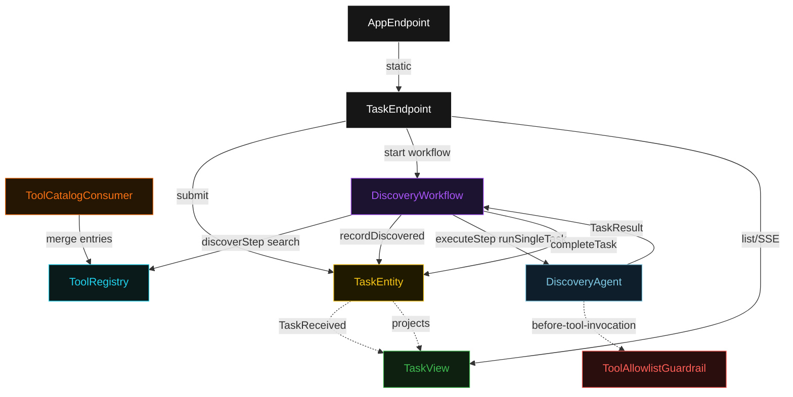
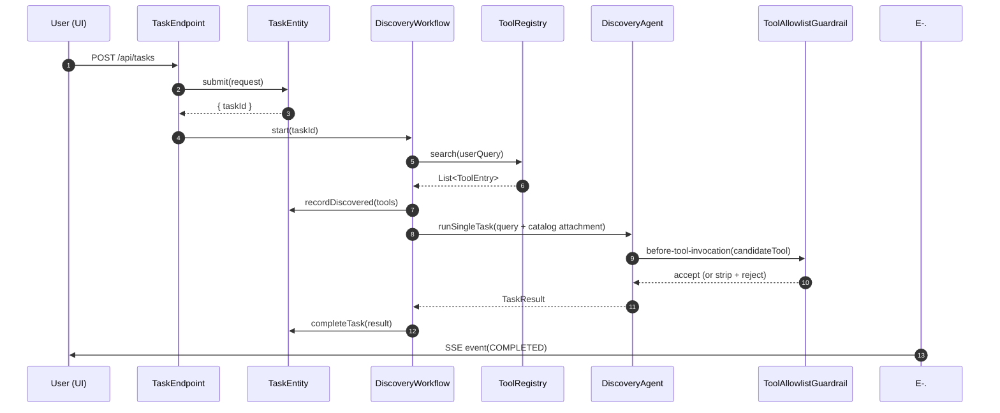
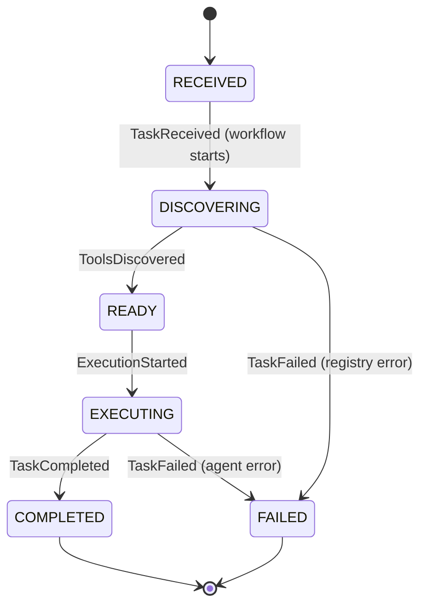
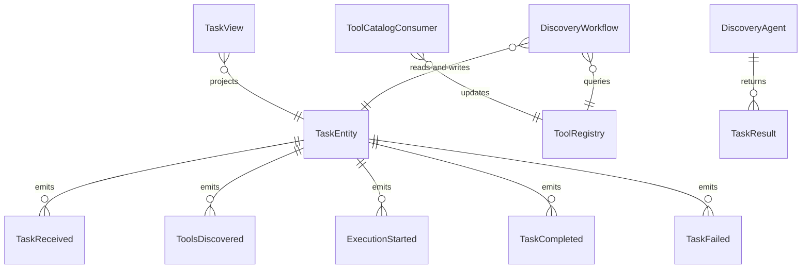

# PLAN — tool-search-discovery

Architectural sketch consumed by `/akka:plan` and rendered on the generated system's Architecture tab. The four mermaid diagrams below carry the theme variables and CSS overrides from Lesson 24; without them, state names render black-on-black and edge labels clip.

---

## Component graph

## Interaction sequence — J1 (happy path)

## State machine — `TaskEntity`

## Entity model

## Component table — Java file targets

| Component | Path (generated) |
|---|---|
| `TaskEndpoint` | `api/TaskEndpoint.java` |
| `AppEndpoint` | `api/AppEndpoint.java` |
| `TaskEntity` | `application/TaskEntity.java` (state in `domain/TaskRecord.java`, events in `domain/TaskEvent.java`) |
| `ToolCatalogConsumer` | `application/ToolCatalogConsumer.java` |
| `DiscoveryWorkflow` | `application/DiscoveryWorkflow.java` |
| `DiscoveryAgent` | `application/DiscoveryAgent.java` (tasks in `application/DiscoveryTasks.java`) |
| `ToolAllowlistGuardrail` | `application/ToolAllowlistGuardrail.java` |
| `ToolRegistry` | `application/ToolRegistry.java` |
| `TaskView` | `application/TaskView.java` |
| `MockModelProvider` (option-a only) | `application/MockModelProvider.java` |
| Bootstrap | `Bootstrap.java` |

## Concurrency notes

- **Per-step timeout**: `discoverStep` 15 s, `executeStep` 60 s, `error` 5 s. Default step recovery `maxRetries(2).failoverTo(DiscoveryWorkflow::error)`. The 60 s on `executeStep` accommodates LLM latency (Lesson 4).
- **Idempotency**: every workflow uses `"discovery-" + taskId` as the workflow id. `TaskEntity.recordDiscovered` is event-version-guarded — a redelivered `discoverStep` is a no-op against an already-READY entity.
- **One agent per task**: the AutonomousAgent instance id is `"discovery-" + taskId`, giving each task its own conversation context.
- **Allowlist loaded once per guardrail instance**: `allowlist.json` is read from classpath at service start. Changes require a restart (the file is not hot-reloaded in the base sample; a deployer may extend `ToolCatalogConsumer` to republish the allowlist).
- **ToolRegistry is in-process**: the registry is a `ConcurrentHashMap` seeded at startup and updated by `ToolCatalogConsumer`. It is not distributed — each node has its own copy. For multi-node production deployment a deployer would replace it with an Akka Key-Value Entity.
- **No saga / no compensation**: `discoverStep` is a pure registry read; `executeStep` appends events. There is nothing external to roll back.
