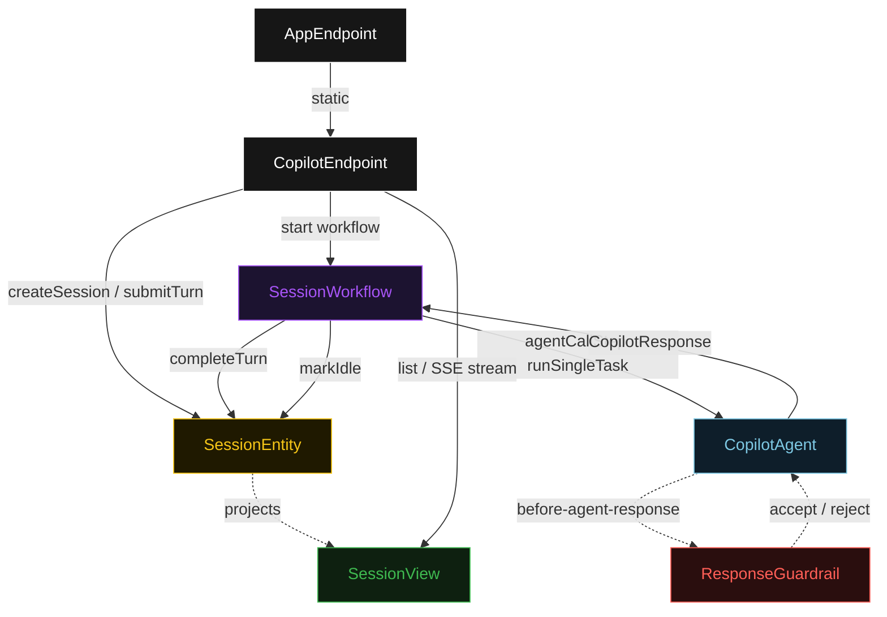
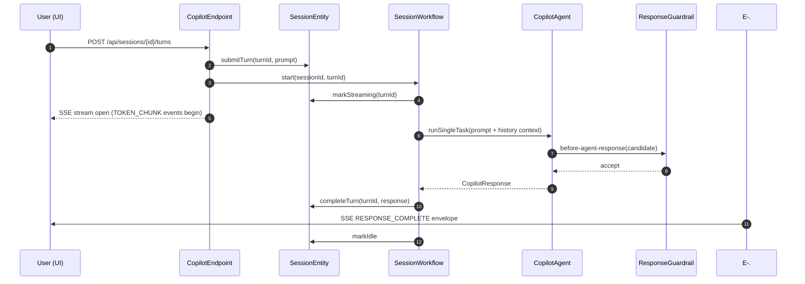
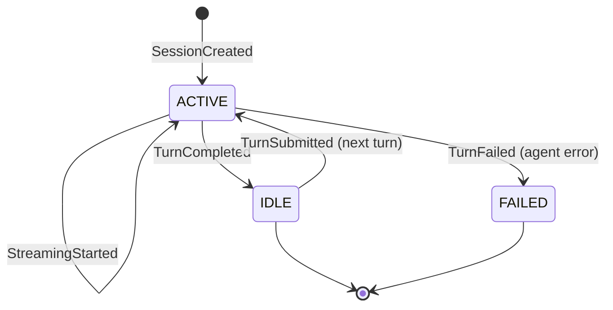
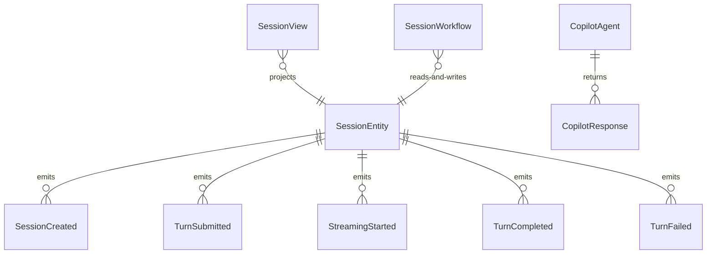

# PLAN — ui-demo

Architectural sketch consumed by `/akka:plan` and rendered on the generated system's Architecture tab. The four mermaid diagrams below carry the theme variables and CSS overrides from Lesson 24; without them, state names render black-on-black and edge labels clip.

---

## Component graph

## Interaction sequence — J1 (happy path)

## State machine — `SessionEntity` (per turn)

## Entity model

## Component table — Java file targets

| Component | Path (generated) |
|---|---|
| `CopilotEndpoint` | `api/CopilotEndpoint.java` |
| `AppEndpoint` | `api/AppEndpoint.java` |
| `SessionEntity` | `application/SessionEntity.java` (state in `domain/Session.java`, events in `domain/SessionEvent.java`) |
| `SessionWorkflow` | `application/SessionWorkflow.java` |
| `CopilotAgent` | `application/CopilotAgent.java` (tasks in `application/CopilotTasks.java`) |
| `ResponseGuardrail` | `application/ResponseGuardrail.java` |
| `SessionView` | `application/SessionView.java` |
| `MockModelProvider` (option-a only) | `application/MockModelProvider.java` |
| Bootstrap | `Bootstrap.java` |

## Concurrency notes

- **Per-step timeout**: `agentCallStep` 60 s, `commitStep` 5 s, `error` 5 s. Default step recovery `maxRetries(2).failoverTo(SessionWorkflow::error)`. The 60 s on `agentCallStep` accommodates LLM latency (Lesson 4).
- **Idempotency**: every workflow uses `"session-" + sessionId + "-" + turnId` as the workflow id; submitting the same `turnId` twice is guarded by `SessionEntity.submitTurn`'s event-version check — a duplicate is a no-op.
- **One agent per session**: the AutonomousAgent instance id is `"copilot-" + sessionId`, which gives the conversation its own context window. The agent's `capability(...).maxIterationsPerTask(3)` caps guardrail-triggered retries at 3.
- **Guardrail-driven retry**: when `ResponseGuardrail` rejects a candidate response, the rejection is returned as a structured error to the agent loop. The loop counts toward `maxIterationsPerTask`; if all 3 iterations fail validation, the workflow's `agentCallStep` fails over to `error` and the turn transitions to `TURN_FAILED`.
- **Streaming**: the SSE stream from `GET /api/sessions/{id}/stream` begins immediately after `submitTurn`; token envelopes are forwarded from the agent task's streaming output. The `RESPONSE_COMPLETE` envelope is emitted only after `TurnCompleted` lands in the entity.
- **No saga / no compensation**: every step is either an append-only entity write or a single-task agent call. There is nothing external to roll back.
