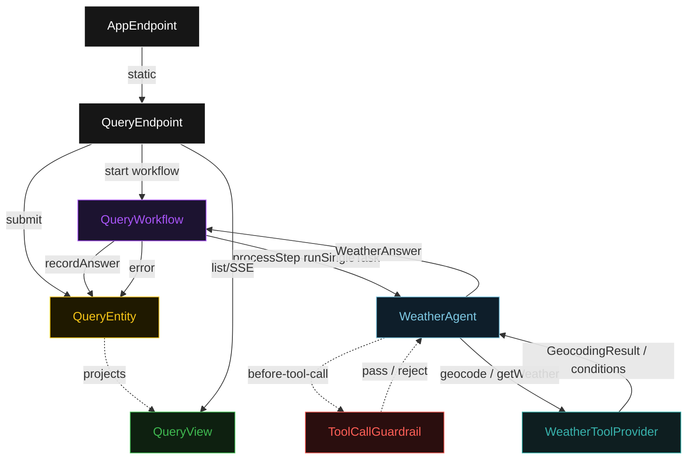
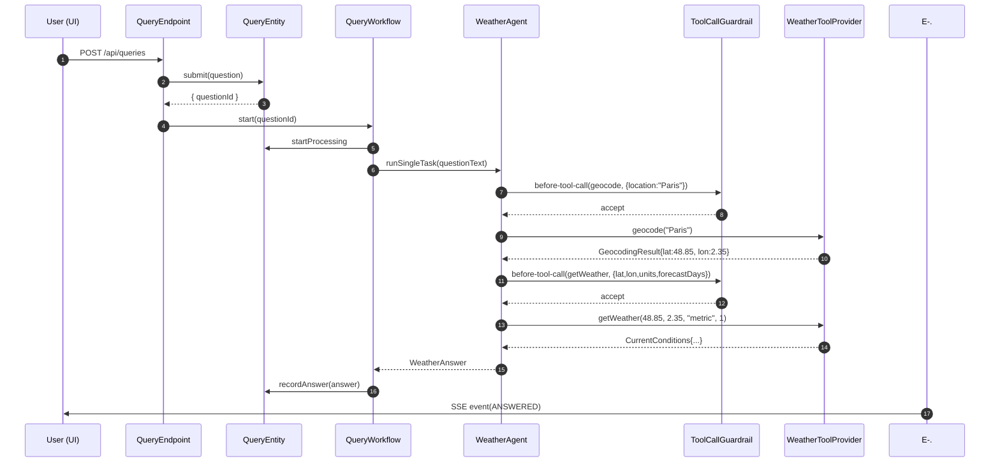
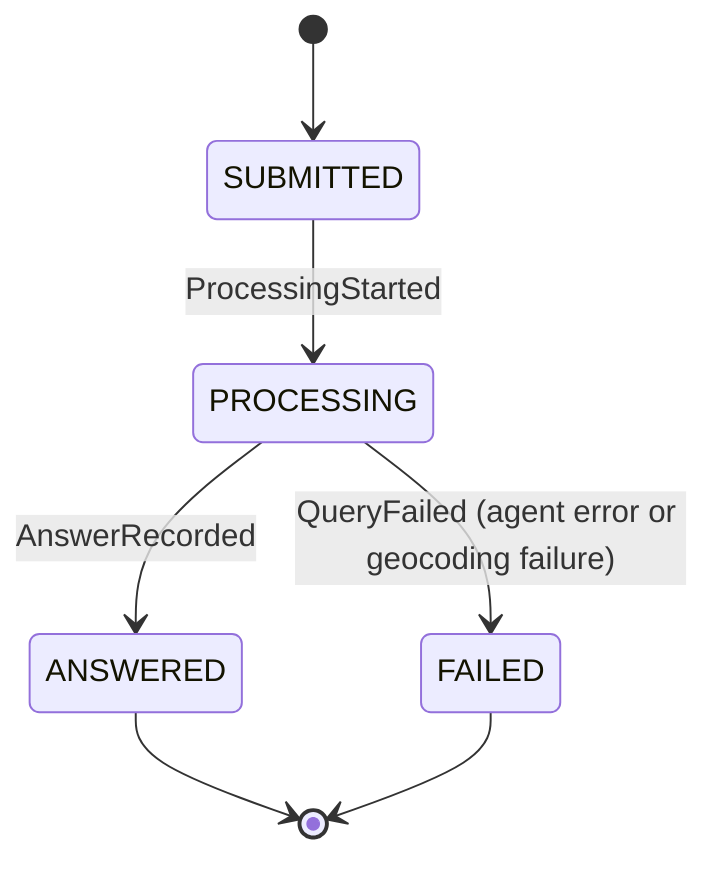
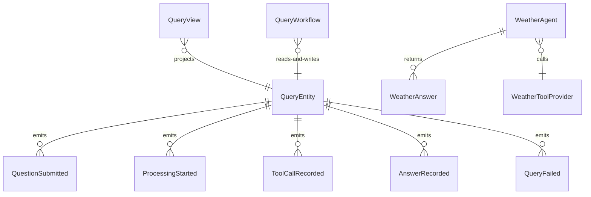

# PLAN — weather-agent

Architectural sketch consumed by `/akka:plan` and rendered on the generated system's Architecture tab. The four mermaid diagrams below carry the theme variables and CSS overrides from Lesson 24; without them, state names render black-on-black and edge labels clip.

---

## Component graph

## Interaction sequence — J1 (happy path)

## State machine — `QueryEntity`

## Entity model

## Component table — Java file targets

| Component | Path (generated) |
|---|---|
| `QueryEndpoint` | `api/QueryEndpoint.java` |
| `AppEndpoint` | `api/AppEndpoint.java` |
| `QueryEntity` | `application/QueryEntity.java` (state in `domain/Query.java`, events in `domain/QueryEvent.java`) |
| `QueryWorkflow` | `application/QueryWorkflow.java` |
| `WeatherAgent` | `application/WeatherAgent.java` (tasks in `application/WeatherTasks.java`) |
| `ToolCallGuardrail` | `application/ToolCallGuardrail.java` |
| `WeatherToolProvider` | `application/WeatherToolProvider.java` |
| `QueryView` | `application/QueryView.java` |
| `MockModelProvider` (option-a only) | `application/MockModelProvider.java` |
| Bootstrap | `Bootstrap.java` |

## Concurrency notes

- **Per-step timeout**: `processStep` 60 s, `error` 5 s. Default step recovery `maxRetries(2).failoverTo(QueryWorkflow::error)`. The 60 s on `processStep` accommodates up to two tool-call round trips plus LLM latency (Lesson 4).
- **Idempotency**: every workflow uses `"weather-" + questionId` as the agent instance id; the workflow id is `"wf-" + questionId`. If `QueryEndpoint` retries a start call, the workflow resumes from its current step rather than restarting.
- **One agent per query**: the AutonomousAgent instance id is `"weather-" + questionId`, giving each task its own conversation context. `maxIterationsPerTask(4)` caps guardrail-triggered retries at 4.
- **Guardrail-driven retry**: when `ToolCallGuardrail` rejects a parameter set, the rejection is returned as a tool-call error to the agent loop. The loop counts toward `maxIterationsPerTask`; if all 4 iterations fail validation, the workflow's `processStep` fails over to `error` and the entity transitions to `FAILED`.
- **Tool stubs are synchronous**: `WeatherToolProvider` stub methods return immediately — no I/O, no thread pools. A real implementation would wrap an HTTP client inside a `CompletableFuture`, but that is deferred to deployer configuration.
- **No saga / no compensation**: the workflow has two steps (processStep → error path only). There is nothing external to roll back — all side effects are entity events.
