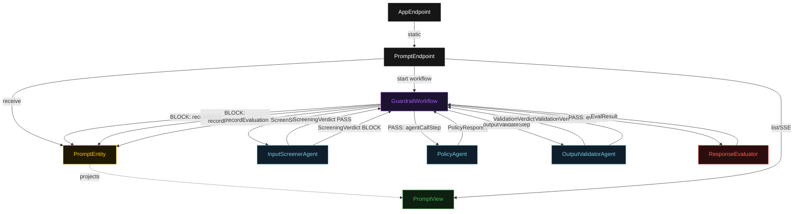
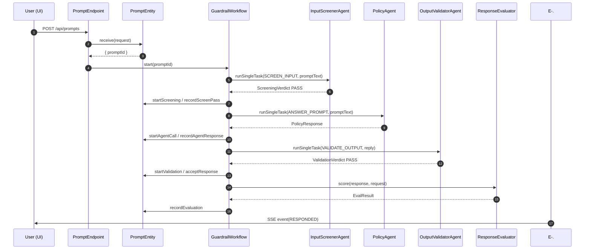
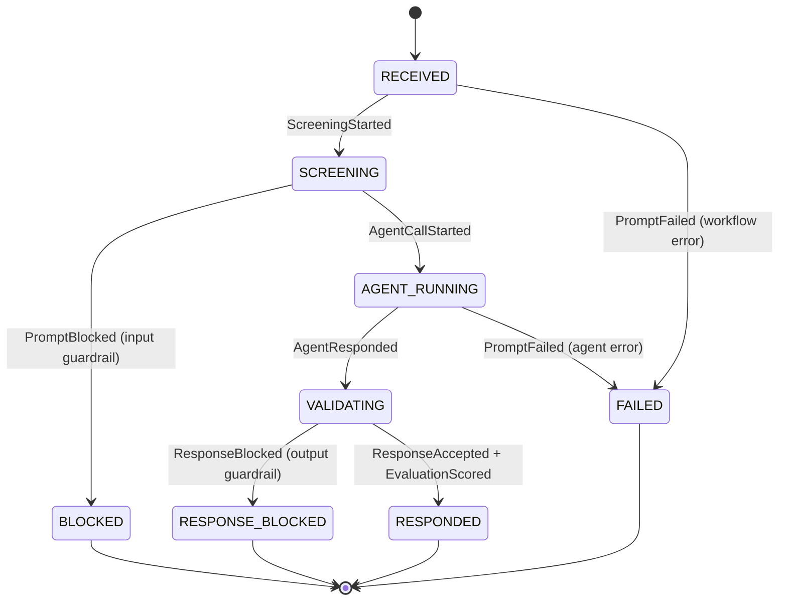
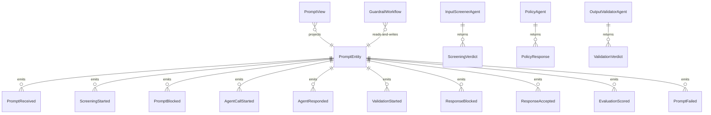

# PLAN — guardrails-side-by-side

Architectural sketch consumed by `/akka:plan` and rendered on the generated system's Architecture tab. The four mermaid diagrams below carry the theme variables and CSS overrides from Lesson 24; without them, state names render black-on-black and edge labels clip.

---

## Component graph

## Interaction sequence — J1 (happy path)

## State machine — `PromptEntity`

## Entity model

## Component table — Java file targets

| Component | Path (generated) |
|---|---|
| `PromptEndpoint` | `api/PromptEndpoint.java` |
| `AppEndpoint` | `api/AppEndpoint.java` |
| `PromptEntity` | `application/PromptEntity.java` (state in `domain/Prompt.java`, events in `domain/PromptEvent.java`) |
| `GuardrailWorkflow` | `application/GuardrailWorkflow.java` |
| `InputScreenerAgent` | `application/InputScreenerAgent.java` |
| `PolicyAgent` | `application/PolicyAgent.java` |
| `OutputValidatorAgent` | `application/OutputValidatorAgent.java` |
| `ResponseEvaluator` | `application/ResponseEvaluator.java` |
| `GuardrailTasks` | `application/GuardrailTasks.java` |
| `PromptView` | `application/PromptView.java` |
| `MockModelProvider` (option-a only) | `application/MockModelProvider.java` |
| Bootstrap | `Bootstrap.java` |

## Concurrency notes

- **Per-step timeout**: `inputScreenStep` 30 s, `agentCallStep` 60 s, `outputValidateStep` 30 s, `evalStep` 5 s, `blockStep` 5 s, `error` 5 s. Default step recovery `maxRetries(2).failoverTo(GuardrailWorkflow::error)` on `agentCallStep`. The 60 s on `agentCallStep` accommodates LLM latency (Lesson 4).
- **Idempotency**: every workflow uses `"guardrail-" + promptId` as the workflow id; `PromptEndpoint` mints the `promptId` before starting the workflow, so a duplicate POST returns the same `promptId` without starting a second workflow.
- **Guardrail agents are single-iteration**: `InputScreenerAgent` and `OutputValidatorAgent` are configured with `maxIterationsPerTask(1)`. They make one decision and return. They do not retry on their own.
- **Short-circuit on block**: when `inputScreenStep` returns a BLOCK verdict, the workflow transitions immediately to `blockStep` and never calls `PolicyAgent`. The entity history records the screening verdict even on the blocked path.
- **Eval is synchronous and deterministic**: `ResponseEvaluator` runs in-process inside `evalStep`. No LLM call, no external service — the same response always scores the same.
- **No saga / no compensation**: every step is either a single-task agent call, an entity write, or a pure computation. There is nothing external to roll back.
