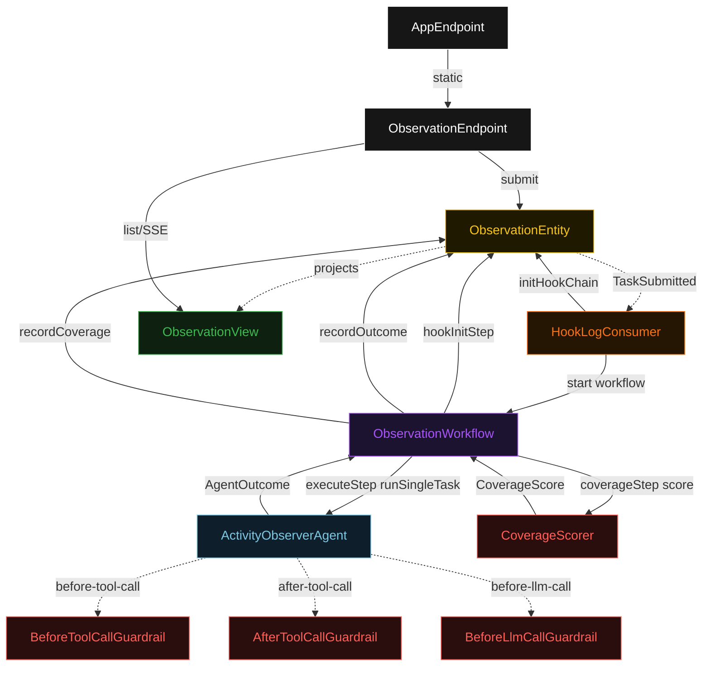
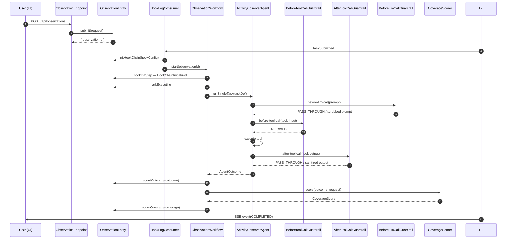
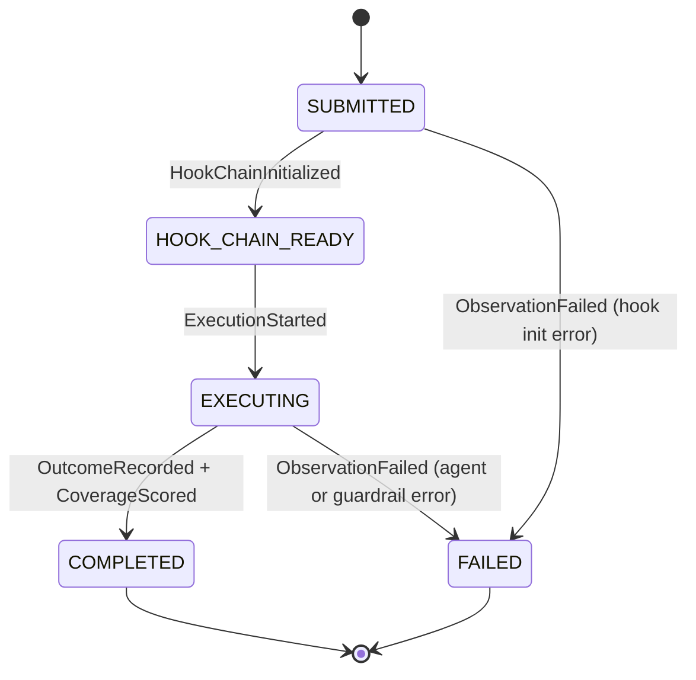
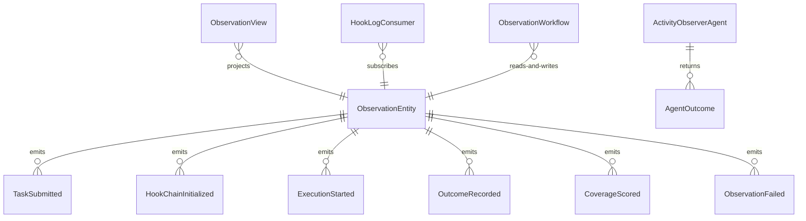

# PLAN — hook-instrumentation

Architectural sketch consumed by `/akka:plan` and rendered on the generated system's Architecture tab. The four mermaid diagrams below carry the theme variables and CSS overrides from Lesson 24; without them, state names render black-on-black and edge labels clip.

---

## Component graph

## Interaction sequence — J1 (happy path)

## State machine — `ObservationEntity`

## Entity model

## Component table — Java file targets

| Component | Path (generated) |
|---|---|
| `ObservationEndpoint` | `api/ObservationEndpoint.java` |
| `AppEndpoint` | `api/AppEndpoint.java` |
| `ObservationEntity` | `application/ObservationEntity.java` (state in `domain/Observation.java`, events in `domain/ObservationEvent.java`) |
| `HookLogConsumer` | `application/HookLogConsumer.java` |
| `ObservationWorkflow` | `application/ObservationWorkflow.java` |
| `ActivityObserverAgent` | `application/ActivityObserverAgent.java` (tasks in `application/ObservationTasks.java`) |
| `BeforeToolCallGuardrail` | `application/BeforeToolCallGuardrail.java` |
| `AfterToolCallGuardrail` | `application/AfterToolCallGuardrail.java` |
| `BeforeLlmCallGuardrail` | `application/BeforeLlmCallGuardrail.java` |
| `CoverageScorer` | `application/CoverageScorer.java` |
| `ObservationView` | `application/ObservationView.java` |
| `MockModelProvider` (option-a only) | `application/MockModelProvider.java` |
| Bootstrap | `Bootstrap.java` |

## Concurrency notes

- **Per-step timeout**: `hookInitStep` 10 s, `executeStep` 90 s, `coverageStep` 5 s, `error` 5 s. Default step recovery `maxRetries(2).failoverTo(ObservationWorkflow::error)`. The 90 s on `executeStep` accommodates multi-tool LLM latency (Lesson 4).
- **Idempotency**: every workflow uses `"obs-" + observationId` as the workflow id. The `HookLogConsumer` Consumer may redeliver `TaskSubmitted` events; `ObservationEntity.initHookChain` is event-version-guarded — a second init against an already-initialized observation is a no-op.
- **One agent per task**: the AutonomousAgent instance id is `"observer-" + observationId`, giving each task its own conversation context. The agent's `capability(...).maxIterationsPerTask(5)` bounds the hook-triggered retry chain.
- **Guardrail accumulation**: all three guardrails append entries to the task's shared hook log context. When the agent returns `AgentOutcome`, the `hookLog` field carries the full accumulated list from all guardrails across all iterations.
- **Coverage is synchronous and deterministic**: `CoverageScorer` runs in-process inside `coverageStep`. No LLM call — the same outcome always scores the same. This preserves the single-agent invariant.
- **No saga / no compensation**: every step is either pure read, append-only event write, or a single-task agent call. Nothing external to roll back.
