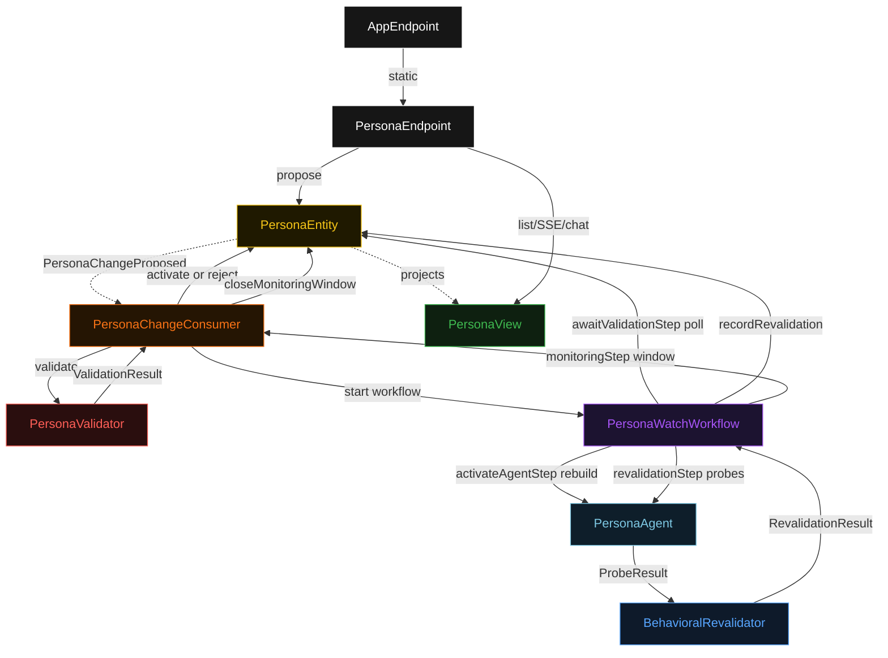
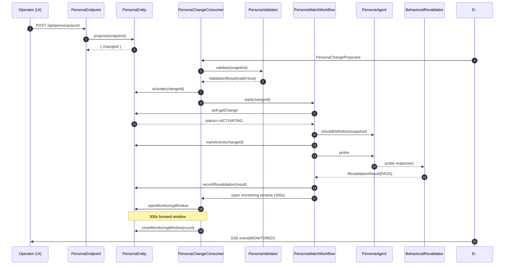
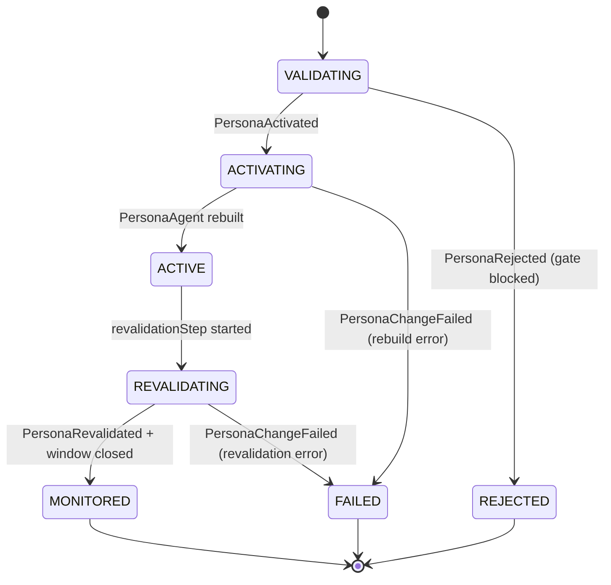
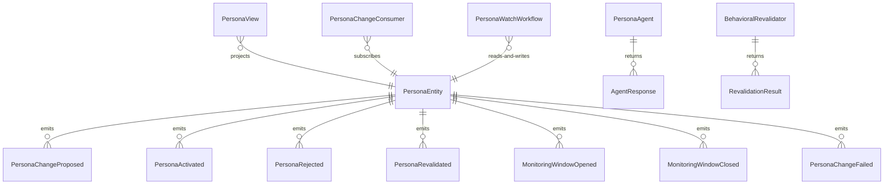

# PLAN — persona-hot-reload

Architectural sketch consumed by `/akka:plan` and rendered on the generated system's Architecture tab. The four mermaid diagrams below carry the theme variables and CSS overrides from Lesson 24; without them, state names render black-on-black and edge labels clip.

---

## Component graph

## Interaction sequence — J1 (happy path)

## State machine — `PersonaEntity`

## Entity model

## Component table — Java file targets

| Component | Path (generated) |
|---|---|
| `PersonaEndpoint` | `api/PersonaEndpoint.java` |
| `AppEndpoint` | `api/AppEndpoint.java` |
| `PersonaEntity` | `application/PersonaEntity.java` (state in `domain/PersonaChange.java`, events in `domain/PersonaEvent.java`) |
| `PersonaChangeConsumer` | `application/PersonaChangeConsumer.java` |
| `PersonaWatchWorkflow` | `application/PersonaWatchWorkflow.java` |
| `PersonaAgent` | `application/PersonaAgent.java` (tasks in `application/PersonaTasks.java`) |
| `PersonaValidator` | `application/PersonaValidator.java` |
| `BehavioralRevalidator` | `application/BehavioralRevalidator.java` |
| `PersonaView` | `application/PersonaView.java` |
| `MockModelProvider` (option-a only) | `application/MockModelProvider.java` |
| Bootstrap | `Bootstrap.java` |

## Concurrency notes

- **Per-step timeout**: `awaitValidationStep` 10 s, `activateAgentStep` 10 s, `revalidationStep` 60 s, `monitoringStep` 320 s, `error` 5 s. Default step recovery `maxRetries(1).failoverTo(PersonaWatchWorkflow::error)`. The 60 s on `revalidationStep` accommodates back-to-back probe LLM calls (Lesson 4).
- **Idempotency**: every workflow uses `"persona-" + changeId` as the workflow id; `PersonaChangeConsumer` is allowed to redeliver `PersonaChangeProposed` events because `PersonaEntity.activate` is version-guarded — a duplicate activate for an already-active change is a no-op.
- **One agent per deployment**: `PersonaAgent` uses a fixed instance id `"persona-agent"`. All chat queries and all probe calls share that instance; the definition is rebuilt in-place via `rebuildDefinition`. The `maxIterationsPerTask(2)` cap prevents runaway probe loops.
- **Gate is synchronous**: `PersonaValidator.validate` runs inside `PersonaChangeConsumer` before any activation event is written. If the validator throws, the Consumer treats it as a rejection.
- **Revalidation is deterministic**: `BehavioralRevalidator` scores ProbeResults in-process. No LLM call — the same probe responses always yield the same RevalidationStatus. This is a deliberate single-agent guarantee.
- **Monitoring window is best-effort**: if `PersonaChangeConsumer` crashes during the window, forwarded-count may undercount. The window still closes at `closedAt`; the entity record shows the partial count. No saga compensation is needed — the window is observational, not transactional.
