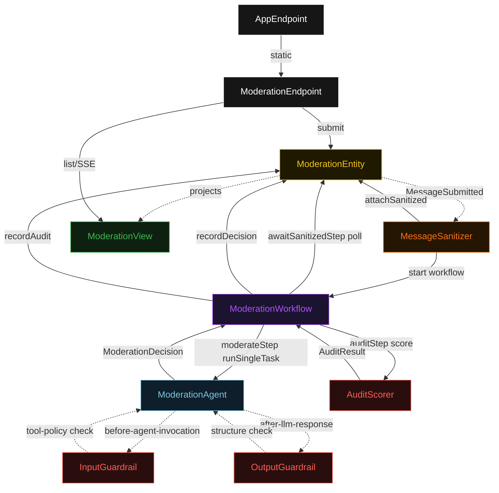
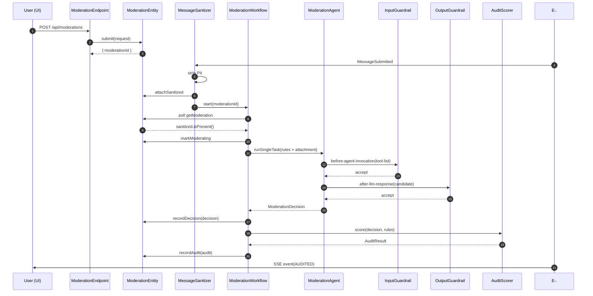
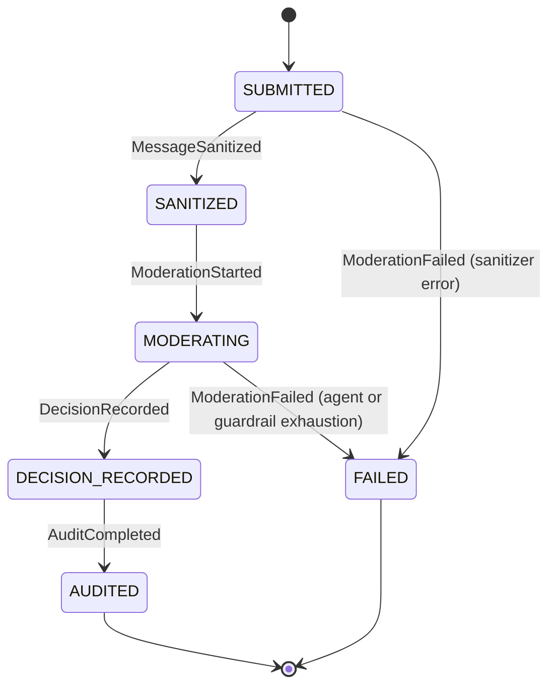
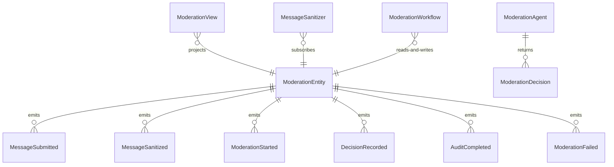

# PLAN — guardrails-baseline

Architectural sketch consumed by `/akka:plan` and rendered on the generated system's Architecture tab. The four mermaid diagrams below carry the theme variables and CSS overrides from Lesson 24; without them, state names render black-on-black and edge labels clip.

---

## Component graph

## Interaction sequence — J1 (happy path)

## State machine — `ModerationEntity`

## Entity model

## Component table — Java file targets

| Component | Path (generated) |
|---|---|
| `ModerationEndpoint` | `api/ModerationEndpoint.java` |
| `AppEndpoint` | `api/AppEndpoint.java` |
| `ModerationEntity` | `application/ModerationEntity.java` (state in `domain/Moderation.java`, events in `domain/ModerationEvent.java`) |
| `MessageSanitizer` | `application/MessageSanitizer.java` |
| `ModerationWorkflow` | `application/ModerationWorkflow.java` |
| `ModerationAgent` | `application/ModerationAgent.java` (tasks in `application/ModerationTasks.java`) |
| `InputGuardrail` | `application/InputGuardrail.java` |
| `OutputGuardrail` | `application/OutputGuardrail.java` |
| `AuditScorer` | `application/AuditScorer.java` |
| `ModerationView` | `application/ModerationView.java` |
| `MockModelProvider` (option-a only) | `application/MockModelProvider.java` |
| Bootstrap | `Bootstrap.java` |

## Concurrency notes

- **Per-step timeout**: `awaitSanitizedStep` 15 s, `moderateStep` 60 s, `auditStep` 5 s, `error` 5 s. Default step recovery `maxRetries(2).failoverTo(ModerationWorkflow::error)`. The 60 s on `moderateStep` accommodates LLM latency (Lesson 4).
- **Idempotency**: every workflow uses `"moderation-" + moderationId` as the workflow id; `MessageSanitizer` Consumer redelivery is safe because `ModerationEntity.attachSanitized` is event-version-guarded — a second sanitize attempt against an already-sanitized moderation is a no-op.
- **One agent per moderation**: the AutonomousAgent instance id is `"moderator-" + moderationId`, giving each task its own conversation context. `capability(...).maxIterationsPerTask(3)` caps guardrail-triggered retries at 3.
- **Two guardrails, one loop**: both `InputGuardrail` and `OutputGuardrail` are registered on `ModerationAgent`. The input guardrail fires once per task (before the first LLM call); the output guardrail fires once per LLM response. Both share the same iteration budget.
- **Audit is synchronous and deterministic**: `AuditScorer` runs in-process inside `auditStep`. No LLM call — the same decision always scores the same.
- **No saga / no compensation**: every step is either a pure read, an append-only event write, or a single-task agent call. There is nothing external to roll back.
