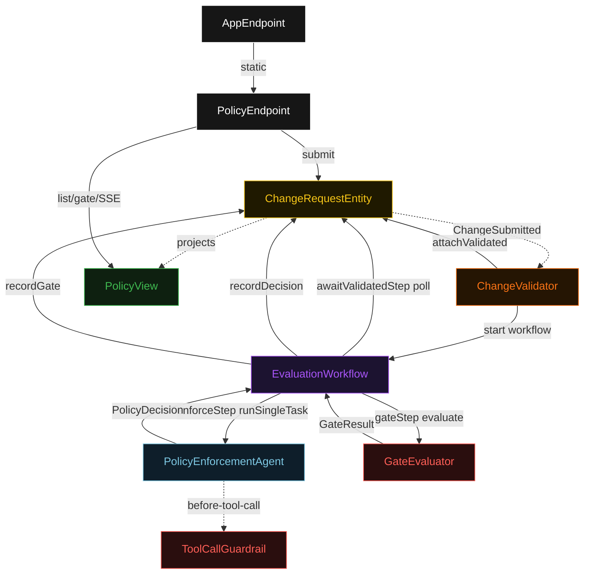
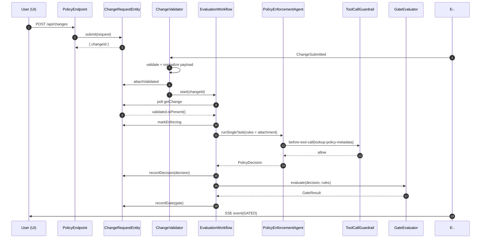
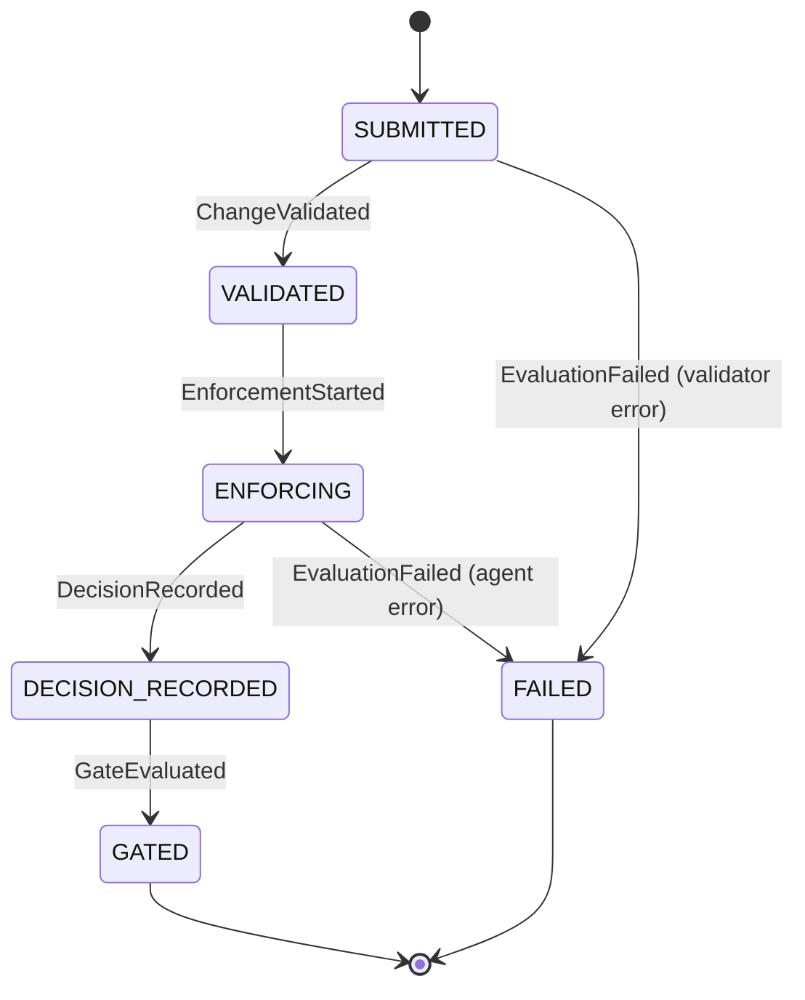
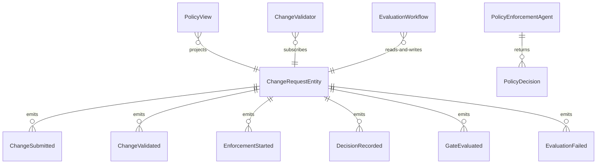

# PLAN — policy-as-code

Architectural sketch consumed by `/akka:plan` and rendered on the generated system's Architecture tab. The four mermaid diagrams below carry the theme variables and CSS overrides from Lesson 24; without them, state names render black-on-black and edge labels clip.

---

## Component graph

## Interaction sequence — J1 (happy path)

## State machine — `ChangeRequestEntity`

## Entity model

## Component table — Java file targets

| Component | Path (generated) |
|---|---|
| `PolicyEndpoint` | `api/PolicyEndpoint.java` |
| `AppEndpoint` | `api/AppEndpoint.java` |
| `ChangeRequestEntity` | `application/ChangeRequestEntity.java` (state in `domain/ChangeEvaluation.java`, events in `domain/ChangeEvent.java`) |
| `ChangeValidator` | `application/ChangeValidator.java` |
| `EvaluationWorkflow` | `application/EvaluationWorkflow.java` |
| `PolicyEnforcementAgent` | `application/PolicyEnforcementAgent.java` (tasks in `application/PolicyTasks.java`) |
| `ToolCallGuardrail` | `application/ToolCallGuardrail.java` |
| `GateEvaluator` | `application/GateEvaluator.java` |
| `PolicyView` | `application/PolicyView.java` |
| `MockModelProvider` (option-a only) | `application/MockModelProvider.java` |
| Bootstrap | `Bootstrap.java` |

## Concurrency notes

- **Per-step timeout**: `awaitValidatedStep` 15 s, `enforceStep` 60 s, `gateStep` 5 s, `error` 5 s. Default step recovery `maxRetries(2).failoverTo(EvaluationWorkflow::error)`. The 60 s on `enforceStep` accommodates LLM latency (Lesson 4).
- **Idempotency**: every workflow uses `"eval-" + changeId` as the workflow id; the `ChangeValidator` Consumer is allowed to redeliver `ChangeSubmitted` events because `ChangeRequestEntity.attachValidated` is event-version-guarded — a second validate attempt against an already-validated change is a no-op.
- **One agent per change**: the AutonomousAgent instance id is `"enforcer-" + changeId`, which gives each task its own conversation context. The agent's `capability(...).maxIterationsPerTask(3)` caps iterations at 3.
- **Guardrail-driven tool blocking**: when `ToolCallGuardrail` rejects a tool call, the rejection is returned as a structured error to the agent loop. The agent continues reasoning from the attached payload and allowed tools. If the agent cannot produce a decision without the blocked tool, the step eventually times out and fails over to `error`.
- **Gate is synchronous and deterministic**: `GateEvaluator` runs in-process inside `gateStep`. No LLM call, no external service — the same decision always produces the same gate result. This is a deliberate single-agent guarantee.
- **No saga / no compensation**: every step is either pure read, append-only event write, or a single-task agent call. There is nothing external to roll back.
