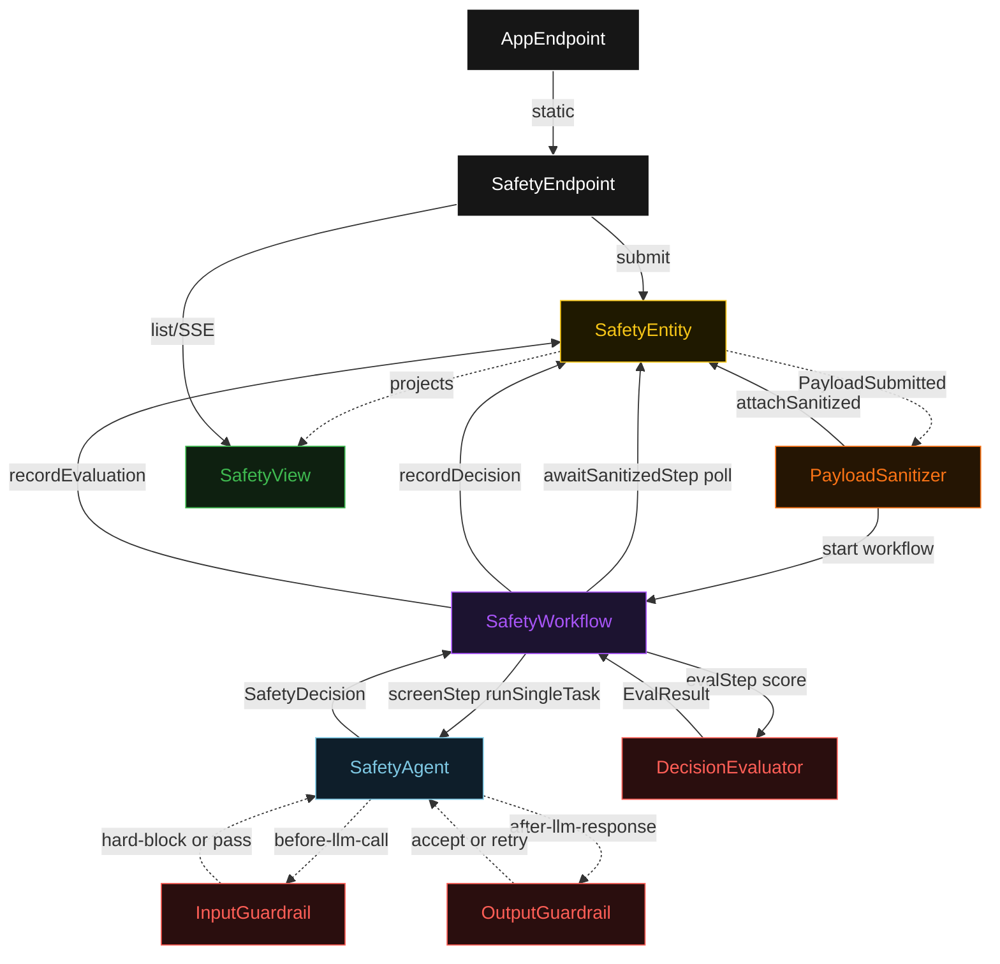
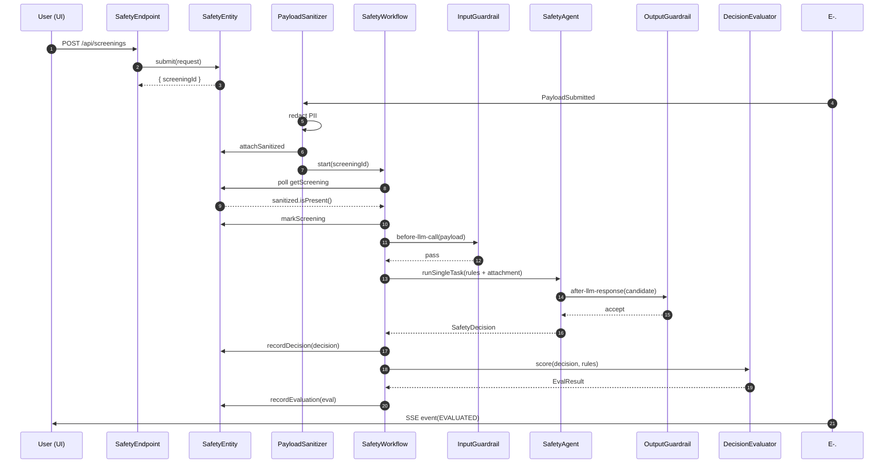
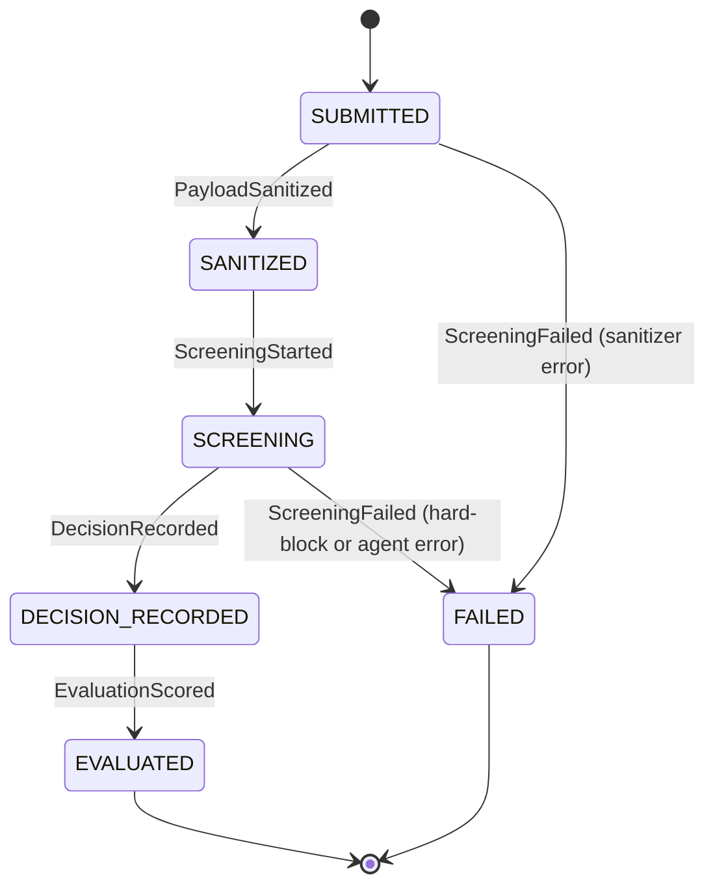
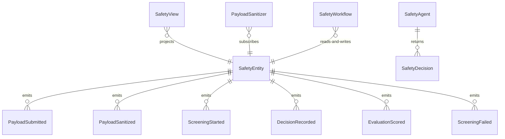

# PLAN — safety-plugins

Architectural sketch consumed by `/akka:plan` and rendered on the generated system's Architecture tab. The four mermaid diagrams below carry the theme variables and CSS overrides from Lesson 24; without them, state names render black-on-black and edge labels clip.

---

## Component graph

## Interaction sequence — J1 (happy path)

## State machine — `SafetyEntity`

## Entity model

## Component table — Java file targets

| Component | Path (generated) |
|---|---|
| `SafetyEndpoint` | `api/SafetyEndpoint.java` |
| `AppEndpoint` | `api/AppEndpoint.java` |
| `SafetyEntity` | `application/SafetyEntity.java` (state in `domain/Screening.java`, events in `domain/ScreeningEvent.java`) |
| `PayloadSanitizer` | `application/PayloadSanitizer.java` |
| `SafetyWorkflow` | `application/SafetyWorkflow.java` |
| `SafetyAgent` | `application/SafetyAgent.java` (tasks in `application/SafetyTasks.java`) |
| `InputGuardrail` | `application/InputGuardrail.java` |
| `OutputGuardrail` | `application/OutputGuardrail.java` |
| `DecisionEvaluator` | `application/DecisionEvaluator.java` |
| `SafetyView` | `application/SafetyView.java` |
| `MockModelProvider` (option-a only) | `application/MockModelProvider.java` |
| Bootstrap | `Bootstrap.java` |

## Concurrency notes

- **Per-step timeout**: `awaitSanitizedStep` 15 s, `screenStep` 60 s, `evalStep` 5 s, `error` 5 s. Default step recovery `maxRetries(2).failoverTo(SafetyWorkflow::error)`. The 60 s on `screenStep` accommodates LLM latency (Lesson 4).
- **Idempotency**: every workflow uses `"screening-" + screeningId` as the workflow id; the `PayloadSanitizer` Consumer is allowed to redeliver `PayloadSubmitted` events because `SafetyEntity.attachSanitized` is event-version-guarded — a second sanitize attempt against an already-sanitized screening is a no-op.
- **One agent per screening**: the AutonomousAgent instance id is `"screener-" + screeningId`, which gives each task its own conversation context. The agent's `capability(...).maxIterationsPerTask(3)` caps guardrail-triggered retries at 3.
- **InputGuardrail hard-block path**: when `InputGuardrail` fires, the task terminates without an LLM call. The workflow's `screenStep` receives a rejection result and fails over to `error`, which transitions the entity to `FAILED`. The `ScreeningFailed` reason carries the matching injection-pattern id.
- **OutputGuardrail-driven retry**: when `OutputGuardrail` rejects a candidate response, the rejection is returned as a structured error to the agent loop. The loop counts toward `maxIterationsPerTask`; if all 3 iterations fail validation, the workflow's `screenStep` fails over to `error` and the entity transitions to `FAILED`.
- **Eval is synchronous and deterministic**: `DecisionEvaluator` runs in-process inside `evalStep`. No LLM call, no external service — the same decision always scores the same. This is a deliberate single-agent guarantee.
- **No saga / no compensation**: every step is either pure read, append-only event write, or a single-task agent call. There is nothing external to roll back.
