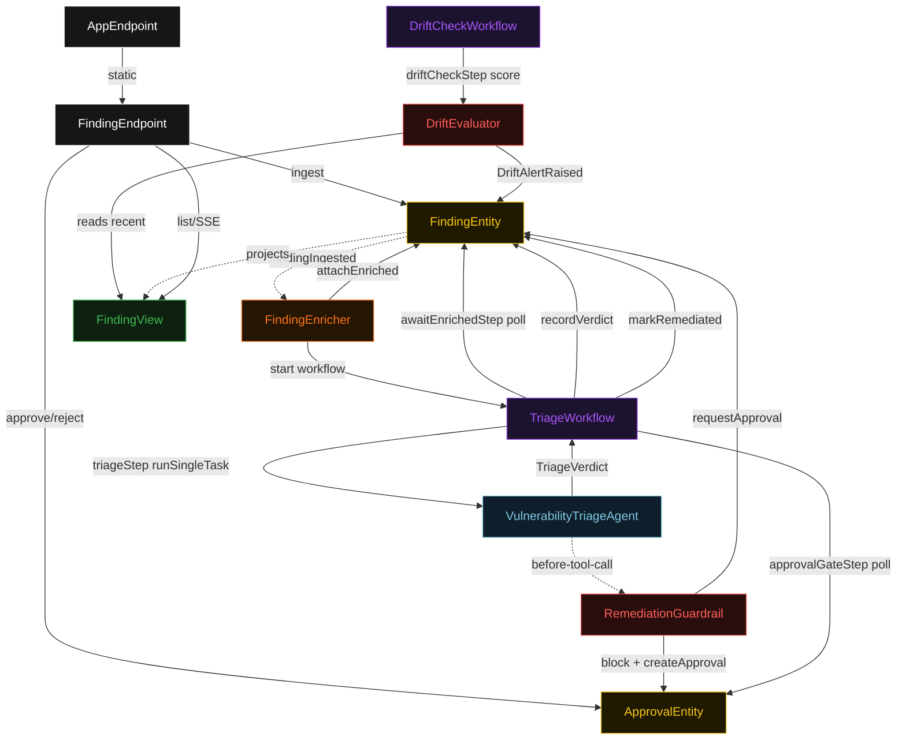
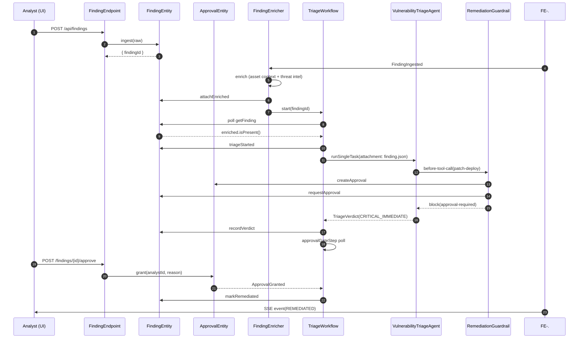
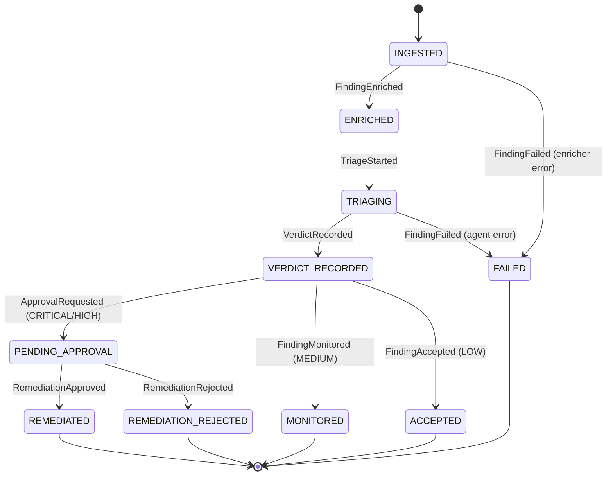
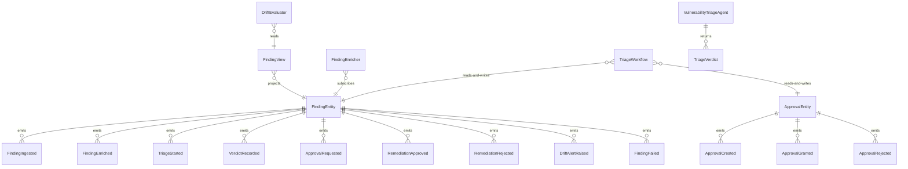

# PLAN — secops-triage

Architectural sketch consumed by `/akka:plan` and rendered on the generated system's Architecture tab. The four mermaid diagrams below carry the theme variables and CSS overrides from Lesson 24; without them, state names render black-on-black and edge labels clip.

---

## Component graph

## Interaction sequence — J1 (happy path — critical finding, approved)

## State machine — `FindingEntity`

## Entity model

## Component table — Java file targets

| Component | Path (generated) |
|---|---|
| `FindingEndpoint` | `api/FindingEndpoint.java` |
| `AppEndpoint` | `api/AppEndpoint.java` |
| `FindingEntity` | `application/FindingEntity.java` (state in `domain/Finding.java`, events in `domain/FindingEvent.java`) |
| `ApprovalEntity` | `application/ApprovalEntity.java` (state in `domain/ApprovalDecision.java`, events in `domain/ApprovalEvent.java`) |
| `FindingEnricher` | `application/FindingEnricher.java` |
| `TriageWorkflow` | `application/TriageWorkflow.java` |
| `DriftCheckWorkflow` | `application/DriftCheckWorkflow.java` |
| `VulnerabilityTriageAgent` | `application/VulnerabilityTriageAgent.java` (tasks in `application/TriageTasks.java`) |
| `RemediationGuardrail` | `application/RemediationGuardrail.java` |
| `DriftEvaluator` | `application/DriftEvaluator.java` |
| `FindingView` | `application/FindingView.java` |
| `MockModelProvider` (option-a only) | `application/MockModelProvider.java` |
| Bootstrap | `Bootstrap.java` |

## Concurrency notes

- **Per-step timeout**: `awaitEnrichedStep` 15 s, `triageStep` 60 s, `approvalGateStep` 1800 s, `remediationStep` 5 s, `driftCheckStep` 30 s, `error` 5 s. Default step recovery `maxRetries(2).failoverTo(TriageWorkflow::error)`. The 60 s on `triageStep` accommodates LLM latency (Lesson 4).
- **Approval gate**: `approvalGateStep` polls `ApprovalEntity` every 2 s with a 30-minute step timeout. If the analyst does not respond within 30 minutes, the workflow fails over to `error` and the finding lands in `FAILED`.
- **Idempotency**: every workflow uses `"triage-" + findingId` as the workflow id. `FindingEnricher` Consumer is allowed to redeliver `FindingIngested` because `FindingEntity.attachEnriched` is event-version-guarded — a second enrich attempt against an already-enriched finding is a no-op.
- **One agent per finding**: AutonomousAgent instance id is `"triage-" + findingId`. The agent's `capability(...).maxIterationsPerTask(3)` caps guardrail-driven iterations.
- **Drift check is isolated**: `DriftCheckWorkflow` uses a stable id `"drift-monitor"` and operates on `FindingView` data only. It does not write to individual `FindingEntity` instances; it emits onto a sentinel entity id `"drift-monitor"` so the drift alert is queryable.
- **No saga / no compensation**: finding enrichment and verdict recording are append-only event writes. There is nothing external to roll back.
