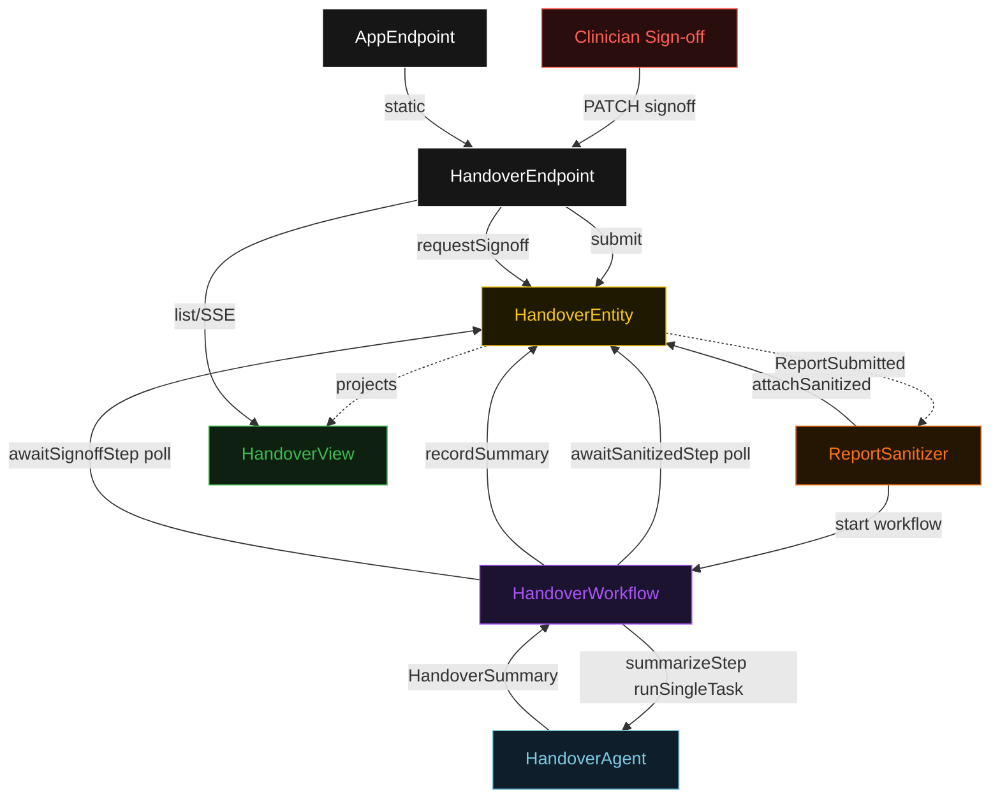
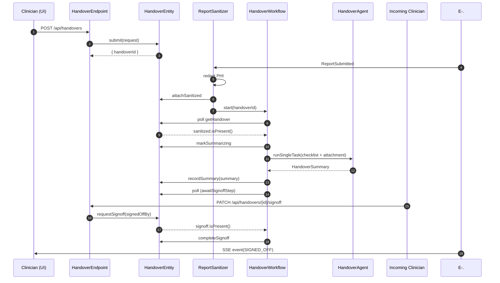
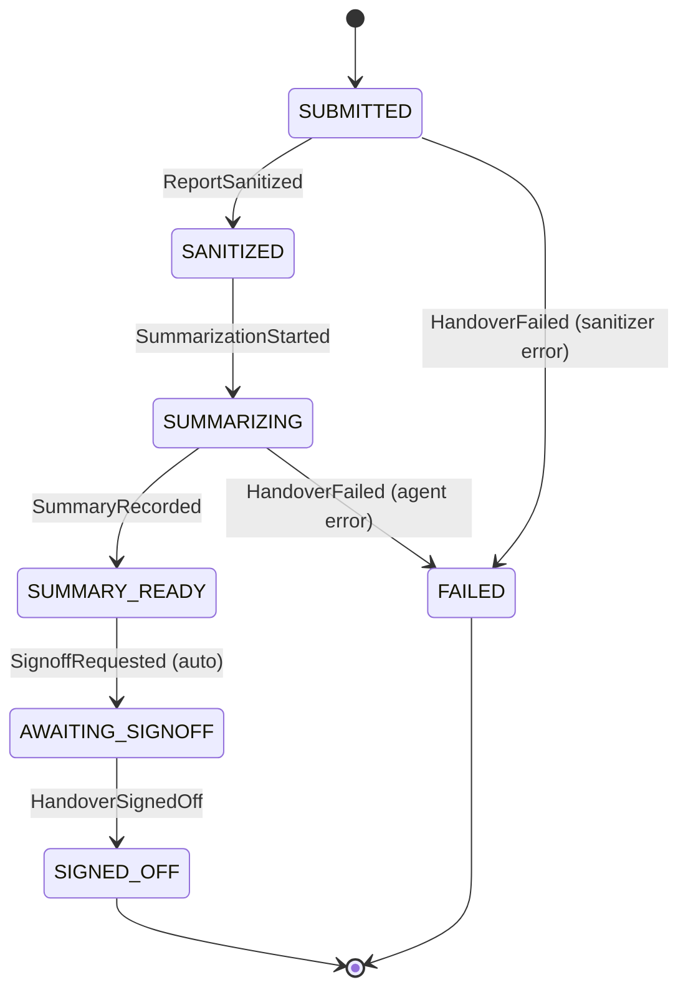
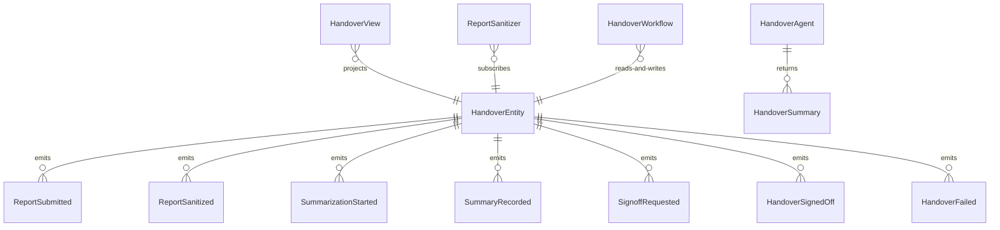

# PLAN — nurse-handover

Architectural sketch consumed by `/akka:plan` and rendered on the generated system's Architecture tab. The four mermaid diagrams below carry the theme variables and CSS overrides from Lesson 24; without them, state names render black-on-black and edge labels clip.

---

## Component graph

## Interaction sequence — J1 (happy path)

## State machine — `HandoverEntity`

## Entity model

## Component table — Java file targets

| Component | Path (generated) |
|---|---|
| `HandoverEndpoint` | `api/HandoverEndpoint.java` |
| `AppEndpoint` | `api/AppEndpoint.java` |
| `HandoverEntity` | `application/HandoverEntity.java` (state in `domain/Handover.java`, events in `domain/HandoverEvent.java`) |
| `ReportSanitizer` | `application/ReportSanitizer.java` |
| `HandoverWorkflow` | `application/HandoverWorkflow.java` |
| `HandoverAgent` | `application/HandoverAgent.java` (tasks in `application/HandoverTasks.java`) |
| `HandoverView` | `application/HandoverView.java` |
| `MockModelProvider` (option-a only) | `application/MockModelProvider.java` |
| Bootstrap | `Bootstrap.java` |

## Concurrency notes

- **Per-step timeout**: `awaitSanitizedStep` 15 s, `summarizeStep` 60 s, `awaitSignoffStep` 14400 s (4 h), `error` 5 s. Default step recovery `maxRetries(2).failoverTo(HandoverWorkflow::error)`. The 60 s on `summarizeStep` accommodates LLM latency (Lesson 4). The 4-hour window on `awaitSignoffStep` covers a full shift handover period.
- **Idempotency**: every workflow uses `"handover-" + handoverId` as the workflow id; the `ReportSanitizer` Consumer is allowed to redeliver `ReportSubmitted` events because `HandoverEntity.attachSanitized` is event-version-guarded — a second sanitize attempt against an already-sanitized handover is a no-op.
- **One agent per handover**: the AutonomousAgent instance id is `"handover-" + handoverId`. The agent's `capability(...).maxIterationsPerTask(3)` caps retries.
- **HITL gate is a poll, not an event push**: `awaitSignoffStep` polls the entity every 5 s and advances only when `handover.signoff().isPresent()`. The clinician's PATCH call lands on the entity and is detected on the next poll cycle. This keeps the workflow self-contained without requiring an external trigger mechanism.
- **No saga / no compensation**: every step is either pure read, append-only event write, or a single-task agent call. There is nothing external to roll back.
- **Single-agent invariant**: `HandoverAgent` is the only AutonomousAgent. The sign-off gate is a workflow polling loop — not a second LLM call.
